# Week 01 — Разбор `SCHEDULER.py`


На этой неделе был проведён подробный разбор файла `SCHEDULER.py`. Основной задачей было понять, как внутри одного TTI код проходит путь от входных данных пользователя до фактического распределения RBG, какие части этого пути общие для всех алгоритмов и где начинается логика конкретного scheduler. При чтении файла отдельно рассматривались работа с CQI, состояние буферов, очередность UE, ограничение по PDCCH, расчёт ёмкости RB и обработка уже сформированного `allocation`.

Различие между алгоритмами находится не во всём цикле `schedule()`, а в нескольких конкретных точках. Общий класс выполняет подготовку пользователей, формирует список кандидатов, занимается PDCCH и после распределения обновляет состояние буферов. Подклассы в основном меняют способ расчёта приоритета и способ выбора UE во время выдачи RBG. Отдельно были разобраны FD-варианты, где решение принимается уже для конкретного RBG с использованием subband CQI.

<details>
<summary>📑 Оглавление</summary>

- [Задачи недели](#задачи-недели)
- [Краткая терминология](#краткая-терминология)
- [Что делает Scheduler](#что-делает-scheduler)
- [Временная и частотная организация ресурса](#временная-и-частотная-организация-ресурса)
- [TTI и состояние между вызовами](#tti-и-состояние-между-вызовами)
- [CQI](#cqi)
- [Буфер](#буфер)
- [История throughput](#история-throughput)
- [Фабрика scheduler](#фабрика-scheduler)
- [Общий pipeline `schedule()`](#общий-pipeline-schedule)
- [🧭 Модели планирования](#-модели-планирования)
- [PDCCH и CCE](#pdcch-и-cce)
- [AMC](#amc)
- [Предварительная оценка PDSCH](#предварительная-оценка-pdsch)
- [Метрики](#метрики)
- [Связь теории с конкретными участками кода](#связь-теории-с-конкретными-участками-кода)
- [Итоги недели](#итоги-недели)
- [📚 Источники](#-источники)

</details>

## Задачи недели

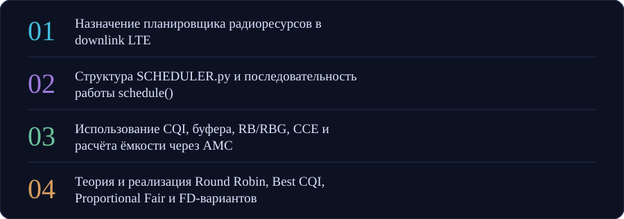


## Краткая терминология

| Термин | Расшифровка | Что означает в рассматриваемом коде |
|---|---|---|
| **UE** | User Equipment | Пользовательское устройство, для которого scheduler выделяет ресурс |
| **eNB / BS** | evolved NodeB / Base Station | Базовая станция, через которую scheduler получает состояние и работает с буферами |
| **TTI** | Transmission Time Interval | Временной шаг планирования; один вызов `schedule()` обрабатывает один TTI |
| **RB / PRB** | Resource Block / Physical Resource Block | Базовая единица ресурса по времени и частоте |
| **RBG** | Resource Block Group | Группа RB, которую текущая логика распределяет как один элемент |
| **CQI** | Channel Quality Indicator | Оценка качества downlink-канала для выбора режима передачи |
| **WB CQI** | Wideband CQI | Одно значение CQI для всей доступной полосы UE |
| **SB CQI** | Subband CQI | CQI для отдельных участков полосы; используется FD-планировщиками |
| **PDCCH** | Physical Downlink Control Channel | Управляющий канал, через который UE получает управляющую информацию о передаче |
| **CCE** | Control Channel Element | Единица ресурса, используемая для размещения PDCCH |
| **PDSCH** | Physical Downlink Shared Channel | Канал, на котором передаются пользовательские данные в downlink |
| **AMC** | Adaptive Modulation and Coding | Часть кода, которая переводит CQI в параметры модуляции/кодирования и оценочную ёмкость RB |
| **MCS** | Modulation and Coding Scheme | Комбинация модуляции и code rate, используемая при расчёте ёмкости |
| **HARQ** | Hybrid Automatic Repeat reQuest | Механизм повторной передачи; поля для него присутствуют в `SchedulingGrant` |
| **LCID** | Logical Channel Identifier | Идентификатор логического канала, поле `SchedulingGrant` |
| **PF** | Proportional Fair | Критерий, учитывающий мгновенную скорость и историю throughput |
| **FD** | Frequency Domain | Частотная часть планирования, где выбор UE повторяется для отдельных RBG |
| **TD** | Time Domain | Временная часть планирования, где формируется общий порядок UE в текущем TTI |


## Что делает Scheduler

Планировщик получает несколько пользователей, у каждого из которых есть состояние канала и некоторое количество данных, ожидающих передачи. Доступный радиоресурс ограничен количеством RBG, поэтому в каждом TTI нужно решить, какие UE получат ресурс и сколько RBG им будет выделено. Решение формируется из нескольких входов: качество канала определяет потенциальную скорость, состояние буфера показывает реальную потребность в передаче, а выбранная модель планирования задаёт порядок, в котором UE получают возможность занять ресурс.

В рассматриваемом коде эта работа разбита на последовательность стадий. Сначала из входного списка убираются UE с пустым буфером или некорректным CQI. Затем подготавливается активное окно, рассчитываются приоритеты и формируется список пользователей, которым может потребоваться PDCCH. После проверки ограничения по CCE начинается распределение RBG на PDSCH. В конце `allocation` используется для извлечения данных из буфера, а объект scheduler сохраняет статистику текущего TTI.

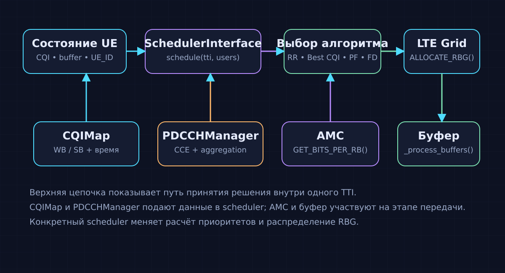

Основной вход в эту последовательность — `schedule(tti, users)`. Сам метод не содержит отдельную формулу для каждого алгоритма. Общий pipeline вызывает методы, которые переопределяются в наследниках, поэтому Round Robin, Best CQI и PF проходят через одинаковую внешнюю последовательность, но получают различный порядок выбора UE.

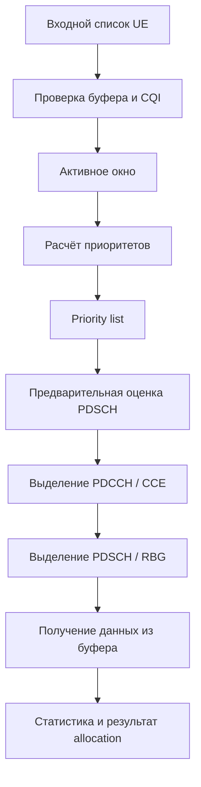
```mermaid
flowchart TD
    A["Входной список UE"] --> B["Проверка буфера и CQI"]
    B --> C["Активное окно"]
    C --> D["Расчёт приоритетов"]
    D --> E["Priority list"]
    E --> F["Предварительная оценка PDSCH"]
    F --> G["Выделение PDCCH / CCE"]
    G --> H["Выделение PDSCH / RBG"]
    H --> I["Получение данных из буфера"]
    I --> J["Статистика и результат allocation"]
```



<details>
<summary>Альтернативный вид: pipeline блоками</summary>

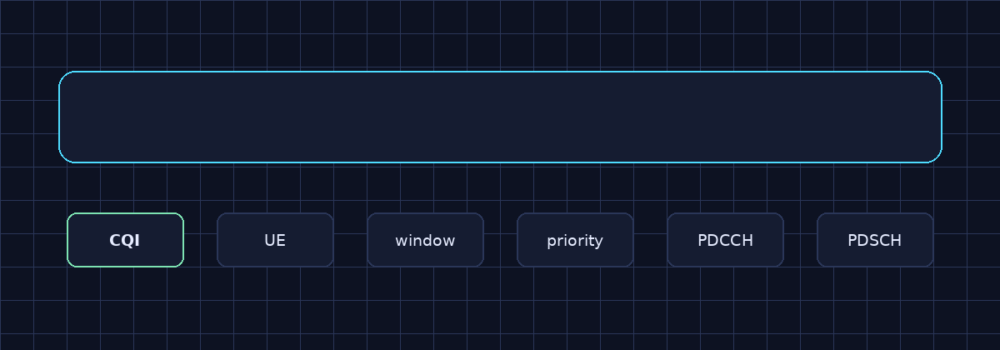

</details>

## Временная и частотная организация ресурса

LTE-ресурс можно представить как сетку, где по одной оси идёт время, а по другой — частота. На физическом уровне ресурс состоит из resource elements, которые группируются в более крупные единицы. Для логики данного файла важны RB и RBG: `lte_grid.ALLOCATE_RBG()` используется тогда, когда scheduler уже принимает решение о конкретной группе ресурсов.

Пока весь TTI рассматривается через один общий порядок UE, достаточно один раз посчитать приоритеты и затем проходить список. Frequency Domain модели работают иначе: для каждого RBG они снова смотрят на доступных пользователей и выбирают того, кто лучше соответствует критерию для именно этого участка полосы. Поэтому SB CQI имеет смысл именно в FD-цикле.

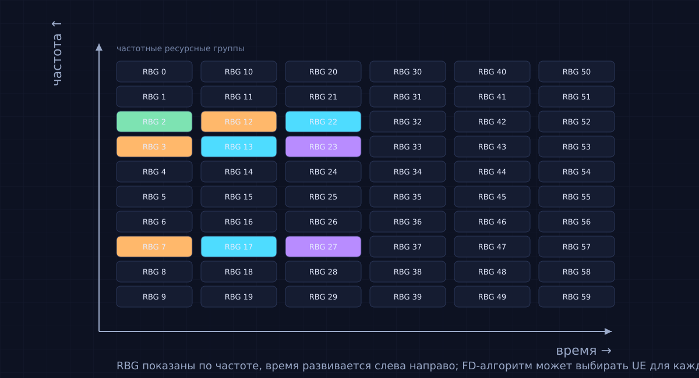

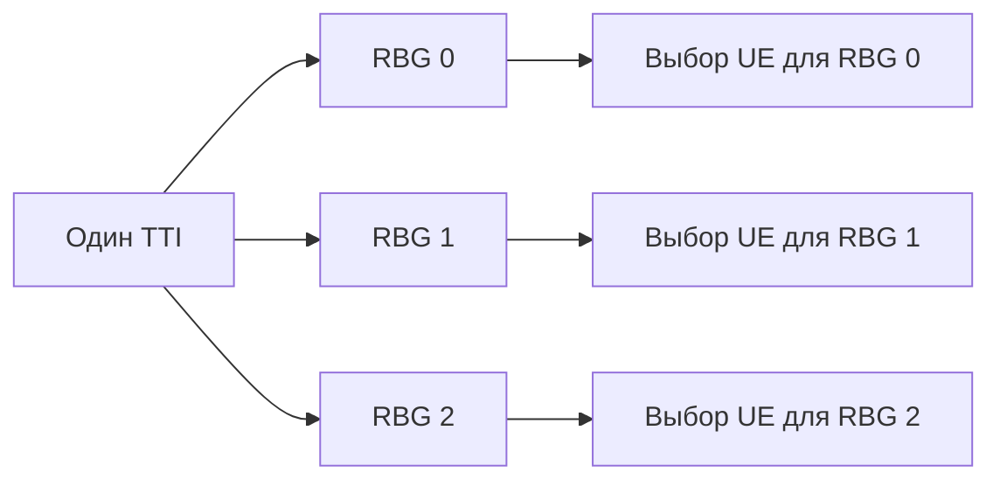
```mermaid
flowchart LR
    TTI["Один TTI"] --> R0["RBG 0"]
    TTI --> R1["RBG 1"]
    TTI --> R2["RBG 2"]
    R0 --> U0["Выбор UE для RBG 0"]
    R1 --> U1["Выбор UE для RBG 1"]
    R2 --> U2["Выбор UE для RBG 2"]
```

<p align="center">
  
  <br>
  <sub>LTE Resource Block: привязка к OFDM symbols и subcarriers · <a href="https://commons.wikimedia.org/wiki/File:Resource-Block_LTE_OFDMA.png">Wikimedia Commons</a></sub>
</p>

## TTI и состояние между вызовами

Один вызов `schedule()` относится к одному TTI, но сам объект scheduler не создаётся заново каждый раз. Поэтому некоторые значения сохраняются между вызовами. У Round Robin это `rr_rbg_offset` и `rr_ue_offset`, а `CQIMap` хранит последние WB и SB отчёты и время их обновления.

В `RoundRobinScheduler` начальная позиция задаётся так:

```python
self.rr_rbg_offset = 0
self.rr_ue_offset = 0
```

Дальше очередь поворачивается относительно текущей позиции:

```python
start_idx = self.rr_ue_offset % num_ues
rotated_ues = windowed_ues[start_idx:] + windowed_ues[:start_idx]
```

Получившийся список используется как новая точка начала обхода. После завершения TTI offset переносится дальше, поэтому последовательность пользователей не сбрасывается к первому элементу на каждом вызове.


## CQI

`CQI` показывает, насколько хорошо UE принимает downlink. Сам scheduler не измеряет радиоканал с нуля: в `SCHEDULER.py` он получает уже подготовленное значение и использует его в нескольких местах. CQI влияет на оценочную скорость передачи, а через неё — на выбор пользователя и расчёт объёма данных, который можно разместить на выделенном ресурсе.

В текущем файле предусмотрены два уровня оценки. `wb_cqi` относится ко всей полосе UE, а `sb_cqi` содержит значения для отдельных частотных участков. Обновление выполняет `_refresh_cqi()`, а алгоритмы получают данные через `_get_wb_cqi()` и `_get_sb_cqi()`.

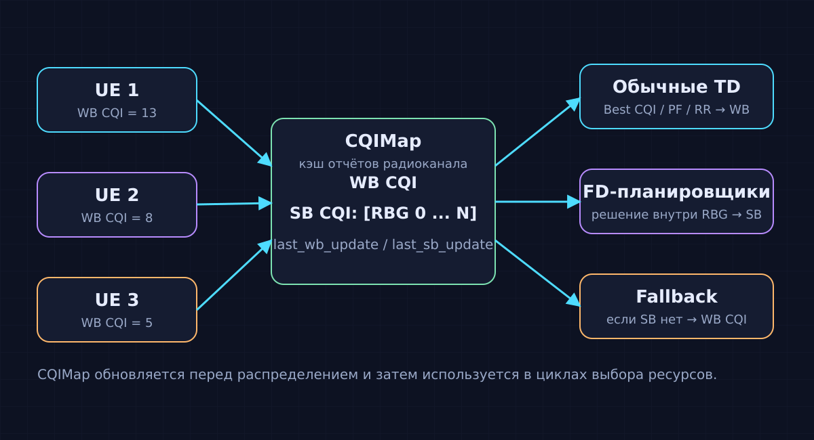

`CQIMap` хранит полученные отчёты и времена их обновления. Для обычных моделей этого достаточно, чтобы быстро взять WB CQI. Для FD-моделей из той же структуры можно получить SB CQI конкретного `rbg_idx`.

<details>
<summary>Как выглядит цикл обновления <code>_refresh_cqi()</code></summary>

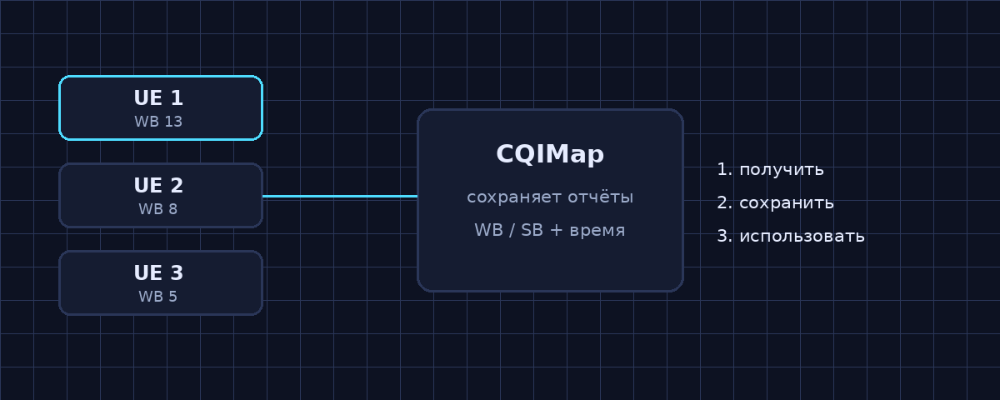

</details>

## Буфер

Состояние канала показывает возможную скорость передачи, но не говорит, есть ли реальные данные в очереди. Поэтому `_filter_eligible_ues()` отдельно проверяет размер буфера. UE с пустой очередью не попадает в дальнейшее распределение.

После подготовки пользователя размер буфера используется в `user['bs_buffer_size']`. В allocation-циклах создаётся отдельное состояние остатка в битах:

```python
remaining_buffer = {
    user['UE_ID']: user['bs_buffer_size'] * 8
    for user in ues_with_pdcch
}
```

После каждого выделенного RBG остаток уменьшается на его оценочную ёмкость. Это связывает абстрактное решение scheduler с фактическим объёмом ожидающих данных.

## История throughput

Для PF одного CQI недостаточно, потому что алгоритму нужно учитывать предыдущее обслуживание пользователя. В `SCHEDULER.py` для этого используется `user['ue'].average_throughput`.

Если UE сейчас способен передать большой объём данных, его текущая скорость `r_i(t)` велика. Если этот же UE уже долго обслуживался, растёт его средняя скорость `R_i(t)`. В результате PF не ориентируется только на моментальный максимум: значение истории влияет на дальнейший приоритет.

Классическая запись PF имеет вид:

$$
PF_i(t)=\frac{r_i(t)}{R_i(t)}
$$

В коде используется конкретная форма:

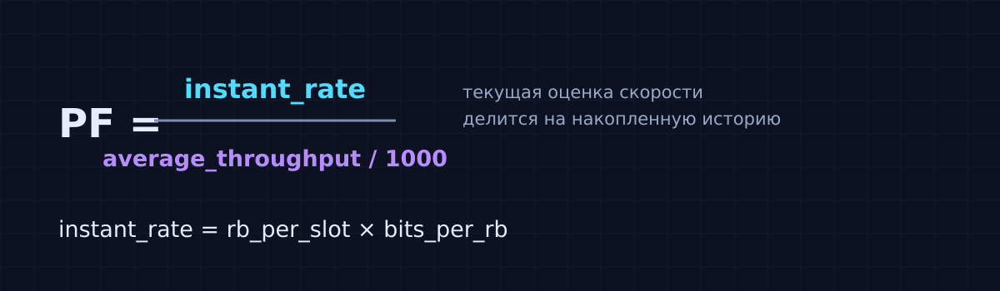

```python
avg_throughput_per_tti = avg_throughput / 1000
pf_metric = instant_rate / avg_throughput_per_tti
```


## Фабрика scheduler

Внешний код может выбрать модель по имени. `SchedulerInterface.create()` связывает название с конкретным классом:

```python
schedulers = {
    'BestCQI': BestCQIScheduler,
    'ProportionalFair': ProportionalFairScheduler,
    'RoundRobin': RoundRobinScheduler,
    'FD_BCQI': FDxBestCQIScheduler,
    'FD_FGS': FDxFairGreedyScheduler,
    'FD_PF': FDxProportionalFairScheduler,
}
```

Фабрика нужна для того, чтобы внешний код работал с единым интерфейсом, а конкретная модель задавалась выбором класса. После создания объект проходит общую схему `schedule()`, а наследники отвечают прежде всего за собственные методы `_calculate_priorities()` и `_allocate_pdsch()`.

## Общий pipeline `schedule()`

<details>
<summary>Полный код основного цикла (нажми, чтобы развернуть)</summary>

```python
self._last_tti = tti

if tti % self.wb_cqi_upd_interval == 0:
    self._refresh_cqi(tti, users)

eligible_ues = self._filter_eligible_ues(tti, users)
self._update_active_window(eligible_ues)
windowed_ues = self.filter_by_window(eligible_ues)
prioritized_ues = self._calculate_priorities(windowed_ues, tti)
priority_list = self._form_priority_list(prioritized_ues, tti)
priority_list_filtered = self._apply_pdsch_estimation(priority_list, tti)
ues_with_pdcch = self._allocate_pdcch(priority_list_filtered)
allocation = self._allocate_pdsch(tti, ues_with_pdcch, eligible_ues)
self._process_buffers(tti, users, allocation)
```

</details>

Как видно до `_allocate_pdcch()` ещё нет фактического выделения пользовательского ресурса. Сначала определяется состав участников и их порядок. После PDCCH в `_allocate_pdsch()` появляется конкретная карта распределения RBG.

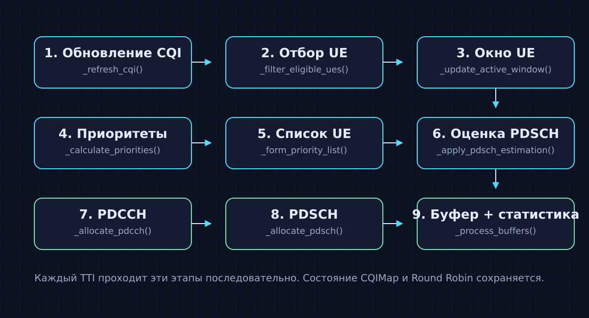

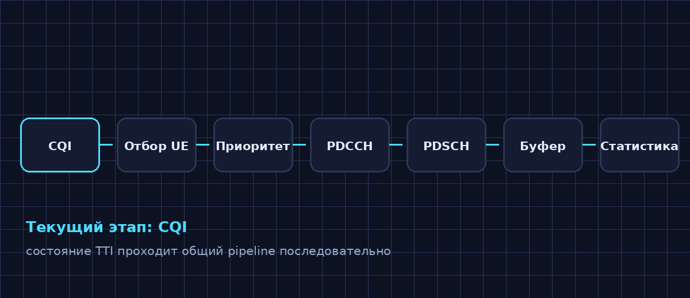


## 🧭 Модели планирования

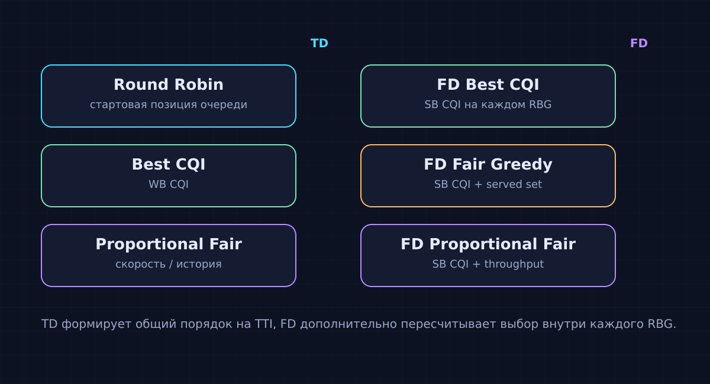

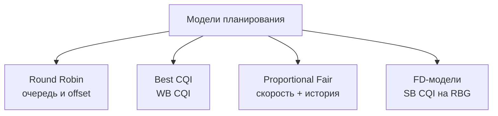
```mermaid
flowchart TD
    MODELS["Модели планирования"] --> RR["Round Robin<br>очередь и offset"]
    MODELS --> BCQI["Best CQI<br>WB CQI"]
    MODELS --> PF["Proportional Fair<br>скорость + история"]
    MODELS --> FD["FD-модели<br>SB CQI на RBG"]
```

**Сравнение моделей:**

| Модель | Критерий выбора UE | CQI | История | Гранулярность |
|---|---|:---:|:---:|---|
| **Round Robin** | Позиция в очереди (`rr_ue_offset`) | – | – | На весь TTI |
| **Best CQI** | Максимальный WB CQI | ✅ WB | – | На весь TTI |
| **Proportional Fair** | `instant_rate / avg_throughput` | ✅ WB | ✅ | На весь TTI |
| **FD Best CQI** | Максимальный SB CQI текущего RBG | ✅ SB | – | На каждый RBG |
| **FD Fair Greedy** | SB CQI + `served_in_round` | ✅ SB | частично | На каждый RBG |
| **FD Proportional Fair** | PF-метрика для конкретного RBG | ✅ SB | ✅ | На каждый RBG |

### Round Robin

Round Robin — последовательная модель обслуживания. В простом случае есть упорядоченный список UE, и scheduler проходит его по кругу: один пользователь получает очередной ресурс, затем следующий, затем следующий. Когда очередь заканчивается, обход возвращается к началу. Важный элемент такой модели — не сама сортировка, а сохранение позиции между циклами.

Если в одном TTI стартовой позицией был `UE1`, следующими кандидатами могут стать `UE2` и `UE3`. После завершения распределения `rr_ue_offset` переносит начало следующего прохода. Благодаря этому пользователи получают ресурс последовательно, а порядок не зависит от текущей величины CQI.

В `_calculate_priorities()` очередь поворачивается:

```python
start_idx = self.rr_ue_offset % num_ues
rotated_ues = windowed_ues[start_idx:] + windowed_ues[:start_idx]
```

Затем `_allocate_pdsch()` берёт очередного пользователя для каждого RBG:

```python
ue = ues_with_pdcch[ue_index % num_ues]
ue_id = ue['UE_ID']
```

После успешного распределения индекс двигается дальше, а состояние сохраняется. Поэтому последовательность можно представить как непрерывный круг:

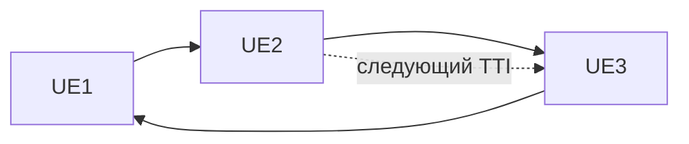
```mermaid
flowchart LR
    A["UE1"] --> B["UE2"] --> C["UE3"] --> A
    B -. "следующий TTI" .-> C
```

У Round Robin CQI не используется как критерий порядка PDSCH. Он всё равно присутствует в общем pipeline и нужен, например, для PDCCH и расчётов, но саму очередь пользователей он не перестраивает.

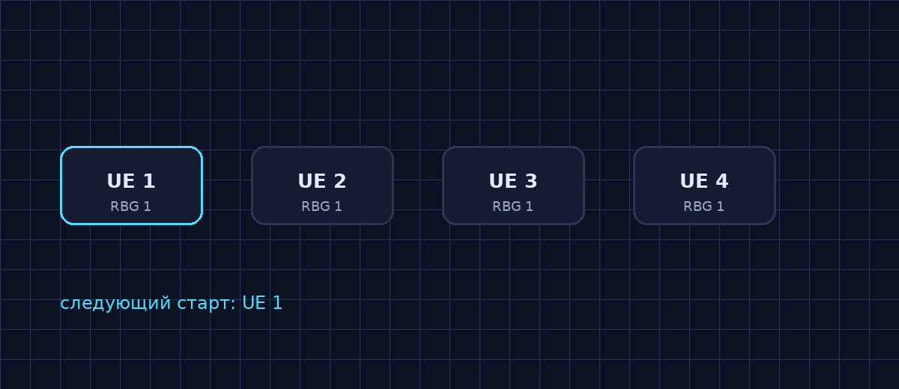

### Best CQI

Best CQI строит порядок пользователей непосредственно по качеству канала. В идее модели каждый UE получает оценку, после чего scheduler ставит выше тех пользователей, у которых текущий канал оценивается лучше.

Связь с физическим уровнем здесь прямая: более высокий CQI позволяет выбрать более производительный режим модуляции и кодирования, а значит один и тот же RBG имеет большую оценочную ёмкость. Поэтому алгоритм сначала рассматривает UE с большим CQI.

В текущем классе приоритет задаётся так:

```python
for user in eligible_ues:
    ue_id = user['UE_ID']
    user['priority'] = self._get_wb_cqi(ue_id)
```

После этого `_form_priority_list()` сортирует пользователей по `priority` в порядке убывания. Затем allocation проходит этот список и отдаёт очередной RBG первому UE, который ещё имеет данные.

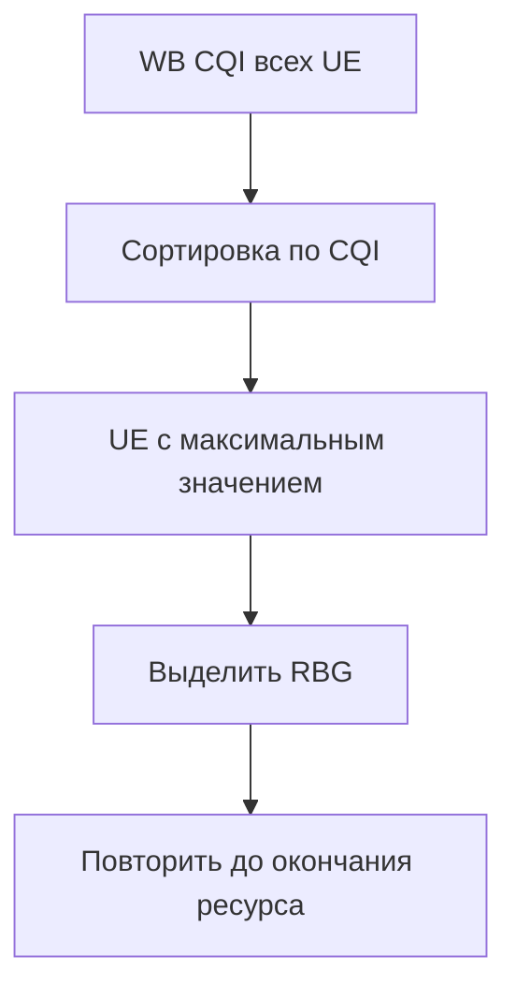
```mermaid
flowchart TD
    A["WB CQI всех UE"] --> B["Сортировка по CQI"]
    B --> C["UE с максимальным значением"]
    C --> D["Выделить RBG"]
    D --> E["Повторить до окончания ресурса"]
```

Таким образом, логика этой модели целиком привязана к текущей оценке канала, а история предыдущего обслуживания в `priority` класса `BestCQIScheduler` не участвует.

### Proportional Fair

Proportional Fair использует две величины одновременно: возможную скорость прямо сейчас и среднюю скорость, которую UE получал ранее. Смысл модели хорошо виден на простом примере. Два пользователя могут иметь похожий канал, но один из них передавал данные в последних TTI значительно меньше. Для него история throughput меньше, поэтому отношение текущей скорости к истории становится выше.

Теоретически PF можно записать как:

$$
PF_i(t)=\frac{r_i(t)}{R_i(t)}
$$

где `r_i(t)` — текущая возможная скорость пользователя, а `R_i(t)` — его средний throughput за предыдущий период.

<details>
<summary>Реализация в коде</summary>

```python
cqi = self._get_wb_cqi(ue_id)
bits_per_rb = self.amc.GET_BITS_PER_RB(cqi)
rb_per_slot = self.lte_grid.rb_per_slot
instant_rate = rb_per_slot * bits_per_rb

avg_throughput = user['ue'].average_throughput
avg_throughput_per_tti = avg_throughput / 1000
pf_metric = instant_rate / avg_throughput_per_tti
```

</details>

После вычисления `priority` пользователи сортируются, и список используется при PDSCH allocation. Если средний throughput равен нулю, код использует отдельную fallback-ветку, чтобы избежать деления на ноль у UE без накопленной истории.

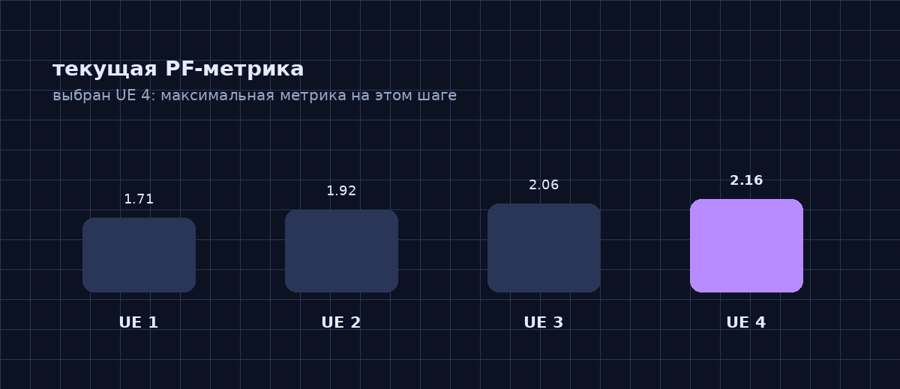


### Частотная часть (Frequency Domain)

Обычный TD-подход позволяет один раз построить порядок UE и затем использовать его при заполнении RBG. Frequency Domain модель рассматривает каждый участок полосы отдельно. Для текущего `rbg_idx` scheduler получает SB CQI доступных пользователей, рассчитывает нужный критерий и выбирает UE именно для этого RBG.

Это меняет саму структуру цикла. Вместо `рассчитать приоритеты -> пройти ресурс` появляется повторяющийся шаг `взять RBG -> получить данные по UE -> выбрать UE -> выделить RBG -> перейти дальше`.

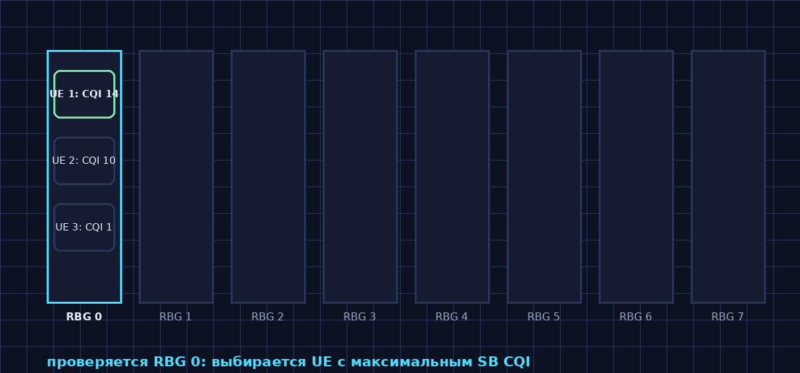

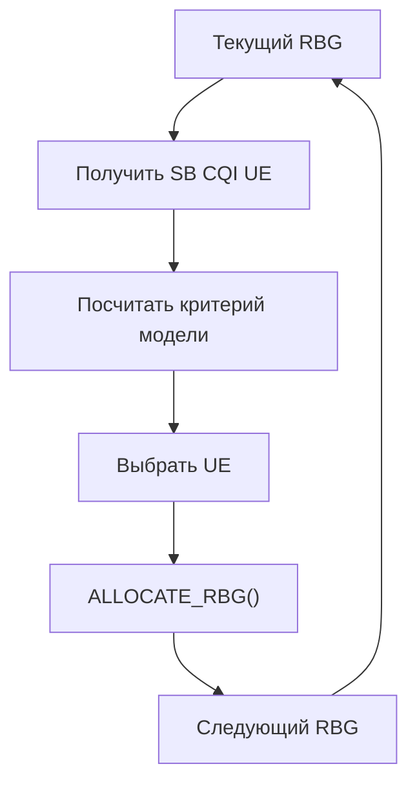
```mermaid
flowchart TD
    A["Текущий RBG"] --> B["Получить SB CQI UE"]
    B --> C["Посчитать критерий модели"]
    C --> D["Выбрать UE"]
    D --> E["ALLOCATE_RBG()"]
    E --> F["Следующий RBG"]
    F --> A
```

**FD Best CQI.** Сохраняет принцип Best CQI, но сравнивает пользователей не по одному общему WB CQI, а по значению SB CQI для текущего RBG. Если у UE разные значения качества на разных участках полосы, один RBG может достаться одному пользователю, а соседний — другому.

```python
sb_cqi_list = self._get_sb_cqi(ue_id)

if sb_cqi_list and rbg_idx < len(sb_cqi_list):
    cqi = (
        sb_cqi_list[rbg_idx]
        if sb_cqi_list[rbg_idx] > 0
        else self._get_wb_cqi(ue_id)
    )
else:
    cqi = self._get_wb_cqi(ue_id)
```

После этого сравниваются значения кандидатов, и ресурс получает UE с максимальным CQI.

**FD Fair Greedy.** Добавляет к частотному выбору состояние уже обслуженных пользователей. Для текущего раунда хранится множество `served_in_round`:

```python
served_in_round = set()
served_in_round.add(ue_id)  # после выдачи ресурса
```

Частотный выбор по SB CQI дополняется ограничением на повторное обслуживание внутри раунда. По мере завершения раунда состояние очищается и цикл начинается заново.

**FD Proportional Fair.** Сохраняет идею пропорционально-справедливого выбора, но текущая скорость уже зависит от конкретного RBG:

```python
cqi = sb_cqi[rbg_idx]
bits_per_rb = self.amc.GET_BITS_PER_RB(cqi)
r_j_k = rbg_width * bits_per_rb
avg_tput = user['ue'].average_throughput
```

Побеждает пользователь с наибольшей метрикой для текущего участка частотного ресурса. В этой модели история throughput меняет выбор внутри каждого RBG, а не только общий порядок UE на начало TTI.


## PDCCH и CCE

До выдачи PDSCH в общем pipeline находится PDCCH. Пользовательские данные передаются на PDSCH, но UE должен получить управляющую информацию о выделении. Поэтому общий scheduler сначала ограничивает список кандидатов управляющим ресурсом PDCCH.

В `PDCCHManager` для каждого UE определяется Aggregation Level. В текущей модели используется зависимость от CQI:

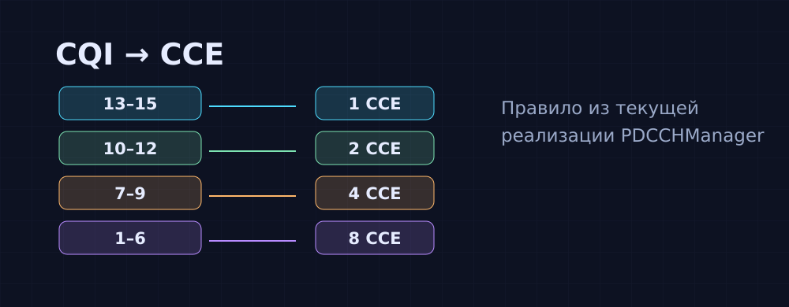

| CQI | Aggregation Level |
|---:|---:|
| 13–15 | 1 CCE |
| 10–12 | 2 CCE |
| 7–9 | 4 CCE |
| 1–6 | 8 CCE |

После определения требуемого количества CCE проверяется доступный бюджет:

```python
available_cce = self.max_dl_cce - self.num_assigned_cce
is_available = required_cce <= available_cce
```

При успешном выделении счётчик увеличивается:

```python
self.num_assigned_cce += cce_count
self.cce_allocations[ue_id] = cce_count
```

Поэтому `ues_with_pdcch`, передаваемый в `_allocate_pdsch()`, уже содержит пользователей, которые прошли этот этап.

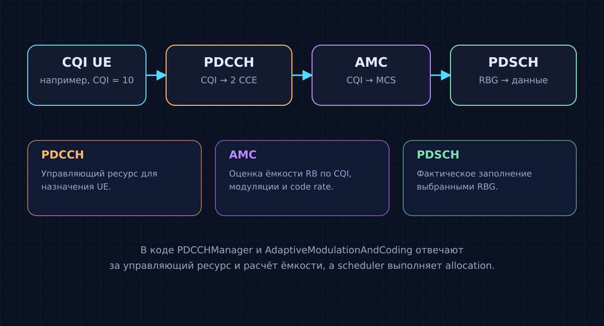

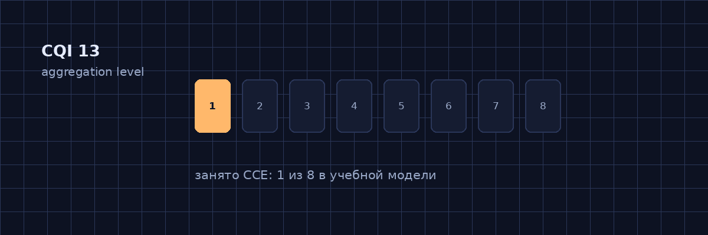


## AMC

`AdaptiveModulationAndCoding` нужен для перевода CQI в оценку того, сколько данных может быть размещено на выделенном ресурсе. В таблице `CQI_TO_MCS` каждому значению CQI соответствует пара параметров — размер созвездия модуляции и code rate. В текущем файле используются QPSK для CQI 1–4, 16QAM для CQI 5–7 и 64QAM для CQI 8–15.

<p align="center">
  
  <br>
  <sub>Констелляционные диаграммы QAM: чем выше порядок модуляции, тем больше бит на символ, но выше требования к качеству канала · <a href="https://commons.wikimedia.org/wiki/File:Rectangular_constellation_for_QAM.svg">Wikimedia Commons</a></sub>
</p>

Сама функция `GET_BITS_PER_RB()` сначала оценивает количество полезных RE. В расчёте учитываются CRS и параметр `pcfich`:

```python
rs_per_slot = n_ports * 4
re_slot0 = (7 - pcfich) * 12 - rs_per_slot
re_slot1 = 7 * 12 - rs_per_slot
re_per_rb_tti = re_slot0 + re_slot1
```

После этого число RE умножается на параметры модуляции и кодирования:

$$
N_{bits/RB} \approx N_{RE}\cdot Q_m\cdot R
$$

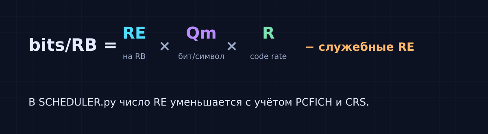

```python
return int(re_per_rb_tti * modulation * code_rate)
```

Полученное значение используется дальше при вычислении `instant_rate`, потребности в RB и остатка данных в буфере.

> ⚠️ **Приближённая модель.** В самом `SCHEDULER.py` отдельно отмечено, что это приближённая модель. Полный расчёт TBS в LTE основан на таблицах, поэтому данный расчёт следует воспринимать как внутреннюю оценку ёмкости, используемую алгоритмами этого файла.

## Предварительная оценка PDSCH

Перед окончательным распределением ресурсов вызывается `_apply_pdsch_estimation()`. Для каждого кандидата scheduler оценивает, сколько RB приблизительно требуется для текущего буфера:

```python
bits_per_rb = self.amc.GET_BITS_PER_RB(cqi)
buffer_bits = user['bs_buffer_size'] * 8
rb_needed = min(buffer_bits // bits_per_rb, total_rb)
```

Для обычных TD-вариантов суммарная оценка ограничивается примерно 95% доступного ресурса. Этот этап выполняется перед `ALLOCATE_RBG()`, поэтому его удобно читать как предварительный расчёт потребности, а не как фактическую выдачу ресурса.


После завершения `_allocate_pdsch()` появляется словарь распределения вида:

```python
allocation = {
    ue_id: [rb_indices]
}
```

Затем `_process_buffers()` определяет число выделенных RB и через AMC оценивает максимально возможный объём данных:

```python
allocated_rbs = len(allocation.get(ueid, []))
max_bits = allocated_rbs * bits_per_rb
max_bytes = max_bits // GLOBALS.BITS_PER_BYTE
```

В этом же файле определён `SchedulingGrant`:

```python
@dataclass(slots=True)
class SchedulingGrant:
    ue_id: int
    num_bytes: int
    lcid: Optional[int] = None
    ndi: bool = True
    harq_process_id: int = 0
    rv: int = 0
```

Структура grant содержит UE, объём данных, LCID и поля HARQ. В текущем pipeline основным результатом остаётся `allocation`, а `SchedulingGrant` представляет более явную структуру, в которой можно хранить параметры конкретной передачи.

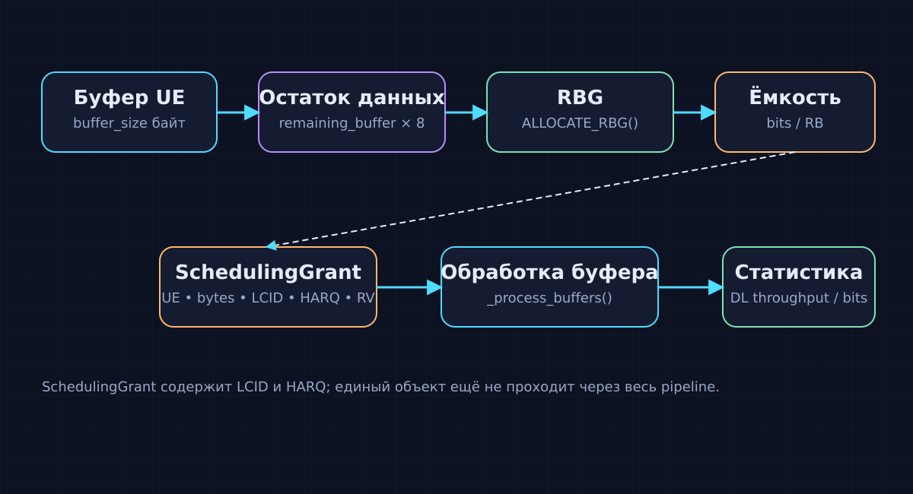

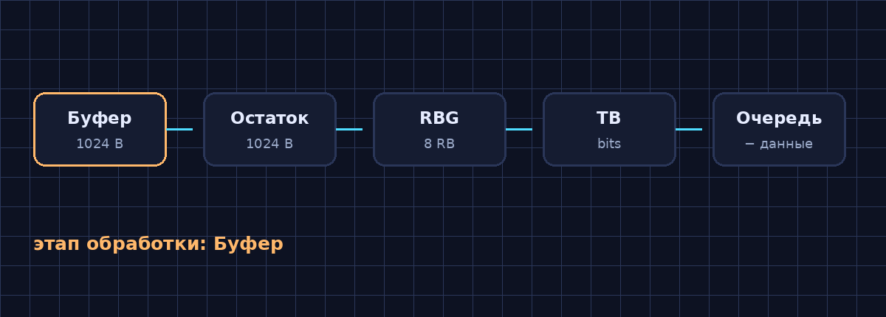


## Метрики

Для разбора поведения кода полезно смотреть не только на конечный `allocation`, но и на состояние scheduler после завершения TTI. `get_stats()` возвращает данные о текущем TTI, числе подходящих UE, количестве выделенных RB, средней выдаче на UE, суммарном буфере, PRB utilization, времени расчёта приоритетов и сортировки, блокировках PDCCH, средних приоритетах, переданных битах и значениях по каждому UE.

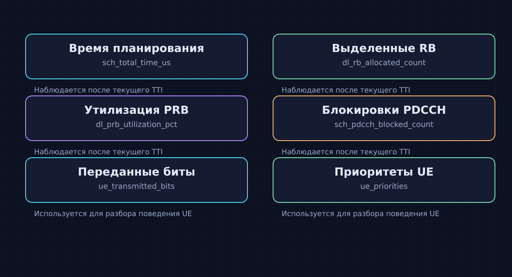

Для PRB utilization используется отношение занятого ресурса к общему числу доступных PRB:

$$
PRB\ Util(\%)=\frac{N_{allocated\ PRB}}{N_{available\ PRB}}\cdot100
$$

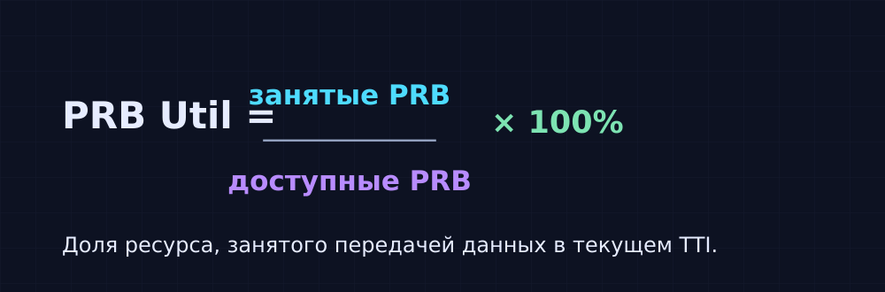

Этот показатель позволяет смотреть на allocation уже как на заполнение доступной частотно-временной полосы. При пустых буферах блоки не выделяются, при росте трафика количество занятых RBG увеличивается.

## Связь теории с конкретными участками кода

Нужно держать в голове четыре основных участка. `SchedulerInterface.schedule()` отвечает за общий ход одного TTI. `_calculate_priorities()` описывает, как конкретная модель превращает состояние UE в порядок кандидатов. `_allocate_pdsch()` отвечает за фактический выбор UE и RBG. `PDCCHManager` и AMC обслуживают ограничения и расчёты, необходимые до и во время передачи.

Один и тот же входной параметр может использоваться сразу в нескольких местах. CQI участвует в приоритете Best CQI, в PF, в расчёте AMC и в определении Aggregation Level текущей модели PDCCH. `average_throughput` нужен для PF. `sb_cqi` появляется в тех местах, где решение принимается отдельно для каждого RBG.

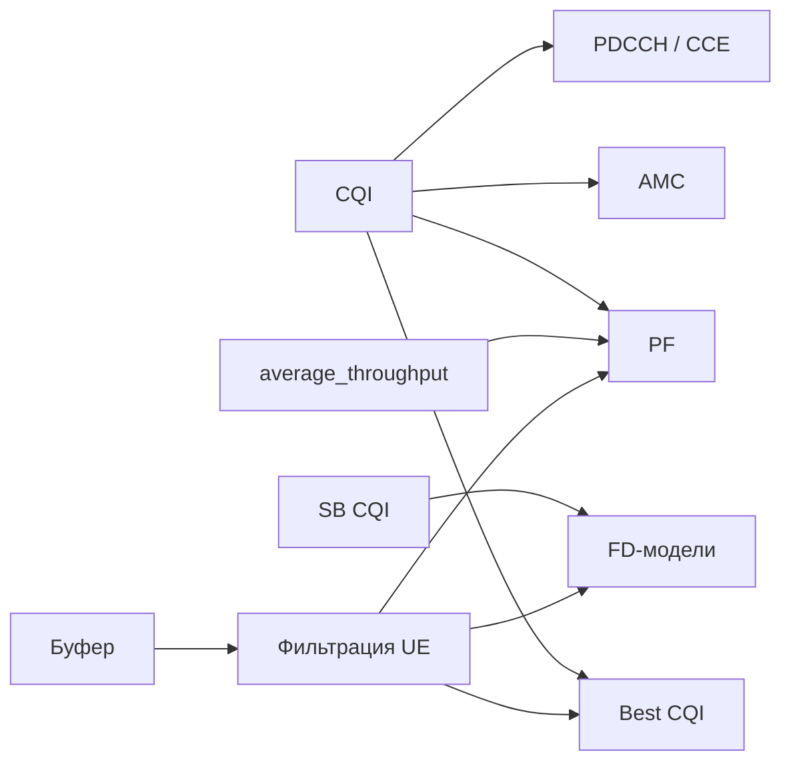
```mermaid
flowchart LR
    CQI["CQI"] --> BCQI["Best CQI"]
    CQI --> PF["PF"]
    CQI --> AMC["AMC"]
    CQI --> CCE["PDCCH / CCE"]
    SB["SB CQI"] --> FD["FD-модели"]
    AVG["average_throughput"] --> PF
    BUF["Буфер"] --> FILTER["Фильтрация UE"]
    FILTER --> BCQI
    FILTER --> PF
    FILTER --> FD
```

По итогу: сначала общий pipeline, затем критерий каждой модели, а после этого вспомогательные классы, которые поддерживают её работу. За счёт этого даже длинные части `SCHEDULER.py` связываются с конкретными шагами принятия решения.


## Итоги недели

По итогам недели были изучены назначение планировщика радиоресурсов, основные модели планирования и архитектура файла `SCHEDULER.py`. Отдельно разобрана логика Round Robin, Best CQI, Proportional Fair и FD-вариантов, а также общий порядок работы `schedule()` и взаимодействие основных классов и структур данных, всего разобрано шесть моделей планирования


## 📚 Источники

| Источник | Ссылка |
|---|---|
| 3GPP TS 36.211 — Physical channels and modulation | [Спецификация](https://portal.3gpp.org/desktopmodules/Specifications/SpecificationDetails.aspx?specificationId=2425) |
| 3GPP TS 36.213 — Physical layer procedures | [Спецификация](https://portal.3gpp.org/desktopmodules/Specifications/SpecificationDetails.aspx?specificationId=2427) |
| 3GPP TS 36.214 — Physical layer; Measurements | [Спецификация](https://portal.3gpp.org/desktopmodules/Specifications/SpecificationDetails.aspx?specificationId=2428) |
| 3GPP TS 36.321 — MAC protocol specification | [Спецификация](https://portal.3gpp.org/desktopmodules/Specifications/SpecificationDetails.aspx?specificationId=2437) |
| Obsidian — Mermaid и математические формулы | [Документация](https://help.obsidian.md/Editing+and+formatting/Advanced+formatting+syntax) |
| srsRAN 4G | [GitHub](https://github.com/srsran/srsRAN_4G) · [Документация](https://docs.srsran.com/projects/4g/) |
| LTE Resource Block | [Wikimedia Commons](https://commons.wikimedia.org/wiki/File:Resource-Block_LTE_OFDMA.png) |
| QAM Constellation Diagram | [Wikimedia Commons](https://commons.wikimedia.org/wiki/File:Rectangular_constellation_for_QAM.svg) |
