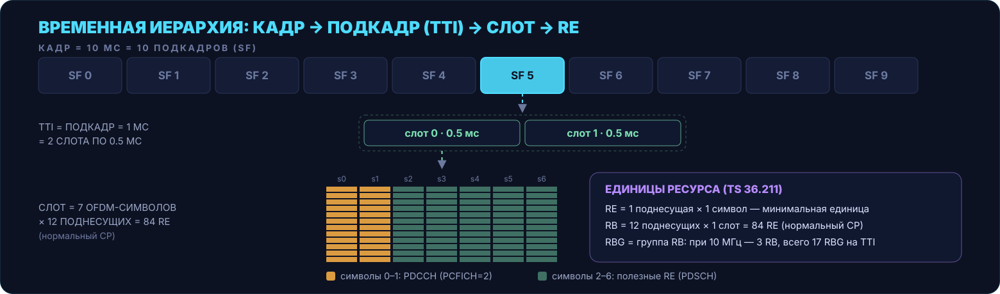
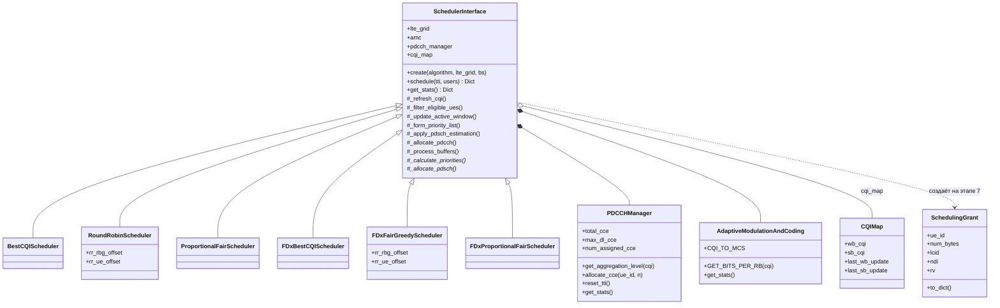
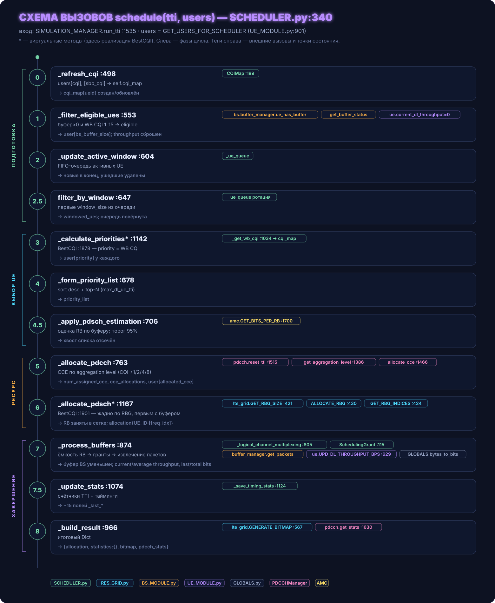
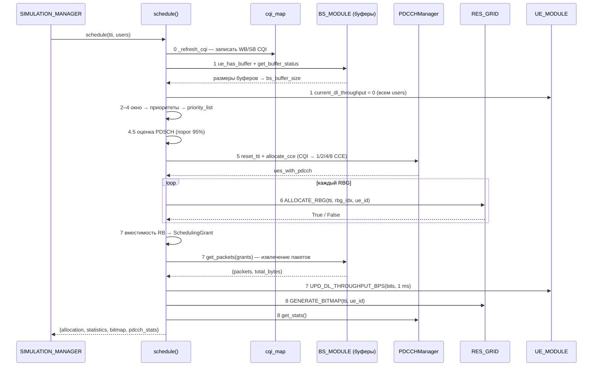
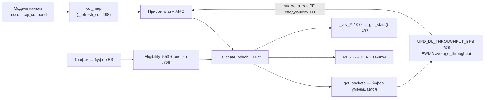

# Week 02 — Полный scheduling cycle и весь код `SCHEDULER.py`

На этой неделе разбирался весь файл `SCHEDULER.py`: из каких блоков он состоит, что делает каждый класс и метод, и как один вызов `schedule()` проходит путь от входных данных UE до изменения буферов и статистики соседних модулей. Первая неделя закрывала назначение модуля и модели планирования; эта неделя закрывает механику цикла и полную карту кода: классы, вспомогательные структуры, точки подмены алгоритмов, состояние между вызовами и статистику.

Числа сценария получены прогоном скрипта [`scripts/scenario_tti5.py`](../scripts/scenario_tti5.py): он собирает стенд на реальных модулях проекта (ресурсная сетка, базовая станция с буфером, три UE с пакетами), вызывает `schedule(5, users)` и печатает состояние до и после, verbose-лог и статистику. Прогон показал поведение в точках, которые при чтении кода легко пропустить: отсечение хвоста списка предварительной оценкой PDSCH, порядок выделения CCE, извлечение пакетов из буфера и обновление средней пропускной способности.

<details open>
<summary>📑 Оглавление</summary>

1. [Задачи недели](#1-задачи-недели)
2. [Вход в цикл: откуда приходят данные UE](#2-вход-в-цикл-откуда-приходят-данные-ue)
3. [Весь код файла: карта классов и методов](#3-весь-код-файла-карта-классов-и-методов)
4. [Схема вызовов schedule()](#4-схема-вызовов-schedule)
5. [Этапы одного TTI: входы, выходы, побочные эффекты](#5-этапы-одного-tti-входы-выходы-побочные-эффекты)
6. [Сценарий: 3 UE, BestCQI, 10 МГц, TTI 5](#6-сценарий-3-ue-bestcqi-10-мгц-tti-5)
7. [Побочные изменения состояния: полная карта](#7-побочные-изменения-состояния-полная-карта)
8. [Как результат уходит наружу: статистика](#8-как-результат-уходит-наружу-статистика)
9. [Сверка кода со спецификациями 3GPP](#9-сверка-кода-со-спецификациями-3gpp)
10. [Итоги недели](#10-итоги-недели)
11. [Источники](#11-источники)

</details>

---


## 1. Задачи недели


На неделю нужно было проследить по коду полный scheduling cycle: данные UE → выбор → распределение ресурсов → изменение буферов и статистики, и подготовить схему вызовов для одного небольшого сценария с указанием входов, выходов и побочных изменений состояния.

Статус выполнения:

- [x] Полный scheduling cycle прослежен по коду: этапы 0–8, от `_refresh_cqi` до `_build_result`
- [x] Схема вызовов для небольшого сценария: 3 UE, BestCQI, 10 МГц, TTI 5 — с числовыми значениями каждого шага
- [x] Для каждого вызова зафиксированы входы, выходы и побочные изменения состояния (разделы 4–7)
- [x] Карта всего файла: классы, методы, матрица переопределений, константы (раздел 3)
- [x] Таблицы модуля сверены со спецификациями 3GPP (раздел 9)

Изучаемый файл — [`SCHEDULER.py`](https://github.com/sherokiddo/project_py_scheduler/blob/dev/PyScheduler/SCHEDULER.py) из репозитория [`sherokiddo/project_py_scheduler`](https://github.com/sherokiddo/project_py_scheduler/tree/dev), 2694 строки, версия модуля v2.1.0 по [документации релиза](https://github.com/sherokiddo/project_py_scheduler/blob/dev/PyScheduler/Documentation/doc_scheduler_v2.1.0.md). Соседние модули рассматривались только как границы вызова: что входит в планировщик, что выходит и какое состояние он меняет снаружи. Все номера строк в тексте — ссылки на код на момент написания.

<div align="right"><sub><a href="#week-02--полный-scheduling-cycle-и-весь-код-schedulerpy">↑ к началу</a> · <a href="#2-вход-в-цикл-откуда-приходят-данные-ue">дальше →</a></sub></div>

---


## 2. Вход в цикл: откуда приходят данные UE

Планировщик не живёт сам по себе: один раз в миллисекунду его вызывает менеджер симуляции. Один TTI в [`SIMULATION_MANAGER.run_tti()`](https://github.com/sherokiddo/project_py_scheduler/blob/dev/PyScheduler/SIMULATION_MANAGER.py#L1491) состоит из трёх шагов, и планировщик — всегда последний. Сначала обновляется физика: позиции и канал пользователей, после чего у каждого UE появляются свежие `ue.cqi` и `ue.cqi_subband`. Затем генератор трафика кладёт пакеты в буферы базовой станции. И только после этого собирается вход планировщика:

```python
# SIMULATION_MANAGER.py:1534–1535
users = self.ue_collection.GET_USERS_FOR_SCHEDULER()
sched_result = self.scheduler.schedule(current_time, users)
```

Входной контракт — список словарей `users`, который собирает [`GET_USERS_FOR_SCHEDULER()`](https://github.com/sherokiddo/project_py_scheduler/blob/dev/PyScheduler/UE_MODULE.py#L901) в `UE_MODULE.py`. На каждый UE ровно четыре поля:

```python
{
    "UE_ID":   ue.UE_ID,        # идентификатор
    "cqi":     ue.cqi,          # wideband CQI 1..15 (результат модели канала)
    "sbb_cqi": ue.cqi_subband,  # subband CQI per RBG (ключ с опечаткой, но это контракт)
    "ue":      ue,              # живая ссылка на объект UE
}
```

> [!IMPORTANT]
> Это **срез состояния на начало TTI**, а не источник данных целиком. CQI приходит из модели канала; ссылка `ue` нужна, чтобы в конце цикла обновить статистику пропускной способности; а размеры буферов в словарь **не попадают** — их планировщик читает напрямую из менеджера буферов базовой станции на этапе 1 и сам дописывает в словарь поле `bs_buffer_size`.

Временная иерархия, в которой живёт вызов (один вызов `schedule()` = один TTI = один подкадр): кадр 10 мс = 10 подкадров, подкадр (TTI) 1 мс = 2 слота по 0.5 мс, RB = 12 поднесущих × 1 слот, при нормальном CP в слоте 7 OFDM-символов. Ресурсная сетка проекта повторяет эту иерархию классами `Frame → Subframe → Slot → RES_BLCK` ([документация LTE_GRID, §2](https://github.com/sherokiddo/project_py_scheduler/blob/dev/PyScheduler/Documentation/LTE_GRID_%D0%B4%D0%BE%D0%BA%D1%83%D0%BC%D0%B5%D0%BD%D1%82%D0%B0%D1%88%D0%BA%D0%B0.docx)).



Сам планировщик создаётся один раз на симуляцию фабрикой [`SchedulerInterface.create()`](https://github.com/sherokiddo/project_py_scheduler/blob/dev/PyScheduler/SCHEDULER.py#L233) из [`SIMULATION_MANAGER.py:1196`](https://github.com/sherokiddo/project_py_scheduler/blob/dev/PyScheduler/SIMULATION_MANAGER.py#L1196). Фабрика принимает имя алгоритма (`'BestCQI'`, `'ProportionalFair'`, `'RoundRobin'`, `'FD_BCQI'`, `'FD_FGS'`, `'FD_PF'`) и возвращает экземпляр конкретного класса — внешний код работает с единым интерфейсом. Объект переживает отдельные TTI, поэтому часть его состояния (карта CQI, очередь окна, смещения Round Robin) переносится между вызовами и влияет на будущие решения.

> 📄 **Документация:** [SIMULATION_MANAGER.py:1491–1537](https://github.com/sherokiddo/project_py_scheduler/blob/dev/PyScheduler/SIMULATION_MANAGER.py#L1491) · [UE_MODULE.py:901–919](https://github.com/sherokiddo/project_py_scheduler/blob/dev/PyScheduler/UE_MODULE.py#L901) · [doc_scheduler_v2.1.0.md, §Factory Pattern](https://github.com/sherokiddo/project_py_scheduler/blob/dev/PyScheduler/Documentation/doc_scheduler_v2.1.0.md) · TS 36.211 §5 (frame structure), §6.2.3 (resource block) · [LTE_GRID-документация §2](https://github.com/sherokiddo/project_py_scheduler/blob/dev/PyScheduler/Documentation/LTE_GRID_%D0%B4%D0%BE%D0%BA%D1%83%D0%BC%D0%B5%D0%BD%D1%82%D0%B0%D1%88%D0%BA%D0%B0.docx)

<div align="right"><sub><a href="#week-02--полный-scheduling-cycle-и-весь-код-schedulerpy">↑ к началу</a> · <a href="#1-задачи-недели">← назад</a> · <a href="#3-весь-код-файла-карта-классов-и-методов">дальше →</a></sub></div>

---


## 3. Весь код файла: карта классов и методов

Файл состоит из двенадцати блоков: шапка-журнал изменений, импорты, две структуры данных, базовый класс с фабрикой и этапами, два вспомогательных класса (PDCCH и AMC), шесть планировщиков и финальный roadmap. Таблица ниже — полная раскладка файла по строкам; остальные разделы отсылают к этим номерам.

| Строки | Блок | Роль |
|---|---|---|
| [1–106](https://github.com/sherokiddo/project_py_scheduler/blob/dev/PyScheduler/SCHEDULER.py#L1) | docstring-шапка | журнал версий v1.0.5 → v2.1.0: баг `last_served_user`, появление AMC и тестов, PDCCH в v1.0.8, новая архитектура v2.0 (Factory, `SchedulerInterface`, окно), FD-планировщики и CQIMap в v2.1.0 |
| [108–112](https://github.com/sherokiddo/project_py_scheduler/blob/dev/PyScheduler/SCHEDULER.py#L108) | импорты | `GLOBALS`, `time`, `dataclass`, `typing`; импорт `BaseStation` из BS_MODULE не используется |
| [115–182](https://github.com/sherokiddo/project_py_scheduler/blob/dev/PyScheduler/SCHEDULER.py#L115) | `SchedulingGrant` | грант извлечения данных из буфера: `ue_id`, `num_bytes`, `lcid`, `ndi`, `harq_process_id`, `rv`; валидация `num_bytes ≥ 0` и `rv ∈ [0..3]`; `to_dict()` |
| [189–207](https://github.com/sherokiddo/project_py_scheduler/blob/dev/PyScheduler/SCHEDULER.py#L189) | `CQIMap` | датакласс-хранилище CQI на UE: `wb_cqi`, `sb_cqi` (per RBG) и метки времени обновлений |
| [214–1226](https://github.com/sherokiddo/project_py_scheduler/blob/dev/PyScheduler/SCHEDULER.py#L214) | `SchedulerInterface` | ядро модуля: фабрика `create` :233, `available_algorithms` :273, `__init__` :288, `schedule` :340, `get_stats` :432, методы этапов :498–1138, абстрактные `_calculate_priorities` :1142 и `_allocate_pdsch` :1167, HARQ-заглушка :1201 |
| [1232–1667](https://github.com/sherokiddo/project_py_scheduler/blob/dev/PyScheduler/SCHEDULER.py#L1232) | `PDCCHManager` | учёт CCE: валидация параметров :1277, таблица `total_cce` :1317, aggregation level :1386, проверка бюджета :1435, `allocate_cce` :1466, `reset_tti` :1515, заглушка `release_cce` :1538, геттеры и `get_stats` :1594–1630 |
| [1673–1841](https://github.com/sherokiddo/project_py_scheduler/blob/dev/PyScheduler/SCHEDULER.py#L1673) | `AdaptiveModulationAndCoding` | таблица `CQI_TO_MCS` :1680, `GET_BITS_PER_RB` :1700, `get_stats` :1725 (считает метрики по кэшу `_last_*` планировщика) |
| [1847–1953](https://github.com/sherokiddo/project_py_scheduler/blob/dev/PyScheduler/SCHEDULER.py#L1847) | `BestCQIScheduler` | priority = WB CQI; жадное TD-распределение RBG |
| [1955–2071](https://github.com/sherokiddo/project_py_scheduler/blob/dev/PyScheduler/SCHEDULER.py#L1955) | `RoundRobinScheduler` | ротация очереди; по одному RBG каждому UE по кругу; смещения `rr_rbg_offset`, `rr_ue_offset` |
| [2073–2183](https://github.com/sherokiddo/project_py_scheduler/blob/dev/PyScheduler/SCHEDULER.py#L2073) | `ProportionalFairScheduler` | priority = instant_rate / average_throughput; жадное TD-распределение |
| [2185–2307](https://github.com/sherokiddo/project_py_scheduler/blob/dev/PyScheduler/SCHEDULER.py#L2185) | `FDxBestCQIScheduler` | на каждом RBG побеждает максимум SB CQI (fallback на WB) |
| [2309–2492](https://github.com/sherokiddo/project_py_scheduler/blob/dev/PyScheduler/SCHEDULER.py#L2309) | `FDxFairGreedyScheduler` | RR-очередь в TD + выбор по SB CQI в FD + ограничение «один UE — один RBG за раунд» (`served_in_round`) |
| [2494–2674](https://github.com/sherokiddo/project_py_scheduler/blob/dev/PyScheduler/SCHEDULER.py#L2494) | `FDxProportionalFairScheduler` | WB PF задаёт порядок выдачи CCE, на каждом RBG побеждает максимум PF-метрики по SB CQI |
| [2676–2694](https://github.com/sherokiddo/project_py_scheduler/blob/dev/PyScheduler/SCHEDULER.py#L2676) | финальный TODO-roadmap | вынести buffer processing в BufferManager; уйти от RES_GRID к DCI + AllocationTracker; каноничный output и DCI; QoS; tie-break; венгерский алгоритм; защита голодающих UE |



**Матрица переопределений.** Различия алгоритмов локальны: базовый класс реализует весь цикл, подклассы подставляют два-три метода.

| Планировщик (строки) | `_calculate_priorities` | `_apply_pdsch_estimation` | `_allocate_pdsch` | доп. состояние |
|---|---|---|---|---|
| BestCQI (1847) | priority = WB CQI [:1878](https://github.com/sherokiddo/project_py_scheduler/blob/dev/PyScheduler/SCHEDULER.py#L1878) | базовый (порог 95%) | жадный TD [:1901](https://github.com/sherokiddo/project_py_scheduler/blob/dev/PyScheduler/SCHEDULER.py#L1901) | — |
| RoundRobin (1955) | ротация от `rr_ue_offset` [:1985](https://github.com/sherokiddo/project_py_scheduler/blob/dev/PyScheduler/SCHEDULER.py#L1985) | pass-through [:1966](https://github.com/sherokiddo/project_py_scheduler/blob/dev/PyScheduler/SCHEDULER.py#L1966) | по 1 RBG по кругу [:2010](https://github.com/sherokiddo/project_py_scheduler/blob/dev/PyScheduler/SCHEDULER.py#L2010) | `rr_rbg_offset`, `rr_ue_offset` |
| ProportionalFair (2073) | inst_rate / avg [:2088](https://github.com/sherokiddo/project_py_scheduler/blob/dev/PyScheduler/SCHEDULER.py#L2088) | базовый (порог 95%) | жадный TD [:2130](https://github.com/sherokiddo/project_py_scheduler/blob/dev/PyScheduler/SCHEDULER.py#L2130) | — |
| FD_BCQI (2185) | priority = WB CQI [:2220](https://github.com/sherokiddo/project_py_scheduler/blob/dev/PyScheduler/SCHEDULER.py#L2220) | pass-through [:2213](https://github.com/sherokiddo/project_py_scheduler/blob/dev/PyScheduler/SCHEDULER.py#L2213) | per-RBG max SB CQI [:2239](https://github.com/sherokiddo/project_py_scheduler/blob/dev/PyScheduler/SCHEDULER.py#L2239) | — |
| FD_FGS (2309) | RR-ротация [:2364](https://github.com/sherokiddo/project_py_scheduler/blob/dev/PyScheduler/SCHEDULER.py#L2364) | pass-through [:2347](https://github.com/sherokiddo/project_py_scheduler/blob/dev/PyScheduler/SCHEDULER.py#L2347) | per-RBG SB CQI + `served_in_round` [:2393](https://github.com/sherokiddo/project_py_scheduler/blob/dev/PyScheduler/SCHEDULER.py#L2393) | `rr_rbg_offset`, `rr_ue_offset` |
| FD_PF (2494) | WB PF [:2558](https://github.com/sherokiddo/project_py_scheduler/blob/dev/PyScheduler/SCHEDULER.py#L2558) | pass-through [:2541](https://github.com/sherokiddo/project_py_scheduler/blob/dev/PyScheduler/SCHEDULER.py#L2541) | per-RBG PF по SB CQI [:2601](https://github.com/sherokiddo/project_py_scheduler/blob/dev/PyScheduler/SCHEDULER.py#L2601) | — |

**Вспомогательные классы.** `PDCCHManager` живёт по циклу TTI: `reset_tti()` обнуляет счётчики в начале этапа 5, `allocate_cce()` раздаёт бюджет `max_dl_cce` (по умолчанию весь `total_cce` из таблицы полоса×PCFICH), повторное выделение одному UE в том же TTI отклоняется, а `release_cce()` — заглушка: освободить CCE при неудаче PDSCH пока нельзя, они доживают до следующего `reset_tti()`. `AdaptiveModulationAndCoding` — единственная точка, где CQI превращается в биты: таблица `CQI_TO_MCS` даёт модуляцию и code rate, `GET_BITS_PER_RB` вычитает из RE служебные символы (PCFICH, CRS); обратно в статистику AMC смотрит через `get_stats()`, читая кэш `_last_allocation` / `_last_users` планировщика — обратная связь объектов. `CQIMap` и `SchedulingGrant` — структуры данных: первая хранит CQI между отчётами, вторая описывает грант извлечения из буфера (создаётся на этапе 7 в `_logical_channel_multiplexing` и сразу потребляется `get_packets`); HARQ-поля гранта (`ndi`, `rv`, `harq_process_id`) пока не используются и ждут интеграции HARQ-менеджера.

**Ключевые константы модуля** (дефолты `__init__` и пороговые значения):

| Параметр | Значение | Где |
|---|---|---|
| `pcfich` | 2 | [:288](https://github.com/sherokiddo/project_py_scheduler/blob/dev/PyScheduler/SCHEDULER.py#L288) |
| `max_dl_ue_tti` | None (без лимита) | [:288](https://github.com/sherokiddo/project_py_scheduler/blob/dev/PyScheduler/SCHEDULER.py#L288) |
| `window_size` / `enable_window` | 100 / True | [:288](https://github.com/sherokiddo/project_py_scheduler/blob/dev/PyScheduler/SCHEDULER.py#L288) |
| `wb/sb_cqi_upd_interval` | 1 / 1 (каждый TTI) | [:288–338](https://github.com/sherokiddo/project_py_scheduler/blob/dev/PyScheduler/SCHEDULER.py#L288) |
| порог оценки PDSCH | 95% `rb_per_slot` | [:706](https://github.com/sherokiddo/project_py_scheduler/blob/dev/PyScheduler/SCHEDULER.py#L706) |
| aggregation level | CQI 13–15→1, 10–12→2, 7–9→4, 1–6→8 CCE | [:1386](https://github.com/sherokiddo/project_py_scheduler/blob/dev/PyScheduler/SCHEDULER.py#L1386) |
| CCE при 10 МГц | PCFICH 1/2/3 → 8 / 25 / 41 | [:1317](https://github.com/sherokiddo/project_py_scheduler/blob/dev/PyScheduler/SCHEDULER.py#L1317) |
| RBG при 10 МГц | 3 RB → 17 RBG | RES_GRID [:421](https://github.com/sherokiddo/project_py_scheduler/blob/dev/PyScheduler/RES_GRID.py#L421) |
| bits/RB (PCFICH=2) | CQI 15→798, CQI 13→755, CQI 7→326 | [:1700](https://github.com/sherokiddo/project_py_scheduler/blob/dev/PyScheduler/SCHEDULER.py#L1700) |
| EWMA α | 0.002 | UE_MODULE [:644](https://github.com/sherokiddo/project_py_scheduler/blob/dev/PyScheduler/UE_MODULE.py#L644) |

> 📄 **Документация:** [doc_scheduler_v2.1.0.md](https://github.com/sherokiddo/project_py_scheduler/blob/dev/PyScheduler/Documentation/doc_scheduler_v2.1.0.md) (§Архитектура, §Иерархия классов, §FD, §SchedulingGrant, §AMC) · заголовок файла :1–106 (журнал версий) · [PR #26](https://github.com/sherokiddo/project_py_scheduler/pull/26) (история FD-планировщиков и CQIMap)

<div align="right"><sub><a href="#week-02--полный-scheduling-cycle-и-весь-код-schedulerpy">↑ к началу</a> · <a href="#2-вход-в-цикл-откуда-приходят-данные-ue">← назад</a> · <a href="#4-схема-вызовов-schedule">дальше →</a></sub></div>

---


## 4. Схема вызовов schedule()


Цвета внешних вызовов на схемах отчёта:

| Цвет | Модуль / объект |
|---|---|
| зелёный | SCHEDULER.py (внутренние структуры) |
| голубой | RES_GRID.py (ресурсная сетка) |
| оранжевый | BS_MODULE.py (буферы) |
| фиолетовый | UE_MODULE.py (объекты UE) |
| серый | GLOBALS.py |
| розовый | PDCCHManager |
| жёлтый | AMC |

Метод [`schedule(tti, users)`](https://github.com/sherokiddo/project_py_scheduler/blob/dev/PyScheduler/SCHEDULER.py#L340) — оркестратор: он не содержит логики конкретного алгоритма, а вызывает этапы в фиксированном порядке (официальный список этапов — в [документации модуля, §«Этапы планирования»](https://github.com/sherokiddo/project_py_scheduler/blob/dev/PyScheduler/Documentation/doc_scheduler_v2.1.0.md)). Алгоритм подставляется через два виртуальных метода: [`_calculate_priorities()`](https://github.com/sherokiddo/project_py_scheduler/blob/dev/PyScheduler/SCHEDULER.py#L1142) и [`_allocate_pdsch()`](https://github.com/sherokiddo/project_py_scheduler/blob/dev/PyScheduler/SCHEDULER.py#L1167) — в базовом классе они бросают `NotImplementedError`, реализацию даёт каждый из шести подклассов.



Сжатый вид той же схемы (номера строк соответствуют таблице раздела 5):

```
SIMULATION_MANAGER.run_tti :1535
└── scheduler.schedule(tti, users)                    SCHEDULER.py:340
    ├── ЭТАП 0   _refresh_cqi :498                    → cqi_map (датакласс CQIMap :189)
    ├── ЭТАП 1   _filter_eligible_ues :553             → BS_MODULE: ue_has_buffer, get_buffer_status
    │                                                      UE_MODULE: ue.current_dl_throughput = 0
    ├── ЭТАП 2   _update_active_window :604            → _ue_queue (FIFO)
    ├── ЭТАП 2.5 filter_by_window :647                 → windowed_ues + ротация очереди
    ├── ЭТАП 3   _calculate_priorities* :1142          → BestCQI :1878: priority = _get_wb_cqi :1034
    ├── ЭТАП 4   _form_priority_list :678              → sort desc + top-N (max_dl_ue_tti)
    ├── ЭТАП 4.5 _apply_pdsch_estimation :706          → AMC.GET_BITS_PER_RB :1700, порог 95%
    ├── ЭТАП 5   _allocate_pdcch :763                  → PDCCHManager :1232: reset_tti :1515,
    │                                                      get_aggregation_level :1386, allocate_cce :1466
    ├── ЭТАП 6   _allocate_pdsch* :1167                → BestCQI :1901 → RES_GRID: GET_RBG_SIZE :421,
    │                                                      ALLOCATE_RBG :430, GET_RBG_INDICES :424
    ├── ЭТАП 7   _process_buffers :874                 → _logical_channel_multiplexing :805
    │                                                      (SchedulingGrant :115)
    │                                                      BS_MODULE: get_packets(grants)
    │                                                      UE_MODULE: UPD_DL_THROUGHPUT_BPS :629
    │                                                      GLOBALS: bytes_to_bits :201
    ├── ЭТАП 7.5 _update_stats :1074, _save_timing_stats :1124
    └── ЭТАП 8   _build_result :966                    → RES_GRID: GENERATE_BITMAP :567
                                                           PDCCHManager: get_stats :1630
        return {allocation, statistics:{}, bitmap, pdcch_stats}
```

<details>
<summary>Полный код оркестратора (SCHEDULER.py:340–430, нажми, чтобы развернуть)</summary>

```python
def schedule(self, tti: int, users: List[Dict]) -> Dict:
    t_sch_start = time.perf_counter()
    self._last_tti = tti

    # ЭТАП 0: Preparation and CQI Map Check
    if tti % self.wb_cqi_upd_interval == 0:
        self._refresh_cqi(tti, users)

    # ЭТАП 1: Eligibility checks
    eligible_ues = self._filter_eligible_ues(tti, users)
    if not eligible_ues:
        return self._empty_result()

    # ЭТАП 2: Active window update
    self._update_active_window(eligible_ues)

    # ЭТАП 2.5: Window filtering
    windowed_ues = self.filter_by_window(eligible_ues)
    if not windowed_ues:
        return self._empty_result()

    # ЭТАП 3: Priority calculation
    t_priority_start = time.perf_counter()
    prioritized_ues = self._calculate_priorities(windowed_ues, tti)
    self._last_prioritized_users = prioritized_ues
    priority_calc_time_us = (time.perf_counter() - t_priority_start) * 1_000_000

    # ЭТАП 4: PList formation
    t_sort_start = time.perf_counter()
    priority_list = self._form_priority_list(prioritized_ues, tti)
    priority_sort_time_us = (time.perf_counter() - t_sort_start) * 1_000_000
    self._last_priority_list_size = len(priority_list)

    if priority_list:
        self._last_avg_priority_value = sum(u.get('priority', 0) for u in priority_list) / len(priority_list)
    else:
        return self._empty_result()

    # Этап 4.5: PDSCH estimation
    priority_list_filtered = self._apply_pdsch_estimation(priority_list, tti)
    self._last_priority_list = priority_list_filtered
    self._last_priority_list_full = priority_list

    # ЭТАП 5: PDCCH allocation
    ues_with_pdcch = self._allocate_pdcch(priority_list_filtered)
    self._last_pdcch_blocked_count = len(priority_list_filtered) - len(ues_with_pdcch)
    if not ues_with_pdcch:
        return self._empty_result()

    # ЭТАП 6: PDSCH allocation
    allocation = self._allocate_pdsch(tti, ues_with_pdcch, eligible_ues)

    # ЭТАП 7: Buffer processing
    self._process_buffers(tti, users, allocation)

    # ЭТАП 7.5: Stats processing
    allocated_rbs = sum(len(rbs) for rbs in allocation.values())
    active_ues = sum(1 for rbs in allocation.values() if len(rbs) > 0)
    self._update_stats(tti, len(eligible_ues), allocated_rbs, active_ues)
    self._last_allocation = allocation.copy()
    self._last_users = users

    sch_time_us = (time.perf_counter() - t_sch_start) * 1_000_000
    self._save_timing_stats(sch_time_us, priority_calc_time_us, priority_sort_time_us)

    # ЭТАП 8: Result formation
    return self._build_result(allocation, users, eligible_ues, tti)
```

</details>

Динамику одного TTI во времени показывает sequence-диаграмма — на ней видно, в какие моменты планировщик выходит за свои границы:



Три свойства цикла, которые отражены на схеме:

1. **Досрочные выходы.** После этапов 1, 2.5, 4 и 5 при пустом списке вызов возвращается через [`_empty_result()`](https://github.com/sherokiddo/project_py_scheduler/blob/dev/PyScheduler/SCHEDULER.py#L1007) — он не просто пустой: он обнуляет счётчики eligible/RB/active, поэтому «пустой TTI» всё равно попадает в метрики. Нюанс, найденный при разборе кода: `sch_pdcch_blocked_count` и `sch_avg_priority_value` при этом **не сбрасываются** и «залипают» с прошлого TTI (в Python это атрибуты экземпляра, которые `_empty_result` не трогает).
2. **Сначала PDCCH, потом PDSCH.** Управляющий ресурс жёстко ограничен (25 CCE при 10 МГц и PCFICH=2 — см. раздел 9), поэтому оценка PDSCH на этапе 4.5 существует, чтобы не потратить CCE на тех, кому не хватит ресурса данных. Это соответствует реальной практике: UE не может принять PDSCH, не получив DCI на PDCCH (TS 36.213 §6.8.1).
3. **Этап 7 обходит всех users**, а не только запланированных: незапланированным статистика обновляется нулём, чтобы EWMA-среднее корректно «остывало» — иначе знаменатель PF-метрики замёрз бы на старом значении.

> 📄 **Документация:** [SCHEDULER.py:340–430](https://github.com/sherokiddo/project_py_scheduler/blob/dev/PyScheduler/SCHEDULER.py#L340) · [doc_scheduler_v2.1.0.md, §Этапы планирования](https://github.com/sherokiddo/project_py_scheduler/blob/dev/PyScheduler/Documentation/doc_scheduler_v2.1.0.md) · TS 36.213 §6.8.1 (PDCCH/DCI) · TS 36.321 §5.4 (планирование и LCP)

<div align="right"><sub><a href="#week-02--полный-scheduling-cycle-и-весь-код-schedulerpy">↑ к началу</a> · <a href="#3-весь-код-файла-карта-классов-и-методов">← назад</a> · <a href="#5-этапы-одного-tti-входы-выходы-побочные-эффекты">дальше →</a></sub></div>

---


## 5. Этапы одного TTI: входы, выходы, побочные эффекты

Каждый этап разобран по одной схеме: что делает → вход → выход → побочный эффект. Сводная таблица с ссылками на код — в конце раздела.

### Этап 0 — обновление карты CQI

[`_refresh_cqi()`](https://github.com/sherokiddo/project_py_scheduler/blob/dev/PyScheduler/SCHEDULER.py#L498) вызывается при `tti % wb_cqi_upd_interval == 0`; интервал по умолчанию 1 — карта обновляется каждый TTI. Метод копирует `user['cqi']` (если значение в диапазоне 1–15) в `self.cqi_map[ueid].wb_cqi`, а непустой `user['sbb_cqi']` — в `sb_cqi`. Для нового UE создаётся запись датакласса [`CQIMap`](https://github.com/sherokiddo/project_py_scheduler/blob/dev/PyScheduler/SCHEDULER.py#L189) с отметкой `last_wb_update = tti`. Периодичность отчётов CQI в реальных сетях задаётся конфигурацией CQI-репортинга (TS 36.331, `CQI-ReportConfig`); здесь аналог — настраиваемые интервалы `wb_cqi_upd_interval` / `sb_cqi_upd_interval`.

С этого момента до конца TTI единственные источники CQI для всех алгоритмов — [`_get_wb_cqi()`](https://github.com/sherokiddo/project_py_scheduler/blob/dev/PyScheduler/SCHEDULER.py#L1034) (нет записи → 0) и [`_get_sb_cqi()`](https://github.com/sherokiddo/project_py_scheduler/blob/dev/PyScheduler/SCHEDULER.py#L1054) (нет записи → пустой список; FD-алгоритмы делают fallback на WB). Нулевой CQI автоматически отсеивает UE на следующем этапе.

> [!WARNING]
> Нюанс, найденный при разборе: невалидный CQI (вне 1–15) **не затирает** существующую запись карты — UE продолжает планироваться по последнему корректному отчёту. Для subband-списка то же: пустой `sbb_cqi` старое значение не очищает.

- **Вход:** `users[i]['cqi']`, `users[i]['sbb_cqi']`. **Выход:** нет (mutates). **Побочный эффект:** `self.cqi_map`.

### Этап 1 — отбор допущенных UE

[`_filter_eligible_ues()`](https://github.com/sherokiddo/project_py_scheduler/blob/dev/PyScheduler/SCHEDULER.py#L553) начинает с побочного эффекта: **всем** пользователям сбрасывается `ue.current_dl_throughput = 0` — статистика прошлого TTI обнуляется до расчёта новой. Затем на каждом UE три проверки: существует ли буфер ([`buffer_manager.ue_has_buffer`](https://github.com/sherokiddo/project_py_scheduler/blob/dev/PyScheduler/BS_MODULE.py#L318)), больше ли нуля суммарный размер буфера ([`get_buffer_status`](https://github.com/sherokiddo/project_py_scheduler/blob/dev/PyScheduler/BS_MODULE.py#L280) возвращает список статусов по логическим каналам, размеры суммируются в `user['bs_buffer_size']`), валиден ли WB CQI из карты. Проверка «есть данные для передачи» перед планированием соответствует логике MAC: планировщик опирается на Buffer Status (TS 36.321 §5.4.5, BSR). В коде закомментированы проверки HARQ-процессов и DRX — заделы будущих версий (TS 36.321 §5.3.1, §5.7).

- **Вход:** `users`, `cqi_map`, буферы BS. **Выход:** `eligible_ues`. **Побочные эффекты:** `ue.current_dl_throughput = 0` у всех; `users[i]['bs_buffer_size']`. Пусто → `_empty_result()`.

### Этапы 2 и 2.5 — скользящее окно активных UE

[`_update_active_window()`](https://github.com/sherokiddo/project_py_scheduler/blob/dev/PyScheduler/SCHEDULER.py#L604) поддерживает FIFO-очередь `_ue_queue`: новички добавляются в конец, исчезнувшие удаляются. [`filter_by_window()`](https://github.com/sherokiddo/project_py_scheduler/blob/dev/PyScheduler/SCHEDULER.py#L647) берёт первые `window_size` (по умолчанию 100) идентификаторов, оставляет из них допущенных на этом TTI и **ротирует** обработанных в конец очереди. Окно — проприетарное решение модуля (в TODO кода перечислены альтернативы: token ring, time-based, exponential decay); его назначение — ограничить число рассматриваемых UE при больших N и дать материал для будущего QoS. При числе UE меньше окна проходят все, но ротация очереди всё равно происходит — это состояние переживает TTI.

<p align="center">
  
  <br>
  <sub>FIFO: вход в хвост очереди, выход с головы. `_ue_queue` скользящего окна работает по этому же принципу — новые UE встают в конец, обработанные ротируются в хвост · <a href="https://commons.wikimedia.org/wiki/File:Fifo_queue.svg">Wikimedia Commons</a></sub>
</p>

- **Вход:** `eligible_ues`. **Выход:** `windowed_ues`. **Побочный эффект:** `_ue_queue` (ротация). Пусто → `_empty_result()`.

### Этап 3 — приоритеты (виртуальный)

[`_calculate_priorities()`](https://github.com/sherokiddo/project_py_scheduler/blob/dev/PyScheduler/SCHEDULER.py#L1142) — первая точка расхождения алгоритмов (реализации — в матрице раздела 3). Контракт: записать `user['priority']`. Best CQI кладёт WB CQI; Proportional Fair — отношение мгновенной скорости к средней; Round Robin — убывающие номера по ротации очереди. Время этапа замеряется `time.perf_counter()` и уходит в статистику.

- **Вход:** `windowed_ues`, `cqi_map`, `ue.average_throughput` (PF). **Выход:** те же словари с `priority`. **Побочный эффект:** поле `priority` (+ `instant_rate` у PF).

### Этап 4 — список планирования

[`_form_priority_list()`](https://github.com/sherokiddo/project_py_scheduler/blob/dev/PyScheduler/SCHEDULER.py#L678) сортирует по `priority` убыванию и обрезает до `max_dl_ue_tti` (по умолчанию None — проходят все). Результат кэшируется в `_last_priority_list_full` и виден в статистике как `sch_priority_list`.

- **Вход:** приоритизированные UE. **Выход:** `priority_list`. **Побочные эффекты:** кэш статистики. Пусто → `_empty_result()`.

### Этап 4.5 — предварительная оценка PDSCH

[`_apply_pdsch_estimation()`](https://github.com/sherokiddo/project_py_scheduler/blob/dev/PyScheduler/SCHEDULER.py#L706) оценивает потребность каждого кандидата: `rb_needed = min(buffer_bits // bits_per_rb, total_rb)`, где `bits_per_rb` даёт [`AMC.GET_BITS_PER_RB`](https://github.com/sherokiddo/project_py_scheduler/blob/dev/PyScheduler/SCHEDULER.py#L1700) по WB CQI. Набор прекращается при достижении 95% `rb_per_slot`; первый в списке проходит всегда. Round Robin и все FD-модели переопределяют этап в pass-through ([RR: `:1966`](https://github.com/sherokiddo/project_py_scheduler/blob/dev/PyScheduler/SCHEDULER.py#L1966), [FD_BCQI: `:2213`](https://github.com/sherokiddo/project_py_scheduler/blob/dev/PyScheduler/SCHEDULER.py#L2213)) — у них распределение равномерное или per-RBG, и жадная оценка им не подходит.

- **Вход:** `priority_list`, `bs_buffer_size`, AMC. **Выход:** укороченный список. **Побочный эффект:** `_last_priority_list`.

### Этап 5 — выделение PDCCH (CCE)

[`_allocate_pdcch()`](https://github.com/sherokiddo/project_py_scheduler/blob/dev/PyScheduler/SCHEDULER.py#L763) начинается с [`pdcch_manager.reset_tti()`](https://github.com/sherokiddo/project_py_scheduler/blob/dev/PyScheduler/SCHEDULER.py#L1515) — счётчики CCE обнуляются каждый TTI (поэтому заглушка [`release_cce()`](https://github.com/sherokiddo/project_py_scheduler/blob/dev/PyScheduler/SCHEDULER.py#L1538) пока безопасна). Для каждого кандидата [`get_aggregation_level(cqi)`](https://github.com/sherokiddo/project_py_scheduler/blob/dev/PyScheduler/SCHEDULER.py#L1386) переводит качество канала в число CCE: 13–15 → 1, 10–12 → 2, 7–9 → 4, 1–6 → 8. Набор уровней {1, 2, 4, 8} — стандартный для PDCCH (TS 36.213 §6.8.1); сам CCE состоит из 9 REG по 4 RE (TS 36.211 §6.8.1). Зависимость «хуже канал → выше уровень агрегации» воспроизводит принцип повторяющейся передачи DCI. [`allocate_cce()`](https://github.com/sherokiddo/project_py_scheduler/blob/dev/PyScheduler/SCHEDULER.py#L1466) проверяет бюджет `max_dl_cce − num_assigned_cce`, при успехе пишет `cce_allocations[ue_id]` и `user['allocated_cce']`, при неудаче UE блокируется (`sch_pdcch_blocked_count` в статистике). Общий бюджет CCE задаётся таблицей [`_calculate_total_cce()`](https://github.com/sherokiddo/project_py_scheduler/blob/dev/PyScheduler/SCHEDULER.py#L1317) от пары (полоса, PCFICH)[^cce]; корректность значений PCFICH (1–3, для 1.4 МГц 2–4) проверяет [`_validate_parameters`](https://github.com/sherokiddo/project_py_scheduler/blob/dev/PyScheduler/SCHEDULER.py#L1277) — это соответствует CFI из TS 36.211 §6.7.

- **Вход:** отфильтрованный `priority_list`, `cqi_map`. **Выход:** `ues_with_pdcch`. **Побочные эффекты:** `num_assigned_cce`, `cce_allocations`, `user['allocated_cce']`. Пусто → `_empty_result()`.

### Этап 6 — распределение PDSCH (RBG) — виртуальный

[`_allocate_pdsch()`](https://github.com/sherokiddo/project_py_scheduler/blob/dev/PyScheduler/SCHEDULER.py#L1167) — вторая точка расхождения алгоритмов и место, где планировщик выходит в ресурсную сетку. Общий механизм: цикл по RBG, на каждом шаге выбирается получатель, вызывается [`lte_grid.ALLOCATE_RBG(tti, rbg_idx, ue_id)`](https://github.com/sherokiddo/project_py_scheduler/blob/dev/PyScheduler/RES_GRID.py#L430) (атомарно: занимаются все RB группы в **обоих** слотах, при неудаче — откат `RELEASE_RBG`), индексы RB добавляются в allocation через [`GET_RBG_INDICES`](https://github.com/sherokiddo/project_py_scheduler/blob/dev/PyScheduler/RES_GRID.py#L424), локальный словарь `remaining_buffer` (биты) уменьшается на оценочную ёмкость RBG. Прерывание — когда все остатки обнулились. Распределение именно по RBG соответствует TS 36.213 §7.1.6 (Type 0 — bitmap RBG); размер RBG берётся из [`GET_RBG_SIZE()`](https://github.com/sherokiddo/project_py_scheduler/blob/dev/PyScheduler/RES_GRID.py#L421) по таблице `RBG_SIZE_TABLE`, которая совпадает с TS 36.213 Table 7.1.6.1-1 (см. раздел 9).

Правило выбора получателя задаёт алгоритм (матрица раздела 3): жадное TD у BestCQI и PF, циклическое у RoundRobin, per-RBG по SB CQI у FD-моделей с fallback на WB при отсутствии subband-отчёта (частотная селективность, идея описана в [doc_scheduler_v2.1.0.md §FD](https://github.com/sherokiddo/project_py_scheduler/blob/dev/PyScheduler/Documentation/doc_scheduler_v2.1.0.md) и [PR #26](https://github.com/sherokiddo/project_py_scheduler/pull/26)).

- **Вход:** `ues_with_pdcch`, `bs_buffer_size`, `cqi_map`, AMC. **Выход:** `allocation: {UE_ID: [freq_idx]}`. **Побочный эффект:** **RB в сетке заняты** (внешнее состояние).

### Этап 7 — извлечение из буфера и статистика UE

[`_process_buffers()`](https://github.com/sherokiddo/project_py_scheduler/blob/dev/PyScheduler/SCHEDULER.py#L874) превращает выделение ресурса в фактическую «передачу». Для каждого user: `max_bits = allocated_rbs · GET_BITS_PER_RB(wb_cqi)`, `max_bytes = max_bits // 8` — вместимость выделенного. [`_logical_channel_multiplexing()`](https://github.com/sherokiddo/project_py_scheduler/blob/dev/PyScheduler/SCHEDULER.py#L805) упаковывает её в гранты [`SchedulingGrant`](https://github.com/sherokiddo/project_py_scheduler/blob/dev/PyScheduler/SCHEDULER.py#L115) (`ue_id`, `num_bytes`, `lcid`, плюс HARQ-поля `ndi`/`rv`/`harq_process_id` — задел под ретрансляции): в режиме Simple Buffer один грант на весь TB, в Layered — делёж поровну между активными логическими каналами (в комментарии кода такая стратегия названа несправедливой). Это упрощённый аналог мультиплексирования MAC SDU в один TB (TS 36.321 §5.1, §6.1.2) с приоритизацией логических каналов (§5.4.3). Гранты уходят в [`buffer_manager.get_packets(grants)`](https://github.com/sherokiddo/project_py_scheduler/blob/dev/PyScheduler/BS_MODULE.py#L295) — **физическое извлечение пакетов**, точка невозврата цикла. Реально извлечённое (его может быть меньше вместимости) переводится в биты через [`GLOBALS.bytes_to_bits`](https://github.com/sherokiddo/project_py_scheduler/blob/dev/PyScheduler/GLOBALS.py#L201), добавляется остаток `max_bits mod 8`, и сумма уходит в [`ue.UPD_DL_THROUGHPUT_BPS(bits, 1)`](https://github.com/sherokiddo/project_py_scheduler/blob/dev/PyScheduler/UE_MODULE.py#L629): мгновенная скорость `bits·1000/1мс`, EWMA-среднее `average_throughput` с α = 0.002, `last_transmitted_bits`, `total_dl_transmitted_bits`. EWMA — классический экспоненциальный сглаживатель (Roberts, 1959); в PF-литературе среднее throughput считается именно так (Jalali et al., 2000).[^jalali]


$$
B_{max} = N_{RB} \cdot \beta(CQI_{wb}), \qquad
Y_{max} = \left\lfloor \frac{B_{max}}{8} \right\rfloor, \qquad
B_{tx} = 8 \cdot Y_{tx} + (B_{max} \bmod 8)
$$

Обозначения: `B_max` — `max_bits` (вместимость выделенных RB), `β` — `GET_BITS_PER_RB(cqi)`, `Y_max` — `max_bytes` (размер гранта), `Y_tx` — `total_bytes`, фактически извлечённые `get_packets`, `B_tx` — `transmitted_bits`.


$$
r(t) = \frac{B_{tx} \cdot 1000}{\Delta t}, \qquad
R(t) = (1-\alpha)\, R(t-1) + \alpha\, r(t), \qquad
\alpha = 0.002
$$

где `r(t)` — `current_dl_throughput` (бит/с, Δt = 1 мс), `R(t)` — `average_throughput` (EWMA-среднее), `B_tx` — биты, переданные за TTI.

Значение α = 0.002 — хардкод с TODO «вывести в управление»; в ревью PR #26 автор модуля объяснял выбор так: коэффициент задаёт скорость сходимости среднего — чем он меньше, тем сильнее влияние истории на текущее значение.[^ewma]

<p align="center">
  
  <br>
  <sub>Веса EWMA затухают экспоненциально: последние отсчёты весят больше всего, далёкая история — всё меньше. Так же «помнит» обслуженный throughput поле `average_throughput` · <a href="https://commons.wikimedia.org/wiki/File:Exponential_moving_average_weights_N%3D15.png">Wikimedia Commons</a></sub>
</p>

> [!CAUTION]
> Найденные при прогоне нюансы: (1) UE без выделения, но с живым буфером получает `UPD_DL_THROUGHPUT_BPS(0)` **дважды** (ветка «ноль RB» не делает continue, затем срабатывает ветка «max_bytes ≤ 0») — лишний нулевой шаг EWMA; (2) ёмкость для гранта считается по **WB** CQI, тогда как FD-алгоритмы на этапе 6 выбирают победителя по **SB** CQI — оценка и факт могут слегка расходиться; (3) точный размер TB в LTE определяется по таблицам TBS (TS 36.213 §7.1.7.2), а не формулой — на это в коде есть явный TODO (отклонение ~8–10%, отмечено и в [ревью PR #26](https://github.com/sherokiddo/project_py_scheduler/pull/26)).

- **Вход:** `allocation`, `users`, буферы BS, `cqi_map`. **Выход:** нет. **Побочные эффекты:** буфер BS уменьшен; `current/average_throughput`, `last/total_dl_transmitted_bits`; `last_ue_transmitted_bits`.

### Этапы 7.5–8 — внутренняя статистика и результат

[`_update_stats()`](https://github.com/sherokiddo/project_py_scheduler/blob/dev/PyScheduler/SCHEDULER.py#L1074) фиксирует счётчики TTI (допущено / активных UE / выделено RB), кэшируются `_last_allocation`, `_last_users` и тайминги этапов в микросекундах ([`_save_timing_stats`](https://github.com/sherokiddo/project_py_scheduler/blob/dev/PyScheduler/SCHEDULER.py#L1124)). [`_build_result()`](https://github.com/sherokiddo/project_py_scheduler/blob/dev/PyScheduler/SCHEDULER.py#L966) собирает ответ: `allocation`, пустая пока `statistics`, bitmap занятия RBG на каждого допущенного UE ([`GENERATE_BITMAP`](https://github.com/sherokiddo/project_py_scheduler/blob/dev/PyScheduler/RES_GRID.py#L567)) и `pdcch_stats` ([`get_stats`](https://github.com/sherokiddo/project_py_scheduler/blob/dev/PyScheduler/SCHEDULER.py#L1630)).

**Сводная таблица этапов:**

| # | метод (строка) | вход | выход | побочный эффект |
|---|---|---|---|---|
| 0 | `_refresh_cqi` :498 | users.cqi/sbb_cqi | — | `cqi_map` |
| 1 | `_filter_eligible_ues` :553 | users, буферы BS | eligible | `bs_buffer_size`; `current_dl_throughput=0` |
| 2 | `_update_active_window` :604 | eligible | — | `_ue_queue` |
| 2.5 | `filter_by_window` :647 | eligible | windowed | ротация `_ue_queue` |
| 3 | `_calculate_priorities`* :1142 | windowed | prioritized | `priority`, `instant_rate` |
| 4 | `_form_priority_list` :678 | prioritized | priority_list | `_last_*` |
| 4.5 | `_apply_pdsch_estimation` :706 | priority_list | filtered | `_last_priority_list` |
| 5 | `_allocate_pdcch` :763 | filtered | ues_with_pdcch | CCE-счётчики, `allocated_cce` |
| 6 | `_allocate_pdsch`* :1167 | ues_with_pdcch | allocation | **RB заняты в сетке** |
| 7 | `_process_buffers` :874 | allocation, users | — | **буфер извлечён**, throughput/EWMA |
| 7.5 | `_update_stats` :1074 | счётчики | — | `_last_*`, тайминги |
| 8 | `_build_result` :966 | allocation | Dict-результат | — |

> 📄 **Документация:** код по ссылкам выше · [doc_scheduler_v2.1.0.md](https://github.com/sherokiddo/project_py_scheduler/blob/dev/PyScheduler/Documentation/doc_scheduler_v2.1.0.md) (§CQIMap, §FD, §SchedulingGrant, §AMC) · TS 36.211 §6.7 (PCFICH/CFI), §6.8.1 (CCE=9 REG) · TS 36.213 §6.8.1 (агрегация 1/2/4/8), §7.1.6.1 (RBG), §7.1.7.2 (TBS) · TS 36.321 §5.1/§5.4.3/§6.1.2 (мультиплексирование, LCP) · Jalali et al. 2000 (PF) · Roberts 1959 (EWMA) · [LTE_GRID-документация §3.5](https://github.com/sherokiddo/project_py_scheduler/blob/dev/PyScheduler/Documentation/LTE_GRID_%D0%B4%D0%BE%D0%BA%D1%83%D0%BC%D0%B5%D0%BD%D1%82%D0%B0%D1%88%D0%BA%D0%B0.docx) (ALLOCATE/GET_RBG)

<div align="right"><sub><a href="#week-02--полный-scheduling-cycle-и-весь-код-schedulerpy">↑ к началу</a> · <a href="#4-схема-вызовов-schedule">← назад</a> · <a href="#6-сценарий-3-ue-bestcqi-10-мгц-tti-5">дальше →</a></sub></div>

---


## 6. Сценарий: 3 UE, BestCQI, 10 МГц, TTI 5

Сценарий маленький намеренно — каждый шаг сверяется с кодом и считается руками. Для прогона использовался скрипт [`scripts/scenario_tti5.py`](../scripts/scenario_tti5.py): стенд собирается на реальных модулях проекта — [`RES_GRID_LTE`](https://github.com/sherokiddo/project_py_scheduler/blob/dev/PyScheduler/RES_GRID.py), [`BaseStation`](https://github.com/sherokiddo/project_py_scheduler/blob/dev/PyScheduler/BS_MODULE.py#L1416) с Simple Buffer, три [`UserEquipment`](https://github.com/sherokiddo/project_py_scheduler/blob/dev/PyScheduler/UE_MODULE.py#L290) с пакетами [`Packet`](https://github.com/sherokiddo/project_py_scheduler/blob/dev/PyScheduler/TRAFFIC_MODEL.py#L99).

**Условия.** Полоса 10 МГц: 50 RB на слот ([`BANDWIDTH_TO_RB`](https://github.com/sherokiddo/project_py_scheduler/blob/dev/PyScheduler/RES_GRID.py#L283), соответствует TS 36.211 Table 5.6-1), 17 RBG по 3 RB ([`RBG_SIZE_TABLE`](https://github.com/sherokiddo/project_py_scheduler/blob/dev/PyScheduler/RES_GRID.py#L293), соответствует TS 36.213 Table 7.1.6.1-1 для 27–63 RB), 25 CCE при PCFICH=2. Алгоритм BestCQI, окно включено, лимит UE на TTI не задан.

| UE | WB CQI | Буфер BS | Пакет |
|---|---|---|---|
| 1 | 13 | 1000 B | один, 1000 B |
| 2 | 7 | 5000 B | один, 5000 B |
| 3 | 15 | 300 B | один, 300 B |

**Вход вызова:** `schedule(tti=5, users)` — три словаря контракта из раздела 2.

**Прогон по этапам** (числа — из фактического выполнения):

- **0.** `cqi_map = {1: wb=13, 2: wb=7, 3: wb=15}`, `last_wb_update=5`, `sb_cqi=[]` — сценарий TD.
- **1.** Все трое допущены: буферы существуют и непустые, CQI валидны. `bs_buffer_size = 1000/5000/300`; `current_dl_throughput` всех троих сброшен в 0.
- **2 / 2.5.** Очередь окна инициализирована `[1, 2, 3]`, все прошли, очередь ротирована (при 3 UE и окне 100 состав не меняется, но сам факт ротации важен для больших N).
- **3.** priority: UE3 = 15, UE1 = 13, UE2 = 7.
- **4.** priority_list = `[3, 1, 2]`.
- **4.5.** Ёмкость RB по AMC ([`:1700`](https://github.com/sherokiddo/project_py_scheduler/blob/dev/PyScheduler/SCHEDULER.py#L1700)): CQI 15 → 798 бит, CQI 13 → 755, CQI 7 → 326. Потребность: UE3 = 2400//798 = 3 RB; UE1 = 8000//755 = 10 RB; UE2 = min(40000//326, 50) = 50 RB. Порог 0.95·50 = 47.5: после UE3+UE1 сумма 13, добавление UE2 даёт 63 ≥ 47.5 — **UE2 отсечён** и не тратит CCE. Лог: `PDSCH estimation threshold reached (13/50 RB = 26.0%), 1 UE excluded`.
- **5.** `reset_tti()`; CQI 15 и 13 попадают в диапазон 13–15 → по 1 CCE в порядке priority-списка: `cce_allocations = {3: 1, 1: 1}`, занято 2 из 25 (8%).
- **6.** Жадное TD-распределение ([`:1901`](https://github.com/sherokiddo/project_py_scheduler/blob/dev/PyScheduler/SCHEDULER.py#L1901)). `remaining_buffer = {3: 2400, 1: 8000}` бит. RBG 0 → UE3 (RB 0–2, остаток 2400−2394=6); RBG 1 → UE3 (RB 3–5, остаток 0); RBG 2–5 → UE1 (RB 6–17, 4×2265 ≥ 8000); RBG 6 — все остатки нулевые, break. **allocation = {1: [6..17], 2: [], 3: [0..5]}** — 18 RB из 50.
- **7.** UE1: вместимость 12·755 = 9060 бит → 1132 B; буфер 1000 B извлечён целиком; передано 8000 + 4 (остаток 9060 mod 8) = **8004 бита** → current 8.004 Мбит/с, EWMA-прибавка 0.002·8 004 000 = **16008 бит/с**. UE3: 6·798 = 4788 бит → 598 B; извлечено 300 B → **2404 бита** → current 2.404 Мбит/с, EWMA **4808 бит/с**. UE2: нули (и двойной вызов `UPD(0)` из-за нюанса раздела 5).
- **7.5 / 8.** Счётчики: 3 допущено, 2 активных, 18 RB, PRB util 36%.

**Выход вызова** (фактический возврат):

```python
{'allocation':  {1: [6..17], 2: [], 3: [0..5]},
 'statistics':  {},
 'bitmap':      {1: [0,0,1,1,1,1,0,…], 3: [1,1,0,…], 2: [0,…]},   # 17 бит на UE
 'pdcch_stats': {'pdcch_cce_total_count': 25, 'pdcch_cce_allocated_count': 2,
                 'pdcch_cce_utilization_pct': 8.0,
                 'pdcch_ue_cce_allocations': {3: 1, 1: 1}}}
```

**Состояние до → после** (распечатка прогона):

```
ДО:    UE1: buffer=1000B cur_tput=0 avg_tput=0.00    last_bits=0    total_bits=0
       UE2: buffer=5000B cur_tput=0 avg_tput=0.00    last_bits=0    total_bits=0
       UE3: buffer=300B  cur_tput=0 avg_tput=0.00    last_bits=0    total_bits=0

ПОСЛЕ: UE1: buffer=0B    cur_tput=8004000 avg_tput=16008.00 last_bits=8004 total_bits=8004
       UE2: buffer=5000B cur_tput=0       avg_tput=0.00     last_bits=0    total_bits=0
       UE3: buffer=0B    cur_tput=2404000 avg_tput=4808.00  last_bits=2404 total_bits=2404

СЕТКА (подкадр 5, slot0 = slot1):
       RB: [3,3,3,3,3,3 | 1,1,1,1,1,1,1,1,1,1,1,1 | свободно до RB 49]
```



<details>
<summary>▶ Полный verbose-лог прогона (протокол работы всех этапов — нажми, чтобы развернуть)</summary>

```
[SCHEDULER] Initialized BestCQIScheduler
[CQI_MAP TTI 5] UE 1: Created entry (WB CQI=13)
[CQI_MAP TTI 5] UE 2: Created entry (WB CQI=7)
[CQI_MAP TTI 5] UE 3: Created entry (WB CQI=15)
[CQI_MAP TTI 5] Active entries: 3 UE
[SCHEDULER TTI 5] Eligibility: 3 total -> 3 eligible
SCHEDULER [Window] Initialized queue with 3 UE
SCHEDULER [Window] TTI window: 3/3 UE selected, order: [1, 2, 3]..., rotated 3 UE to end of queue
[SCHEDULER.BestCQI TTI 5] Priority calculation: 3 UE, avg priority=11.67
[SCHEDULER TTI 5] PriorityList: Selected 3 UE
[SCHEDULER TTI 5] Top-3 UE: [(3, 15), (1, 13), (2, 7)]
[SCHEDULER TTI 5] PDSCH estimation threshold reached (13/50 RB = 26.0%), 1 UE excluded
[SCHEDULER TTI 5] After estimation: 2 UE selected, 1 UE excluded
[SCHEDULER TTI 5] Estimated PDSCH: 13/50 RB (26.0%)
[SCHEDULER] PDCCH allocation: 2 requested -> 2 allocated
[PDSCH] UE 1: 12 RB allocated (RB 6-17)
[PDSCH] UE 3: 6 RB allocated (RB 0-5)
[BUFFER] TTI 5 UE 1: RB=12, CQI=13, bits/RB=755, MaxBytes=1132, Transmitted=1000B (8004bits, 8004.0Kbps)
[BUFFER] TTI 5 UE 3: RB=6, CQI=15, bits/RB=798, MaxBytes=598, Transmitted=300B (2404bits, 2404.0Kbps)
[SCHEDULER] TTI 5: Buffer processing - Total 10408 bits to 2 UE
[SCHEDULER TTI 5] Result: 2 UE scheduled, 18 RB allocated
```

</details>

> [!TIP]
> Прогон воспроизводим: `PYSCHEDULER_PATH=<путь до PyScheduler> python3 scripts/scenario_tti5.py` (нужен numpy). Скрипт печатает состояние до/после, verbose-лог, `get_stats()`, `amc.get_stats()`, `cqi_map` и занятость сетки — всё, что цитируется в этом разделе.

> [!TIP]
> **Интерактивная модель планировщика:** [`interactive/scheduler_playground.html`](../interactive/scheduler_playground.html) — модель на основе кода `SCHEDULER.py`. Пошаговое проигрывание всех этапов `schedule()` с логами и состоянием каждого этапа, все 6 алгоритмов, параметры (полоса, PCFICH, окно, лимит UE/TTI, интервал CQI), редактируемые CQI и буферы, мульти-TTI режим с генерацией трафика и дрейфом канала, графики throughput и Jain's Index. Кнопка «📌 Сценарий из отчёта» воспроизводит числа этого раздела. Файл автономен — можно просто открыть локально в браузере.

**Живой симулятор** (в Obsidian отрисуется прямо в заметке; на GitHub iframe не отображается — там используйте ссылку):

[↗ Открыть симулятор в новой вкладке](https://dokbrawn.github.io/REC-S5/)

<iframe src="https://dokbrawn.github.io/REC-S5/" width="100%" height="860" style="border:1px solid #2a3658;border-radius:10px;background:#0d1222" title="SCHEDULER.py playground"></iframe>

> 📄 **Документация:** прогон [`scripts/scenario_tti5.py`](../scripts/scenario_tti5.py) · таблицы полосы и RBG: TS 36.211 Table 5.6-1, TS 36.213 Table 7.1.6.1-1 · CCE при 10 МГц: таблица [`_calculate_total_cce`](https://github.com/sherokiddo/project_py_scheduler/blob/dev/PyScheduler/SCHEDULER.py#L1317) (в коде помечена как LTE Release 15 Scheduler Design Document, Table 8)

<div align="right"><sub><a href="#week-02--полный-scheduling-cycle-и-весь-код-schedulerpy">↑ к началу</a> · <a href="#5-этапы-одного-tti-входы-выходы-побочные-эффекты">← назад</a> · <a href="#7-побочные-изменения-состояния-полная-карта">дальше →</a></sub></div>

---


## 7. Побочные изменения состояния: полная карта

Помимо возвращаемого значения один вызов `schedule()` меняет состояние пяти хранилищ; на схеме ниже — фактические значения из сценария раздела 6.



**Что переживает TTI и влияет на будущее:**

| хранилище | изменение в сценарии | жизнь |
|---|---|---|
| `cqi_map` | 3 записи созданы | до следующего отчёта CQI |
| `_ue_queue` | `[1,2,3]`, ротация | между TTI |
| `ue.average_throughput` | EWMA: 16008 / 0 / 4808 бит/с | **знаменатель PF в следующих TTI** |
| `ue.total_dl_transmitted_bits` | +8004 / +0 / +2404 | навсегда (накопительный) |
| `rr_rbg_offset`, `rr_ue_offset` | (у BestCQI не используются) | между TTI у RR/FD_FGS |
| RB в RES_GRID | RB 0–17 подкадра 5 заняты | до переиспользования подкадра (кадр = 10 подкадров) |
| CCE-счётчики | 2/25 занято | до `reset_tti()` следующего TTI |
| `_last_*` (~15 полей) | счётчики, allocation, users, тайминги | до следующего TTI (читаются `get_stats()`) |
| `users[i]['priority'/'bs_buffer_size'/'allocated_cce']` | добавлены | **не переживают** — список пересоздаётся каждый TTI |

Замкнутый контур обратной связи: решение этого TTI → извлечённые биты → EWMA-среднее → знаменатель PF-метрики → приоритеты следующего TTI. Именно поэтому этап 7 обходит всех users, включая незапланированных.



> 📄 **Документация:** [SCHEDULER.py:874–1032](https://github.com/sherokiddo/project_py_scheduler/blob/dev/PyScheduler/SCHEDULER.py#L874) · [UE_MODULE.py:629–656](https://github.com/sherokiddo/project_py_scheduler/blob/dev/PyScheduler/UE_MODULE.py#L629) (EWMA α=0.002) · [RES_GRID.py:430–450](https://github.com/sherokiddo/project_py_scheduler/blob/dev/PyScheduler/RES_GRID.py#L430) · Roberts (1959) — EWMA · Jalali et al. (2000) — PF-метрика

<div align="right"><sub><a href="#week-02--полный-scheduling-cycle-и-весь-код-schedulerpy">↑ к началу</a> · <a href="#6-сценарий-3-ue-bestcqi-10-мгц-tti-5">← назад</a> · <a href="#8-как-результат-уходит-наружу-статистика">дальше →</a></sub></div>

---


## 8. Как результат уходит наружу: статистика

Малоочевидный факт: возвращаемое значение `schedule()` в главном цикле симуляции **выбрасывается** — [`_ = self.run_tti(...)`](https://github.com/sherokiddo/project_py_scheduler/blob/dev/PyScheduler/SIMULATION_MANAGER.py#L1289). Каналом данных наружу служат статистические геттеры, которые `StatsManager` ([SIMULATION_MANAGER.py:115–175](https://github.com/sherokiddo/project_py_scheduler/blob/dev/PyScheduler/SIMULATION_MANAGER.py#L115)) вызывает по своему интервалу: [`scheduler.get_stats()`](https://github.com/sherokiddo/project_py_scheduler/blob/dev/PyScheduler/SCHEDULER.py#L432), [`scheduler.amc.get_stats()`](https://github.com/sherokiddo/project_py_scheduler/blob/dev/PyScheduler/SCHEDULER.py#L1725), [`scheduler.pdcch_manager.get_stats()`](https://github.com/sherokiddo/project_py_scheduler/blob/dev/PyScheduler/SCHEDULER.py#L1630). Все три читают кэш `_last_*`, заполненный на этапе 7.5, — порядок «сначала schedule, потом collect» критичен.

Фактические метрики сценария:

| Метрика | Значение | Как получена |
|---|---|---|
| `sch_eligible_ue_count` | 3 | этап 1 |
| `sch_active_ue_count` | 2 | allocation ≠ ∅ |
| `dl_rb_allocated_count` | 18 | сумма длин allocation |
| `dl_rb_per_ue_avg` | 9.0 | 18 / 2 |
| `dl_prb_utilization_pct` | 36.0 | 18 / 50 RB |
| `pdcch_cce_utilization_pct` | 8.0 | 2 / 25 CCE |
| `sch_pdcch_blocked_count` | 0 | никто не заблокирован по CCE |
| `dl_capacity_bits_sum_tti` | 13848 | 12·755 + 6·798 |
| `dl_transmitted_bits_sum_tti` | 10408 | 8004 + 2404 |
| `dl_bits_per_rb_avg` | 578.22 | 10408 / 18 |
| `sch_total_time_us` | ≈217 | perf_counter вокруг schedule() |


$$
\text{PRB util} = \frac{N_{alloc}}{N_{RB}} \cdot 100 = \frac{18}{50} \cdot 100 = 36, \qquad
\text{CCE util} = \frac{2}{25} \cdot 100 = 8
$$

(значения в процентах: 36% занятия RB и 8% бюджета CCE).' 

Разница ёмкости (13848) и переданного (10408) — плата за дискретность: ресурс выдаётся целыми RB, а буферы оказались меньше вместимости. В реальной системе зазор закрывается точным TBS по таблицам TS 36.213 §7.1.7.2; в коде на это есть TODO в секции AMC (см. раздел 9).

> 📄 **Документация:** [SCHEDULER.py:432–496](https://github.com/sherokiddo/project_py_scheduler/blob/dev/PyScheduler/SCHEDULER.py#L432), [:1725–1841](https://github.com/sherokiddo/project_py_scheduler/blob/dev/PyScheduler/SCHEDULER.py#L1725), [:1630–1667](https://github.com/sherokiddo/project_py_scheduler/blob/dev/PyScheduler/SCHEDULER.py#L1630) · [SIMULATION_MANAGER.py:159–235](https://github.com/sherokiddo/project_py_scheduler/blob/dev/PyScheduler/SIMULATION_MANAGER.py#L159) (StatsManager.collect)

<div align="right"><sub><a href="#week-02--полный-scheduling-cycle-и-весь-код-schedulerpy">↑ к началу</a> · <a href="#7-побочные-изменения-состояния-полная-карта">← назад</a> · <a href="#9-сверка-кода-со-спецификациями-3gpp">дальше →</a></sub></div>

---


## 9. Сверка кода со спецификациями 3GPP

Полезно знать, какие числа в коде соответствуют стандарту, а какие — упрощения модели. Ниже сверка со спецификациями.

**Полоса → число RB.** [`BANDWIDTH_TO_RB`](https://github.com/sherokiddo/project_py_scheduler/blob/dev/PyScheduler/RES_GRID.py#L283): 1.4→6, 3→15, 5→25, 10→50, 15→75, 20→100. Совпадает с TS 36.211 Table 5.6-1 (transmission bandwidth configuration NRB). ✅

**Размер RBG.** [`RBG_SIZE_TABLE`](https://github.com/sherokiddo/project_py_scheduler/blob/dev/PyScheduler/RES_GRID.py#L293): {6 RB→1, 15→2, 25→2, 50→3, 75→4, 100→4}. Совпадает с TS 36.213 Table 7.1.6.1-1 (P ≤ 10 RB → 1; 11–26 → 2; 27–63 → 3; 64–110 → 4). ✅

**Уровни агрегации PDCCH.** [`get_aggregation_level`](https://github.com/sherokiddo/project_py_scheduler/blob/dev/PyScheduler/SCHEDULER.py#L1386): набор {1, 2, 4, 8} — стандартный (TS 36.213 §6.8.1) ✅; само правило «CQI → уровень» — упрощённая эвристика модуля (в docstring это прямо оговорено: в реальных системах учитываются SINR, интерференция, история HARQ NACK). ⚠️ модель

**Бюджет CCE.** [`CCE_TABLE`](https://github.com/sherokiddo/project_py_scheduler/blob/dev/PyScheduler/SCHEDULER.py#L1317) от (полоса, PCFICH); источник в комментарии кода — LTE Release 15 Scheduler Design Document, Table 8. Валидация PCFICH (1–3; для 1.4 МГц 2–4) соответствует CFI из TS 36.211 §6.7 ✅. В коде есть TODO вынести таблицы в GLOBALS.

**Ёмкость RB.** [`GET_BITS_PER_RB`](https://github.com/sherokiddo/project_py_scheduler/blob/dev/PyScheduler/SCHEDULER.py#L1700): 12 поднесущих × 7 символов на слот (TS 36.211 §6.2.3, §6.12 ✅), минус PDCCH-символы первого слота (PCFICH) ✅, минус 4 RE на порт на слот под CRS (TS 36.211 §6.10.1 ✅). Не учитываются PHICH и PDSCH-DM-RS — ограничение отмечено в [документации модуля §AMC](https://github.com/sherokiddo/project_py_scheduler/blob/dev/PyScheduler/Documentation/doc_scheduler_v2.1.0.md). ⚠️ модель

$$
RE = \underbrace{\left[(7 - \text{PCFICH}) \cdot 12 - 4 n_{ports}\right]}_{\text{слот 0}} + \underbrace{\left[7 \cdot 12 - 4 n_{ports}\right]}_{\text{слот 1}}, \qquad
\beta(CQI) = \left\lfloor RE \cdot Q_m \cdot R \right\rfloor
$$

Для 10 МГц, PCFICH = 2, одна антенна: RE = 136, и тогда CQI 15 → 798 бит/RB, CQI 13 → 755, CQI 7 → 326 — именно эти числа используются в сценарии раздела 6.

**Таблица CQI → MCS.** [`CQI_TO_MCS`](https://github.com/sherokiddo/project_py_scheduler/blob/dev/PyScheduler/SCHEDULER.py#L1680) — самое интересное расхождение. Модуляции совпадают с TS 36.213 Table 7.2.3-1 по границам (QPSK / 16QAM / 64QAM), но эффективные спектральные эффективности (mod × rate) смещены:

| CQI | код (mod, rate) | bits/RE кода | TS 36.213 Table 7.2.3-1 | bits/RE spec |
|---|---|---|---|---|
| 1 | QPSK, 0.152 | 0.304 | QPSK, 78/1024 | 0.152 |
| 5 | 16QAM, 0.369 | 1.477 | QPSK, 449/1024 | 0.877 |
| 7 | 16QAM, 0.601 | 2.404 | 16QAM, 378/1024 | 1.477 |
| 10 | 64QAM, 0.650 | 3.902 | 64QAM, 466/1024 | 2.730 |
| 13 | 64QAM, 0.926 | 5.555 | 64QAM, 772/1024 | 4.523 |
| 15 | 64QAM, 0.978 | 5.868 | 64QAM, 948/1024 | 5.555 |

Видно, что таблица модуля для CQI 5–13 воспроизводит спектральную эффективность **стандартной таблицы со сдвигом на +2 индекса** (например, код CQI 7 = spec CQI 9), для CQI 1–4 — удвоенные значения spec, а CQI 14–15 экстраполированы за максимум стандарта. Практическое следствие: ёмкость RB в симуляции систематически завышена относительно spec-таблицы (для CQI 15: 5.87 против 5.55 bits/RE). Это осознанное упрощение: в коде стоит TODO перейти на точный расчёт TBS по TS 36.213 §7.1.7.2 (Table 7.1.7.2.1-1), и в [ревью PR #26](https://github.com/sherokiddo/project_py_scheduler/pull/26) владелец модуля подтверждал: «нужно повысить точность расчётов… требуется таблица TBS и корректные механизмы AMC».[^tbs] Для схемы вызовов важно: `GET_BITS_PER_RB` — единая точка, где CQI превращается в биты, и она используется четырьмя этапами (4.5, 6, 7, статистика AMC).

**PF-метрика.** Код: `instant_rate = rb_per_slot · bits_per_rb`; `PF = instant_rate / (average_throughput / 1000)` ([`:2088`](https://github.com/sherokiddo/project_py_scheduler/blob/dev/PyScheduler/SCHEDULER.py#L2088)) — соответствует каноническому `r_i(t)/R_i(t)` из Jalali et al. (2000) с точностью до перевода среднего из бит/с в бит/TTI (÷1000 при TTI=1мс). Fallback при нулевой истории (`avg ≤ 0 → PF = instant_rate`) защищает от деления на ноль у новых UE. ✅

$$
PF_i(t) = \frac{r_i(t)}{R_i(t)}, \qquad
r_i(t) = N_{RB} \cdot \beta(CQI_i), \qquad
R_i(t) = \frac{T_i}{1000}
$$

Обозначения: `N_RB` — `rb_per_slot`, `β` — `GET_BITS_PER_RB`, `T_i` — `average_throughput` UE i в бит/с; деление на 1000 переводит среднее в биты на TTI (1 мс).

**Мультиплексирование логических каналов.** [`_logical_channel_multiplexing`](https://github.com/sherokiddo/project_py_scheduler/blob/dev/PyScheduler/SCHEDULER.py#L805): Simple — весь TB одному буферу; Layered — поровну активным LC. Реальный MAC делает приоритизацию по QCI/приоритетам логических каналов (TS 36.321 §5.4.3 LCP) — в коде это помечено как несправедливая стратегия и задел на QoS. ⚠️ модель

> [!NOTE]
> Итог сверки: временная иерархия, полосы, RBG, уровни агрегации, структура RE и PCFICH-ограничение соответствуют спецификациям; таблица CQI→MCS, формула ёмкости и LCP — осознанные упрощения с TODO в коде. На структуру цикла это не влияет: все «модельные» точки локализованы (AMC, CQI_TO_MCS, multiplexing, aggregation rule) и заменяемы без перестройки схемы вызовов.

> 📄 **Документация:** [TS 36.211](https://portal.3gpp.org/desktopmodules/Specifications/SpecificationDetails.aspx?specificationId=2425) §5, §5.6, §6.2.3, §6.7, §6.8.1, §6.10.1, §6.12 · [TS 36.213](https://portal.3gpp.org/desktopmodules/Specifications/SpecificationDetails.aspx?specificationId=2427) §6.8.1, §7.1.6.1, §7.1.7.2, §7.2.3 · [TS 36.321](https://portal.3gpp.org/desktopmodules/Specifications/SpecificationDetails.aspx?specificationId=2437) §5.4.3 · [PR #26 и ревью](https://github.com/sherokiddo/project_py_scheduler/pull/26) · [doc_scheduler_v2.1.0.md §AMC](https://github.com/sherokiddo/project_py_scheduler/blob/dev/PyScheduler/Documentation/doc_scheduler_v2.1.0.md)

<div align="right"><sub><a href="#week-02--полный-scheduling-cycle-и-весь-код-schedulerpy">↑ к началу</a> · <a href="#8-как-результат-уходит-наружу-статистика">← назад</a> · <a href="#10-итоги-недели">дальше →</a></sub></div>

---


## 10. Итоги недели

Разобран весь файл `SCHEDULER.py`: составлены карта блоков и классов по строкам, матрица переопределений шести планировщиков, описание вспомогательных классов (PDCCHManager, AMC, CQIMap, SchedulingGrant) и ключевых констант модуля. Полный scheduling cycle прослежен от входа до побочных эффектов и зафиксирован схемой вызовов: данные UE приходят срезом словарей из `GET_USERS_FOR_SCHEDULER`, буферы читаются напрямую из менеджера буферов базовой станции, выбор пользователей идёт двумя каскадами (приоритеты алгоритма, затем оценка PDSCH и бюджет CCE), распределение ресурса — через атомарный `ALLOCATE_RBG` в ресурсной сетке, а завершается цикл извлечением пакетов из буфера и обновлением пропускной способности UE, EWMA-среднее из которого возвращается в контур планирования следующим TTI.

Сценарий (3 UE, BestCQI, 10 МГц, TTI 5) посчитан прогоном `scripts/scenario_tti5.py`: все входы, выходы и побочные изменения состояния зафиксированы в числах. Дополнительно выполнена сверка таблиц кода со спецификациями 3GPP: временная иерархия, полосы, RBG и уровни агрегации соответствуют стандарту; таблица CQI→MCS, формула ёмкости RB и мультиплексирование логических каналов — осознанные упрощения модели, уже отмеченные TODO в коде и ревью PR #26. По ходу разбора выявлены три кодовых нюанса (двойное нулевое обновление статистики, сохранение устаревшего CQI при невалидном отчёте, WB/SB-рассогласование оценки и извлечения) — они задокументированы в разделах 5 и 9 и не влияют на структуру цикла.

<div align="right"><sub><a href="#week-02--полный-scheduling-cycle-и-весь-код-schedulerpy">↑ к началу</a> · <a href="#9-сверка-кода-со-спецификациями-3gpp">← назад</a> · <a href="#11-источники">дальше →</a></sub></div>

---


## 11. Источники

**Спецификации 3GPP:**

| Документ | Что подтверждает | Ссылка |
|---|---|---|
| TS 36.211 — Physical channels and modulation | кадр/подкадр/слот (§5), полоса→NRB (Table 5.6-1), RB=12×слот (§6.2.3), PCFICH/CFI (§6.7), CCE=9 REG (§6.8.1), CRS (§6.10.1), 7 символов/слот (§6.12), модуляции (§7.1) | [portal.3gpp.org](https://portal.3gpp.org/desktopmodules/Specifications/SpecificationDetails.aspx?specificationId=2425) |
| TS 36.213 — Physical layer procedures | агрегация PDCCH 1/2/4/8 (§6.8.1), RBG-размеры (Table 7.1.6.1-1), TBS (Table 7.1.7.2.1-1), таблица CQI (Table 7.2.3-1) | [portal.3gpp.org](https://portal.3gpp.org/desktopmodules/Specifications/SpecificationDetails.aspx?specificationId=2427) |
| TS 36.321 — MAC protocol specification | мультиплексирование MAC SDU (§5.1, §6.1.2), приоритизация логических каналов (§5.4.3), BSR (§5.4.5) | [portal.3gpp.org](https://portal.3gpp.org/desktopmodules/Specifications/SpecificationDetails.aspx?specificationId=2437) |
| TS 36.300 — E-UTRA Overall description | общая архитектура и роль MAC-планировщика | [3gpp.org](https://www.3gpp.org/dynareport/36300.htm) |
| TS 36.214 — Physical layer; Measurements | измерения канала (контекст CQI) | [portal.3gpp.org](https://portal.3gpp.org/desktopmodules/Specifications/SpecificationDetails.aspx?specificationId=2428) |

**Документация репозитория:**

| Документ | Использован в разделах |
|---|---|
| [`doc_scheduler_v2.1.0.md`](https://github.com/sherokiddo/project_py_scheduler/blob/dev/PyScheduler/Documentation/doc_scheduler_v2.1.0.md) — архитектура, этапы, CQIMap, FD, AMC, SchedulingGrant, roadmap | 1, 3, 4, 5, 9 |
| [`LTE_GRID_документашка.docx`](https://github.com/sherokiddo/project_py_scheduler/blob/dev/PyScheduler/Documentation) — структура сетки Frame→Subframe→Slot→RB, методы RES_GRID_LTE | 2, 3, 5, 9 |
| [`UE_MODULE_документашка.docx`](https://github.com/sherokiddo/project_py_scheduler/blob/dev/PyScheduler/Documentation) — поля UE, статистика throughput | 2, 5, 7 |
| [`TRAFFIC_MODEL.md`](https://github.com/sherokiddo/project_py_scheduler/blob/dev/PyScheduler/Documentation/TRAFFIC_MODEL.md) — Packet, генераторы Poisson/OnOff/MMPP | 6 |
| [PR #26 «Major update: FD Schedulers»](https://github.com/sherokiddo/project_py_scheduler/pull/26) + ревью — история FD-планировщиков, CQIMap, обсуждение точности AMC и EWMA α | 3, 5, 9 |
| [`tests/scheduler_tests/`](https://github.com/sherokiddo/project_py_scheduler/tree/dev/PyScheduler/tests/scheduler_tests) — 27 тестов (common invariants, FD-модели), `FD_benchmark.py` | 6 (фикстуры стенда) |
| Интерактивная модель [`interactive/scheduler_playground.html`](../interactive/scheduler_playground.html) — модель планировщика на основе кода модуля | 3–8 (визуализация) |
| Заголовок `SCHEDULER.py` (строки 1–106) — журнал изменений v1.0.5 → v2.1.0 | 1, 3 |

**Академические источники:**

| Источник | Что подтверждает |
|---|---|
| Jalali A., Padovani R., Pankaj R. *Data throughput of CDMA-HDR a high efficiency-high data rate personal communication wireless system.* IEEE VTC 2000-Spring. [DOI 10.1109/VETECS.2000.851618](https://doi.org/10.1109/VETECS.2000.851618) | каноническая PF-метрика r(t)/R(t) |
| Roberts S. W. *Control chart tests based on geometric moving averages.* Technometrics, 1959 | EWMA-сглаживание среднего throughput |

**Изображения:**

| Файл | Источник, лицензия |
|---|---|
| Fifo queue | [Wikimedia Commons](https://commons.wikimedia.org/wiki/File:Fifo_queue.svg), свободная лицензия |
| Exponential moving average weights N=15 | [Wikimedia Commons](https://commons.wikimedia.org/wiki/File:Exponential_moving_average_weights_N%3D15.png), свободная лицензия |
| Остальные схемы (hero, pipeline, call schema, scenario grid, state map, формулы, разделители) | нарисованы для этого отчёта, лежат в `docs/assets/` |

**Инструменты и связанные материалы:** [Obsidian](https://help.obsidian.md/Editing+and+formatting/Advanced+formatting/syntax) (Mermaid, callouts), [srsRAN 4G](https://github.com/srsran/srsRAN_4G) (референсная реализация MAC-планировщика для сверки терминологии), отчёт [Week 01](https://github.com/dokbrawn/REC-S5/tree/main/week1) (базовая теория моделей планирования).

<div align="right"><sub><a href="#week-02--полный-scheduling-cycle-и-весь-код-schedulerpy">↑ к началу</a> · <a href="#10-итоги-недели">← назад</a></sub></div>

---

[^ewma]: Обсуждение α в ревью [PR #26](https://github.com/sherokiddo/project_py_scheduler/pull/26): IvanNoritsin — «Почему именно 0.002?», ответ автора — «можно любое число, от него зависит сходимость… чем меньше значение, тем больше влияние предыдущих значений на текущее среднее». В коде помечено как «временный хардкод, вывести в управление» ([UE_MODULE.py:644](https://github.com/sherokiddo/project_py_scheduler/blob/dev/PyScheduler/UE_MODULE.py#L644)).

[^cce]: Источник таблицы в комментарии кода — «LTE Release 15 Scheduler Design Document, Table 8»; рядом TODO «вынести таблицы в GLOBALS при следующем апдейте». По стандарту число CCE выводится из доступных REG: N_CCE = ⌊N_REG / 9⌋ (TS 36.213 §6.8.1, TS 36.211 §6.8.1).

[^tbs]: TODO в секции AMC: «Заменить формульный расчёт RE на lookup-таблицу TBS по TS 36.213 Table 7.1.7.2.1 (I_TBS + N_PRB → TBS). Текущая формула даёт отклонение ~8–10% от реального TBS. Точный метод: CQI → I_MCS → I_TBS → TBS_TABLE[I_TBS][N_PRB]».

[^jalali]: Jalali A., Padovani R., Pankaj R. *Data throughput of CDMA-HDR a high efficiency-high data rate personal communication wireless system.* IEEE VTC 2000-Spring, vol. 3, pp. 1814–1818. [DOI 10.1109/VETECS.2000.851618](https://doi.org/10.1109/VETECS.2000.851618) — первоисточник PF-метрики r(t)/R(t).
