# Week 03 — Сравнение с srsRAN: аллокаторы, пайплайн, границы модулей

Первая неделя разбирала, что такое планировщик и как устроен наш `SCHEDULER.py` ([отчёт Week 01](week_01_report.md)); вторая неделя прошла весь scheduling cycle по шагам и зафиксировала входы, выходы и побочные эффекты каждого этапа ([отчёт Week 02](week_02_report.md)). Обе недели смотрели внутрь нашей модели. Эта неделя смотрит наружу: как ту же задачу — распределить частотно-временные ресурсы между пользователями — решают настоящие открытые стеки базовых станций srsRAN, и чем наши решения отличаются от их решений.

Сравнение построено на коде: ключевые фрагменты всех трёх кодовых баз вставлены прямо в текст, один против другого, чтобы вывод можно было проверить глазами, не уходя со страницы. Отсылки вида `sched_grid.cc:139` — это файл и строка в снимке репозитория, описанном в разделе 1; гиперссылки оставлены только для стандартов, документации и самих снимков (раздел 15). Там, где тема уже раскрыта в прошлых отчётах, здесь только сравнениеа.

<details open>
<summary>📑 Оглавление</summary>

1. [Задачи недели](#1-задачи-недели)
2. [Что сравниваем: модель и две кодовые базы srsRAN](#2-что-сравниваем-модель-и-две-кодовые-базы-srsran)
3. [Что стандартизовано, а что нет](#3-что-стандартизовано-а-что-нет)
4. [srsRAN 4G: пайплайн одного DL TTI](#4-srsran-4g-пайплайн-одного-dl-tti)
5. [srsRAN Project: пайплайн одного NR-слота](#5-srsran-project-пайплайн-одного-nr-слота)
6. [Три пайплайна рядом](#6-три-пайплайна-рядом)
7. [Аллокаторы данных: три модели состояния в коде](#7-аллокаторы-данных-три-модели-состояния-в-коде)
8. [Выбор частоты: от subband CQI к RBG](#8-выбор-частоты-от-subband-cqi-к-rbg)
9. [Совместное распределение и венгерский метод](#9-совместное-распределение-и-венгерский-метод)
10. [Аллокаторы контроля: CCE и PDCCH](#10-аллокаторы-контроля-cce-и-pdcch)
11. [Метрики, очереди и HARQ](#11-метрики-очереди-и-harq)
12. [AMC и TBS: формула против таблиц](#12-amc-и-tbs-формула-против-таблиц)
13. [Границы модулей: кто решает, кто собирает, кто передаёт](#13-границы-модулей-кто-решает-кто-собирает-кто-передаёт)
14. [Итоги: зазоры и что перенимать](#14-итоги-зазоры-и-что-перенимать)
15. [Источники](#15-источники)

</details>

---


## 1. Задачи недели


На неделю нужно было провести сравнение нашего планировщика с srsRAN: сравнить аллокаторы ресурсов и работу в целом — пайплайн, переходы и связи с другими модулями

Статус выполнения:

- [x] Изучены обе кодовые базы srsRAN: 4G (LTE) и Project (NR); для каждой восстановлен путь одного TTI/слота от границы с PHY до готовых грантов (разделы 4–5)
- [x] Пайплайны трёх реализаций сопоставлены по этапам: порядок, атомарность, откаты, работа с буферами (раздел 6)
- [x] Аллокаторы данных (RBG/PRB) сравнены по структуре состояния прямо в коде: битовая маска, словарь PRB, bitmap слота (раздел 7)
- [x] Частотно-селективный выбор: как subband CQI попадает в планировщик, отображается на RBG и участвует в формировании маски в srsRAN 4G — и как устроен наш per-RBG механизм (раздел 8)
- [x] Совместное распределение UE × RBG как задача назначения: постановка, переход от CQI к стоимости, шаги венгерского метода, связь с роадмапом нашего модуля (раздел 9)
- [x] Аллокаторы контроля (CCE/PDCCH) сравнены в коде: счётчик против DFS по позициям (раздел 10)
- [x] Метрики выбора UE, очереди, HARQ и LCP сравнены с нашими упрощениями (раздел 11), AMC и TBS — в разделе 12
- [x] Границы модулей: наш «планировщик-исполнитель» против «планировщика-решателя» в srsRAN (раздел 13)
- [x] Итоговый список зазоров и того, что стоит перенять (раздел 14)

Сравнение велось по конкретным снимкам кода: наша ветка `dev` (2694 строки в `SCHEDULER.py`), srsRAN 4G — ветка `master`, коммит `bef8680` от 10.09.2026, srsRAN Project — ветка `main`, коммит `4bf1543` от 16.02.2026. Все отсылки `файл:строка` в тексте — к этим снимкам. Кодовые базы srsRAN живые, номера строк со временем уезжают, имена файлов и функций стабильны.

<div align="right"><sub><a href="#week-03--сравнение-с-srsran-аллокаторы-пайплайн-границы-модулей">↑ к началу</a> · <a href="#2-что-сравниваем-модель-и-две-кодовые-базы-srsran">дальше →</a></sub></div>

---


## 2. Что сравниваем: модель и две кодовые базы srsRAN

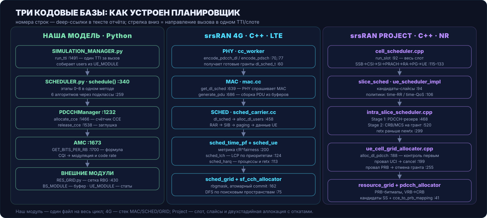

Три сравниваемые системы написаны для разных целей, и от этого зависит большая часть различий. Сначала коротко о каждой.

**Наша модель** — учебный симулятор scheduling cycle: один файл [`SCHEDULER.py`](https://github.com/sherokiddo/project_py_scheduler/blob/dev/PyScheduler/SCHEDULER.py) на 2694 строки плюс класс ресурсной сетки `RES_GRID.py`. Шесть алгоритмов (BestCQI, ProportionalFair, RoundRobin и их full-duplex варианты), собственная сетка TTI, собственный учёт CCE и CQI. Планировщик здесь сам тянет пакеты из буфера BS и сам обновляет статистику UE — он и решатель, и исполнитель.

**srsRAN 4G** ([`srsran/srsRAN_4G`](https://github.com/srsran/srsRAN_4G), ветка `master`) — полный LTE-стек eNodeB на C++: PHY, MAC, RLC, PDCP, RRC, S1AP. Планировщик живёт внутри MAC (`srsenb/src/stack/mac/`), решает, кому какие ресурсы, и возвращает результат PHY; PDU собирает MAC, данные на вход планировщику даёт RLC через буферы. Это зрелая кодовая база с десятилетней историей: многие решения в ней — компромиссы, помеченные честными комментариями.

**srsRAN Project** ([`srsran/srsRAN_Project`](https://github.com/srsran/srsRAN_Project), ветка `main`) — стек gNodeB для 5G NR, переписанный с нуля на C++17 с разделением на CU и DU. Планировщик (`lib/scheduler/`) работает слотами, знает про срезы (slices), BWP, поисковые пространства PDCCH и явный билдер грантов с откатами.

Сравниваются четыре вещи: порядок этапов пайплайна в одном TTI/слоте, аллокаторы ресурсов данных (RBG/PRB) и контроля (CCE/PDCCH), метрики выбора пользователей вместе с обслуживанием очередей и HARQ, и границы модулей — кто принимает решение, кто собирает данные и кто передаёт. Отдельно разобраны две темы, которые в srsRAN развиты глубже, чем у нас: частотно-селективный выбор ресурсов по subband CQI (раздел 8) и вопрос, существует ли вообще совместный оптимум распределения UE × RBG и как его искать (раздел 9).

<div align="right"><sub><a href="#week-03--сравнение-с-srsran-аллокаторы-пайплайн-границы-модулей">↑ к началу</a> · <a href="#3-что-стандартизовано-а-что-нет">дальше →</a></sub></div>

---


## 3. Что стандартизовано, а что нет

Может показаться, что планировщики srsRAN и наш решают одну стандартизованную задачу. 3GPP описывает только результат: форматы DCI, таблицы MCS и TBS, структуру ресурсной сетки, процедуры HARQ и LCP. Алгоритм выбора в стандарт не входит. Какому UE дать какие PRB в каком TTI, решает сама реализация.

Стандартизовано:

- **Ресурсная сетка и RBG**: LTE — [TS 36.211](https://www.etsi.org/deliver/etsi_ts/136200_136299/136211/), NR — [TS 38.211](https://www.etsi.org/deliver/etsi_ts/138200_138299/138211/); размеры RBG и правила отображения в DCI — [TS 36.213](https://www.etsi.org/deliver/etsi_ts/136200_136299/136213/), [TS 38.214](https://www.etsi.org/deliver/etsi_ts/138200_138299/138214/).
- **CQI/MCS/TBS**: таблицы соответствия и правила расчёта размера транспортного блока — TS 36.213 §7.1.7 (LTE), TS 38.214 §5.1.3 (NR). Форматы отчётов CQI, включая subband-отчётность и параметр K, — там же.
- **Процедуры MAC**: приоритизация логических каналов (LCP), bucket size Bj, HARQ — [TS 36.321](https://www.etsi.org/deliver/etsi_ts/136300_136399/136321/) и [TS 38.321](https://www.etsi.org/deliver/etsi_ts/138300_138399/138321/).
- **PDCCH**: агрегации CCE, поисковые пространства, правила поиска кандидатов — TS 36.213 §6.8 (LTE), TS 38.213 §10 (NR).

Не стандартизовано (и именно здесь живут различия):

- порядок обхода UE и метрика приоритета (PF, RR, BestCQI, QoS — всё реализации);
- порядок аллокации control- и data-ресурсов внутри TTI, атомарность и откаты;
- как subband CQI влияет на выбор RBG (srsRAN 4G сжимает маску от худших CQI — это её собственное решение, а не требование стандарта);
- как делить ресурсы между UE совместно (жадно, по очереди, оптимально — на усмотрение реализации).

Поэтому корректная рамка сравнения такая: обе реализации обязаны попадать в одни и те же внешние ограничения (таблицы TBS, форматы DCI, ёмкость PDCCH), но внутри этих ограничений они свободны — и пользуются свободой по-разному.

<div align="right"><sub><a href="#week-03--сравнение-с-srsran-аллокаторы-пайплайн-границы-модулей">↑ к началу</a> · <a href="#4-srsran-4g-пайплайн-одного-dl-tti">дальше →</a></sub></div>

---


## 4. srsRAN 4G: пайплайн одного DL TTI

Модель управления — **pull**: PHY-воркер, дойдя до дедлайна подкадра, сам дёргает MAC (`mac.cc:639`, `get_dl_sched`), а тот передаёт управление планировщику (`mac.cc:656`, `scheduler.dl_sched`). Сам по себе планировщик не запускается: его вызывают, когда радио готово принять решение.

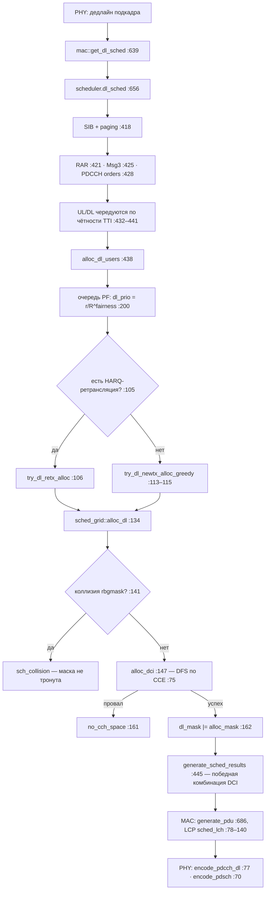

Порядок этапов внутри `sched_carrier.cc` жёсткий: сначала общие каналы — SIB и paging (`:418`), затем RAR (`:421`), Msg3 (`:425`) и PDCCH orders (`:428`); служебный трафик получает ресурсы раньше пользовательского, потому что от него зависит работа всей соты. UL и DL чередуются по чётности TTI (`:432–441`), и только потом доходит до данных пользователей — `alloc_dl_users` (`:438`).

Дальше работает очередь: `sched_time_pf.cc` считает для каждого UE приоритет `dl_prio = r / R^fairness_coeff` (`:200`), сортирует и отдаёт планировщику по одному. Для каждого UE сначала ищется HARQ-ретрансляция (`sched_base.cc:105`) и только при её отсутствии — новая передача через `try_dl_newtx_alloc_greedy` (`:113`). Оба пути упираются в одну точку коммита — `sched_grid.cc:134`, `alloc_dl`: там проверяется коллизия маски, размещается DCI и лишь при успехе обоих маска вливается в сетку. Детали этого механизма — в разделе 7, выбор частоты внутри `try_dl_newtx_alloc_greedy` — в разделе 8.

За планировщиком остаются только решения: победившую комбинацию DCI фиксирует `generate_sched_results` (`:445`), PDU из буферов RLC собирает MAC (`mac.cc:686`) с приоритизацией логических каналов в `sched_lch.cc:78–140`, кодирует PHY. Планировщик не трогает ни пакеты, ни статистику UE — этим занимаются соседние модули.

<div align="right"><sub><a href="#week-03--сравнение-с-srsran-аллокаторы-пайплайн-границы-модулей">↑ к началу</a> · <a href="#5-srsran-project-пайплайн-одного-nr-слота">дальше →</a></sub></div>

---


## 5. srsRAN Project: пайплайн одного NR-слота

Модель управления — **push**: DU присылает slot indication, и `cell_scheduler::run_slot` (`cell_scheduler.cpp:92`) разыгрывает весь слот целиком. Единица времени другая (слот, а не TTI), но структура похожа: сначала служебное, потом пользовательское.

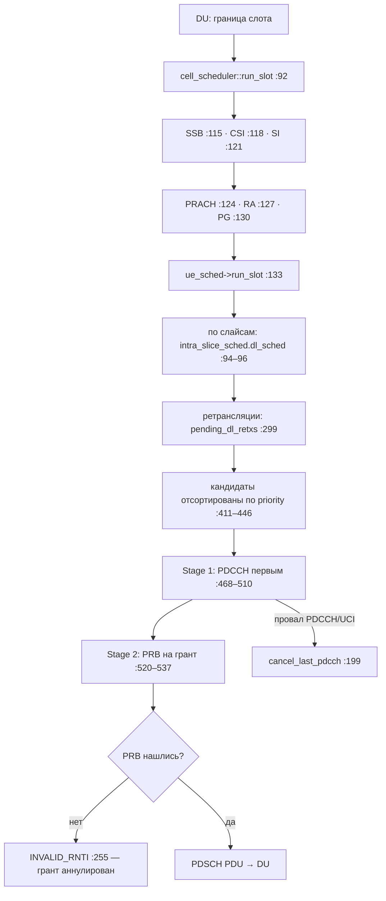

Слот начинается с общих каналов: SSB (`:115`), CSI-RS (`:118`), SI (`:121`), PRACH (`:124`), RA (`:127`), paging (`:130`) — и только потом пользовательские данные (`ue_sched->run_slot`, `:133`). Дальше появляется то, чего в LTE-ветке нет: **срезы**. `intra_slice_scheduler` обходит слайсы по старшинству (`:94–96`), внутри среза сначала ретрансляции (`pending_dl_retxs`, `:299`), затем новые передачи; кандидаты сортируются по приоритету, который даёт политика — round-robin (`scheduler_time_rr.cpp`) или time-QoS (`scheduler_time_qos.cpp`) с PF-метрикой внутри веса.

Главное структурное отличие — **двухстадийность с явными откатами**. Stage 1 (`intra_slice_scheduler.cpp:468–510`) сначала размещает PDCCH для UE: выбирает поисковое пространство и кандидата CCE. Stage 2 (`:520–537`) уже под состоявшийся PDCCH ищет PRB. Если что-то идёт не так, откатывается всё построение назад:

```cpp
// srsRAN Project · ue_cell_grid_allocator.cpp:196 — UCI не встал, откатываем PDCCH
auto uci_result = alloc_uci(ue_cc, ss_info, pdsch_td_res_index);
if (not uci_result.has_value()) {
  ++pdcch_alloc.result.failed_attempts.uci;
  pdcch_sched.cancel_last_pdcch(pdcch_alloc);          // откат контроля
  return make_unexpected(dl_alloc_failure_cause::uci_alloc_failed);
}
```

```cpp
// srsRAN Project · ue_cell_grid_allocator.cpp:255 — PRB не нашлись, грант аннулируется
if (vrbs.empty()) {
  // RBs could not be allocated. Cancel associated grants.
  grant.pdcch->ctx.rnti       = rnti_t::INVALID_RNTI;
  grant.pdsch->pdsch_cfg.rnti = rnti_t::INVALID_RNTI;
  // TODO: Cancel UCI allocation.
  grant.h_dl.reset();                                  // HARQ-процесс тоже освобождается
  return;
}
```

В коде остался `TODO: Cancel UCI allocation`: даже в продакшен-стеке откат неполный. PDU из результатов планировщика собирает DU, а планировщик, как и в 4G, данных не касается. Граница «решатель/исполнитель» та же, только исполнитель теперь отдельный юнит (DU).

<div align="right"><sub><a href="#week-03--сравнение-с-srsran-аллокаторы-пайплайн-границы-модулей">↑ к началу</a> · <a href="#6-три-пайплайна-рядом">дальше →</a></sub></div>

---


## 6. Три пайплайна рядом

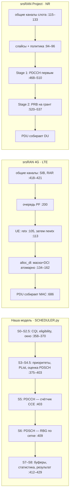

| | Наша модель | srsRAN 4G | srsRAN Project |
|---|---|---|---|
| Кто запускает TTI/слот | `SIMULATION_MANAGER` вызывает `run_tti()` | PHY дёргает MAC к дедлайну | DU присылает slot indication |
| Общие каналы | нет (учебное упрощение) | SIB/RAR/Msg3 до данных | SSB/SI/PRACH/paging до данных |
| Что раньше: контроль или данные | контроль (этап 5), потом данные (этап 6) | данные (маска), DCI внутри той же транзакции | контроль (Stage 1), потом данные (Stage 2) |
| Порядок выбора частоты | по индексу RBG, торги между UE | маска на одного UE, сжатие от худшего CQI | по RBG внутри политики среза |
| Атомарность | RBG — с откатом, CCE — без | маска + DCI одной транзакцией | грант строится поэтапно, откаты явные |
| HARQ-ретрансляции | нет | приоритет перед новыми передачами | приоритет внутри среза |
| Кто собирает PDU | сам планировщик (этап 7) | MAC + LCP | DU |

Из таблицы видны три разных порядка аллокации, и это, пожалуй, главный пайплайн-вывод недели:

1. **Наш: control-first без отката контроля.** CCE списываются счётчиком на этапе 5 до того, как стало ясно, хватит ли RBG на этапе 6. Для данных откат есть (`RELEASE_RBG`), для контроля — заглушка `release_cce` (`SCHEDULER.py:1538`), поэтому провал PDSCH после успешного PDCCH оставляет CCE занятыми до сброса TTI.
2. **4G: data-first с атомарным коммитом.** Маска RBG выбирается первой, DCI примеряется внутри `alloc_dl`, и либо коммитируется всё, либо не меняется ничего.
3. **Project: control-first с полным откатом.** Порядок как у нас (сначала PDCCH), но любой провал следующей стадии откатывает предыдущие: `cancel_last_pdcch`, `INVALID_RNTI`, сброс HARQ-процесса.

Наш порядок — не «неправильный»: он совпадает с Project. Разница в том, что Project свои ранние решения умеет забирать назад, а наша заглушка `release_cce` — нет. Это первый пункт списка зазоров в разделе 14.

<div align="right"><sub><a href="#week-03--сравнение-с-srsran-аллокаторы-пайплайн-границы-модулей">↑ к началу</a> · <a href="#7-аллокаторы-данных-три-модели-состояния-в-коде">дальше →</a></sub></div>

---


## 7. Аллокаторы данных: три модели состояния в коде

Состояние занятых ресурсов в трёх реализациях хранится по-разному, и форма хранения диктует форму алгоритма. Проще всего это увидеть, поставив три фрагмента коммита рядом.

**srsRAN 4G** держит на TTI одну битовую маску `rbgmask_t`: бит — это RBG. Коммит гранта — одна транзакция: проверка коллизии, примерка DCI, вливание маски.

```cpp
// srsRAN 4G · sched_grid.cc:139 — alloc_dl: коммит или ничего
const rbgmask_t& alloc_mask = ue_buffer->get_pending_rbgmask();
if ((dl_mask & alloc_mask).any()) {          // коллизия с уже занятым → отказ
  ue_buffer->clear_pending_alloc();          // сетка при этом не тронута
  return alloc_result::error;
}
...
if (dci_dl != nullptr) {
  if (not cch.alloc_dci(*dci_dl)) {          // DCI не встал → отказ, маска не тронута
    ue_buffer->clear_pending_alloc();
    return alloc_result::no_cch_space;
  }
}
dl_mask |= alloc_mask;                       // коммит: одна операция над маской
...
ue_buffer->commit_alloc(alloc_mask, tbs, harq_pid, ...);
return alloc_result::success;
```

**Наша модель** хранит сетку как словари по TTI: `allocated` (PRB → UE), `rbg_allocation` (RBG → UE) и пересчитываемый список `available_rb`. Коммит идёт через `ALLOCATE_RBG` в `RES_GRID.py` — и в нём есть откат: если хотя бы один RB в группе не отдался, вся группа освобождается обратно.

```python
# наш модуль · RES_GRID.py:424 — группа RBG и её границы
def GET_RBG_INDICES(self, rbg_idx: int) -> List[int]:
    size  = self.GET_RBG_SIZE()
    start = rbg_idx * size
    end   = start + size
    return list(range(start, min(end, self.rb_per_slot)))   # последний RBG может быть узким

# наш модуль · RES_GRID.py:430 — коммит с откатом
def ALLOCATE_RBG(self, tti: int, rbg_idx: int, UE_ID: int) -> bool:
    rb_indices = self.GET_RBG_INDICES(rbg_idx)
    for slot in [0, 1]:
        slot_id = f"sub_{tti%10}_slot_{slot}"
        for freq in rb_indices:
            if not self.ALLOCATE_RB(tti, slot_id, freq, UE_ID):
                self.RELEASE_RBG(tti, rbg_idx)              # откат всей группы
                return False
    return True
```

**srsRAN Project** держит `prb_bitmap` на каждый слот каждой сотки и строит грант поэтапно через билдер. Откат здесь аннулирует уже построенный грант: PDCCH и PDSCH помечаются `INVALID_RNTI`, HARQ-процесс сбрасывается (фрагмент — в разделе 5). Биты в маске никто не возвращает.

Сравнение трёх моделей:

| | 4G | наша модель | Project |
|---|---|---|---|
| Структура состояния | битовая маска RBG на TTI | словари PRB/RBG на TTI | bitmap PRB на слот |
| Гранулярность коммита | весь грант целиком | RBG (внутри — до RB) | грант (внутри — PDCCH, UCI, HARQ, PRB) |
| Откат | не нужен: сначала проверки, потом одно `\|=` | `RELEASE_RBG` при провале любого RB | `INVALID_RNTI` + сброс HARQ, `cancel_last_pdcch` |
| Последний узкий RBG | `count_prb_per_tb` по маске | `min(end, rb_per_slot)` в `GET_RBG_INDICES` | интервалы vrb/crb |

По части данных наша модель ближе к 4G, чем казалось на неделе 2. `ALLOCATE_RBG` — транзакция с откатом, узкий последний RBG учитывается, коллизия исключена порядком обхода (RBG берётся из `available_rb`). Проблема в контроле. 4G откатывает всё одной транзакцией, Project аннулирует грант, а у нас CCE утекает (раздел 10).

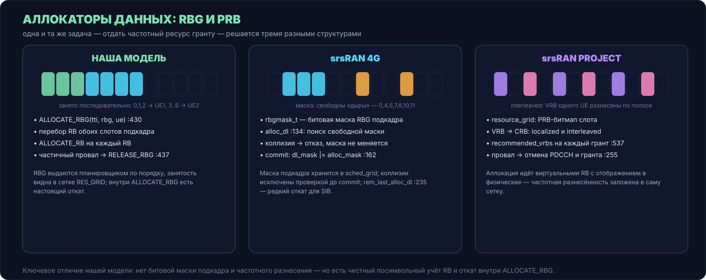

<div align="right"><sub><a href="#week-03--сравнение-с-srsran-аллокаторы-пайплайн-границы-модулей">↑ к началу</a> · <a href="#8-выбор-частоты-от-subband-cqi-к-rbg">дальше →</a></sub></div>

---


## 8. Выбор частоты: от subband CQI к RBG

Радиоканал неоднороден по полосе: из-за частотно-селективных замираний одни участки полосы слышно хорошо, другие плохо. Стандарт позволяет UE сообщать не только общее качество (wideband CQI), но и качество по подполосам (subband CQI) — и планировщик, который этим пользуется, может давать каждому UE те частоты, где его канал лучше. Этот механизм в srsRAN 4G реализован целиком; у нас — своя, другая по форме версия. Разберём обе по коду.

### 8.1. Как CQI попадает в планировщик 4G

Из PHY в MAC приходят два разных вызова: для wideband-отчёта и для subband-отчёта. Во втором вместе со значением передаётся индекс подполосы — иначе планировщик не знал бы, к какому участку полосы это значение относится.

```cpp
// srsRAN 4G · mac.cc:399 — два входа CQI
int mac::cqi_info(uint32_t tti, uint16_t rnti, uint32_t enb_cc_idx, uint32_t cqi_value)
{
  ...
  scheduler.dl_cqi_info(tti, rnti, enb_cc_idx, cqi_value);            // wideband
  ue_db[rnti]->metrics_dl_cqi(cqi_value);
  return SRSRAN_SUCCESS;
}

int mac::sb_cqi_info(uint32_t tti, uint16_t rnti, uint32_t enb_cc_idx,
                     uint32_t sb_idx, uint32_t cqi_value)
{
  ...
  scheduler.dl_sb_cqi_info(tti, rnti, enb_cc_idx, sb_idx, cqi_value); // subband + позиция
  return SRSRAN_SUCCESS;
}
```

В планировщике оба потока оседают в структуре `sched_dl_cqi`: усреднённый wideband в `wb_cqi_avg`, значения подполос в массиве `subband_cqi`.

### 8.2. Хранение и отображение subband → RBG

Ключевой вопрос: значение CQI относится к подполосе, а распределяются RBG. Как одно связать с другим? В 4G — арифметическим отображением и fallback-ом:

```cpp
// srsRAN 4G · sched_dl_cqi.h:107 — CQI конкретного RBG
int get_rbg_cqi(uint32_t rbg) const
{
  if (not subband_cqi_enabled()) {
    return static_cast<int>(wb_cqi_avg);        // subband выключен → wideband
  }
  uint32_t sb_idx = rbg_to_sb_index(rbg);       // RBG → подполоса
  return get_subband_cqi_(sb_idx);
}

// sched_dl_cqi.h:167 — переключатель и отображение
bool     subband_cqi_enabled() const { return K > 0; }   // K задаётся через RRC
uint32_t rbg_to_sb_index(uint32_t rbg_index) const
{ return rbg_index * N() / cell_nof_rbg; }

// sched_dl_cqi.h:178 — значение подполосы с fallback
int get_subband_cqi(uint32_t subband_index) const
{
  if (not subband_cqi_enabled()) { return get_wb_cqi_info(); }
  return bp_list[get_bp_index(subband_index)].last_feedback_tti.is_valid()
             ? subband_cqi[subband_index]
             : wb_cqi_avg;                      // нет свежего фидбэка → wideband
}
```

Из этого кода читаются четыре свойства механизма:

- **Параметр K** (число сообщаемых подполос, задаётся RRC): при `K = 0` subband-режим выключен полностью, работает только wideband.
- **Соответствие RBG ↔ subband не один-к-одному**: `rbg_to_sb_index` делит полосу пропорционально, несколько соседних RBG попадают в одну подполосу и делят одно значение CQI. Число подполос ограничено константами из таблиц TS 36.213 (`max_subband_size = 8`, `max_nof_subbands = 13`, число bandwidth parts — по TS 36.321 Table 7.2.2-2).
- **Fallback**: если по bandwidth part нет свежего отчёта, возвращается `wb_cqi_avg`. Значение CQI для RBG в этот момент не несёт частотно-селективной информации — это надо помнить при интерпретации.
- **Усреднение для гранта**: рядом есть `get_grant_avg_cqi(rbg_interval)` — средний CQI по всем подполосам выделенного интервала; именно он уходит в расчёт TBS (`get_dl_cqi(rbgs)` в разделе 12).

### 8.3. Выбор отделён от резервирования

Новая DL-передача начинается с `try_dl_newtx_alloc_greedy` — и её структура важна сама по себе: сначала выбирается маска частот, и только потом она резервируется в сетке.

```cpp
// srsRAN 4G · sched_base.cc:79
alloc_result try_dl_newtx_alloc_greedy(sf_sched& tti_sched, sched_ue& ue,
                                       const dl_harq_proc& h, rbgmask_t* result_mask)
{
  const rbgmask_t& current_mask = tti_sched.get_dl_mask();
  if (current_mask.all()) { return alloc_result::no_sch_space; }   // всё занято — короткий путь

  srsran::interval<uint32_t> req_bytes = ue.get_requested_dl_bytes(...);  // сколько байт ждёт
  if (req_bytes.stop() == 0) { return alloc_result::no_rnti_opportunity; }
  ...
  rbgmask_t opt_mask;
  if (not find_optimal_rbgmask(*ue_cell, tti_sched.get_tti_tx_dl(), current_mask,
                               dci_format, req_bytes, tb, opt_mask)) {
    return alloc_result::no_sch_space;                             // ← выбор частот
  }
  return tti_sched.alloc_dl_user(&ue, opt_mask, h.get_id());       // ← резервирование (§7)
}
```

На вход выбора подаются: контекст UE и сотки, текущий TTI, маска свободных ресурсов, формат DCI, требуемый объём байт и CQI. На выходе — маска `rbgmask_t` и предварительно посчитанные MCS/TBS. Всё, что происходит после (проверки, коммит, DCI), выбором частот уже не является.

### 8.4. Как выбирается маска: find_optimal_rbgmask

```cpp
// srsRAN 4G · sched_ue_cell.cc:522 (сокращено)
newtxmask = find_available_rbgmask(dl_mask.size(),
                                   dci_format == SRSRAN_DCI_FORMAT1A,   // 1A → только связные наборы
                                   dl_mask);
tb = compute_mcs_and_tbs_lower_bound(ue_cell, tti_tx_dl, newtxmask, dci_format);

if (not ue_cell.dl_cqi().subband_cqi_enabled()) {
  // Wideband: TBS прямо пропорционален числу PRB → итеративный поиск
  // минимального числа RBG, вмещающего req_bytes (false position method)
  ...
}

// Subband CQI case
// NOTE: There is no monotonically increasing guarantee between TBS and nof allocated prbs.
//       One single subband CQI could be dropping the CQI of the whole TB.
//       ... there is no guarantee this is going to be the optimal solution
rbgmask_t smaller_mask;
tbs_info  tb2;
do {
  smaller_mask = remove_min_cqi_rbgs(newtxmask, ue_cell.dl_cqi());
  tb2          = compute_mcs_and_tbs_lower_bound(ue_cell, tti_tx_dl, smaller_mask, dci_format);
  if (tb2.tbs_bytes >= (int)req_bytes.stop() or tb.tbs_bytes <= tb2.tbs_bytes) {
    tb        = tb2;
    newtxmask = smaller_mask;      // принимаем ужатую маску
  }
} while (tb2.tbs_bytes > (int)req_bytes.stop());
```

```cpp
// srsRAN 4G · sched_dl_cqi.cc:95 — что значит «убрать худшие RBG»
rbgmask_t remove_min_cqi_rbgs(const rbgmask_t& rbgmask, const sched_dl_cqi& dl_cqi)
{
  int       min_cqi;
  rbgmask_t minmask = find_min_cqi_rbgs(rbgmask, dl_cqi, min_cqi);
  if (min_cqi < 0) { return minmask; }
  minmask = ~minmask & rbgmask;    // снять с маски все RBG с минимальным CQI
  return minmask;
}
```

Логика двух ветвей разная. **Wideband**: TBS монотонно растёт с числом PRB, поэтому стартуют с полной свободной маски и методом ложной позиции находят минимальное число RBG, которое вмещает `req_bytes` — экономия ресурсов без потери ёмкости. **Subband**: монотонности больше нет — один плохой саббанд в маске тянет вниз средний CQI всего TB, — поэтому алгоритм идёт от обратного: берет максимальную маску и шагами выкидывает RBG с худшим CQI, после каждого шага пересчитывая MCS/TBS, пока ёмкость ещё покрывает запрос. Комментарий в коде прямо признаёт: оптимальность не гарантируется, есть `TODO: can be optimized`.

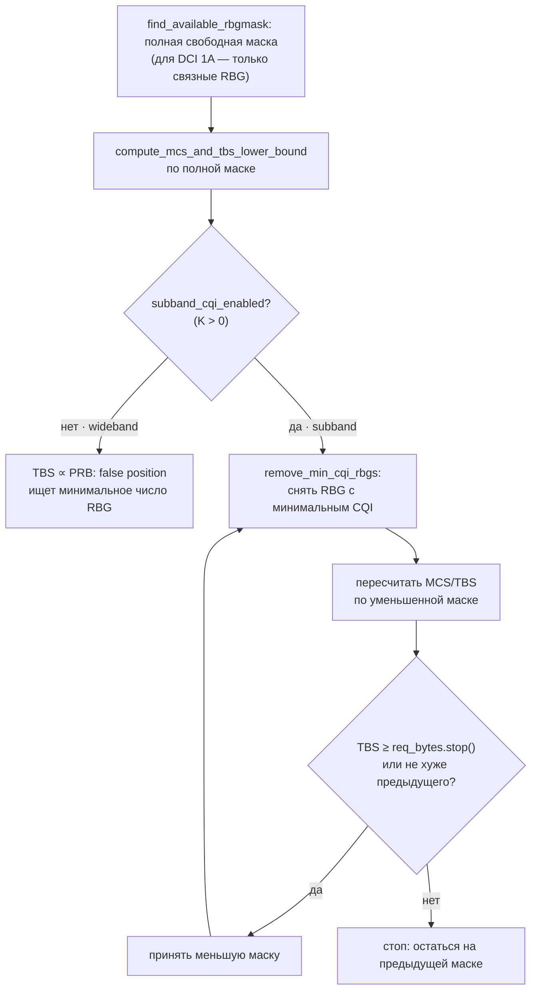

Ограничения, которые накладывает этот механизм (и которые нужно держать в голове любому, кто захочет менять выбор частот):

- **форма аллокации**: для DCI Format 1A маска обязана быть связной — произвольный набор «лучших по CQI» RBG вразнобой формат не примет;
- **RBG ≠ PRB**: последняя группа может содержать меньше PRB, поэтому число установленных битов маски само по себе не определяет объём ресурса — ёмкость считается по фактическим PRB (`count_prb_per_tb`);
- **TBS связан с маской**: любое изменение набора RBG меняет средний CQI гранта и, следовательно, MCS/TBS — оценка маски обязана пересчитываться вместе с ней.

### 8.5. Та же задача у нас: per-RBG subband CQI

Наша модель хранит CQI в датаклассе `CQIMap` — по одному на UE, с двумя полями:

```python
# наш модуль · SCHEDULER.py:189
@dataclass
class CQIMap:
    wb_cqi: int              # CQI значения [1-15]
    last_wb_update: int      # TTI посл. обновления
    sb_cqi: List[int]        # Per-RBG CQI [length = num_rbg]
    last_sb_update: int
```

Список `sb_cqi` имеет длину `num_rbg` — то есть значение качества у нас заведено **сразу на каждый RBG**, без промежуточных подполос и без отображения `rbg_to_sb_index`. Наполняется он в `_refresh_cqi` и только когда включён full-duplex:

```python
# наш модуль · SCHEDULER.py:537 — subband-часть _refresh_cqi
# SB CQI обновляется только если enable_fd=True;
# индикатором FD сейчас служит наличие непустого списка в user['sbb_cqi']
sb_cqi_list = user.get('sbb_cqi')
if sb_cqi_list and isinstance(sb_cqi_list, list) and len(sb_cqi_list) > 0:
    if ueid in self.cqi_map:
        self.cqi_map[ueid].sb_cqi = sb_cqi_list.copy()
        self.cqi_map[ueid].last_sb_update = tti
```

(Попутное наблюдение для чистки кода: docstring `_refresh_cqi` говорит, что SB CQI берётся из `user['ue'].cqi_subband`, а фактически читается ключ `user['sbb_cqi']` — контракт стоит привести к одному виду.)

Потребитель — FD-варианты планировщика. У `FDxProportionalFair` выбор частоты устроен как торги за каждый RBG по порядку:

```python
# наш модуль · SCHEDULER.py:2615 — FD-вариант Proportional Fair (сокращено)
for rbg_idx in range(total_rbg):
    if all(buf <= 0 for buf in remaining_buffer.values()):
        break                                    # все буферы пусты — частота не нужна
    rb_indices = self.lte_grid.GET_RBG_INDICES(rbg_idx)
    rbg_width  = len(rb_indices)                 # последний узкий RBG учтён
    for user in ues_with_pdcch:
        if remaining_buffer[user['UE_ID']] <= 0:
            continue
        sb_cqi_list = self._get_sb_cqi(user['UE_ID'])
        if sb_cqi_list and rbg_idx < len(sb_cqi_list) and sb_cqi_list[rbg_idx] > 0:
            cqi = sb_cqi_list[rbg_idx]           # per-RBG значение
        else:
            cqi = self._get_wb_cqi(user['UE_ID'])  # fallback на wideband
        bits_per_rb = self.amc.GET_BITS_PER_RB(cqi)
        r_j_k       = rbg_width * bits_per_rb    # оценка ёмкости RBG для этого UE
        ...                                      # PF-метрика, argmax по пользователям
    ...                                          # победитель: ALLOCATE_RBG(user, rbg_idx)
```

`FDxBestCQI` (`SCHEDULER.py:2274`) устроен так же, только метрика другая; HD-планировщики subband не используют вовсе — они смотрят только wideband.

### 8.6. Сравнение двух механизмов

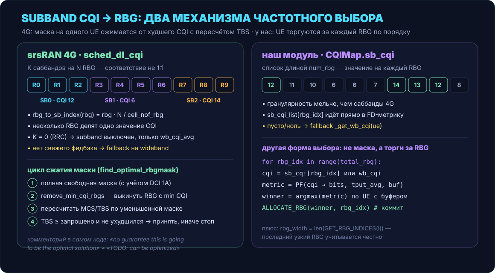

Оба механизма решают одну задачу — дать UE те частоты, где его канал лучше, — но форма решения противоположная:

- **Ось цикла.** У 4G внешний цикл — очередь UE, внутренний — сжатие маски под одного UE: «какие частоты и в каком объёме нужны этому UE, чтобы передать его байты». У нас внешний цикл — индекс RBG, внутренний — соревнование пользователей: «кто из UE больше заслуживает этот конкретный RBG прямо сейчас».
- **Обратная связь с ёмкостью.** 4G после каждого изменения маски пересчитывает MCS/TBS и останавливается, когда ёмкость гранта покрывает `req_bytes` — выбор частот и проверка осуществимости связаны в один цикл. У нас оценка ёмкости (`r_j_k`) используется только внутри метрики, а заполнение идёт до исчерпания буфера; отдельной проверки «влезет ли запрошенное в выделенное» нет.
- **Гранулярность.** У нас мельче: значение на каждый RBG против K подполос на полосу у 4G. Обратная сторона — у 4G гранулярность привязана к реальным отчётам UE (K из RRC, таблицы 36.213), а наша per-RBG сетка — допущение симулятора: UE физически не может так детально измерять полосу без оговорённой периодичности.
- **Fallback.** Одинаковый паттерн: нет subband-данных — работаем по wideband (`get_subband_cqi` → `wb_cqi_avg`; у нас пустой список/ноль → `_get_wb_cqi`).
- **Форма результата.** У 4G — маска (`rbgmask_t`), которую можно проверить на коллизии и связность одним `&`. У нас — последовательность точечных коммитов `ALLOCATE_RBG`; маски как объекта нет, поэтому и ограничений формы (связность под DCI 1A) проверить негде — наш DCI пока заглушка.
- **Оптимум не гарантирован.** Комментарий в коде 4G прямо говорит, что жадное сжатие маски оптимум не обещает. Наш per-RBG выбор жадный так же: на каждом шаге решение локальное. Есть ли глобальный оптимум и как его считать, разбирается в следующем разделе.

<div align="right"><sub><a href="#week-03--сравнение-с-srsran-аллокаторы-пайплайн-границы-модулей">↑ к началу</a> · <a href="#9-совместное-распределение-и-венгерский-метод">дальше →</a></sub></div>

---


## 9. Совместное распределение и венгерский метод

И srsRAN 4G, и srsRAN Project, и наш модуль распределяют ресурсы **жадно**: 4G обходит очередь UE и для каждого локально ужимает маску; Project идёт по политике внутри среза; мы торгуемся за RBG по порядку. Жадный алгоритм оптимален на каждом шаге, но максимум суммарного качества по всем пользователям не гарантирует ни один из трёх. Раздел 8 закончился тем же: комментарий в `find_optimal_rbgmask` признаёт «no guarantee this is going to be the optimal solution».

Чтобы оценить потери и найти альтернативу, посмотрим на весь TTI сразу, а не на одного UE.

### 9.1. Матрица качества и задача назначения

Пусть в сотке K пользователей и N свободных RBG. Качество канала каждого UE на каждом RBG описывается матрицей C, где `c[k][n]` — CQI пользователя k на группе n (в нашей модели это ровно `sb_cqi[rbg_idx]` из `CQIMap`, в 4G — `get_rbg_cqi(n)`).

Назначение ресурсов тогда — бинарные переменные `x[k][n] ∈ {0,1}`: единица означает «RBG n отдан UE k». Базовые ограничения учебного назначения:

- каждый RBG отдаётся не более чем одному UE: `Σ_k x[k][n] ≤ 1`;
- каждый UE получает не более одного RBG за раунд: `Σ_n x[k][n] ≤ 1`;
- цель — максимизировать суммарное качество: `max Σ c[k][n] · x[k][n]`.

Это классическая **задача о назначениях**: исполнители — UE, работы — RBG.

### 9.2. Переход от CQI к стоимости

Венгерский метод решает задачу **минимизации**, а CQI хочется максимизировать. Мост — замена:

```
a[k][n] = C_max − c[k][n],   где C_max = 15 (потолок шкалы CQI)
```

Высокий CQI превращается в низкую стоимость, и назначение с минимальной суммарной стоимостью совпадает с назначением с максимальным суммарным CQI. Важно оговориться: это способ построить учебную задачу. Боевая целевая функция планировщика обязана учитывать не только CQI, но и справедливость (историю обслуживания в PF), размеры буферов и QoS — она определяется отдельно; матричная постановка даёт верхнюю границу «по качеству канала», а не готовый продуктовый алгоритм.

### 9.3. Шаги метода

Для квадратной матрицы стоимостей A размера N×N классический венгерский метод работает так:

1. **Редукция строк**: из каждой строки вычесть её минимальный элемент — в каждой строке появится хотя бы один нуль.
2. **Редукция столбцов**: из каждого столбца вычесть его минимальный элемент — нулей станет больше.
3. **Поиск независимых нулей**: выбрать набор нулей, никакие два из которых не стоят в одной строке или столбце. Если удалось выбрать N нулей — это и есть оптимальное назначение.
4. **Покрытие**: если независимых нулей меньше N, покрыть все нули минимальным числом горизонтальных и вертикальных линий.
5. **Корректировка**: найти минимальный непокрытый элемент, вычесть его из всех непокрытых и прибавить к элементам на пересечении линий; вернуться к шагу 3.

Сложность — O(N³): для полосы в 25 RBG это тысячи операций на TTI — терпимо даже для реального времени, для симулятора тем более.

### 9.4. Рабочий пример: почему жадность теряет

Возьмём 4 UE и 4 RBG:

| CQI | RBG 1 | RBG 2 | RBG 3 | RBG 4 |
|---|---|---|---|---|
| **UE 1** | 15 | **14** ✓ | 3 | 2 |
| **UE 2** | 2 | 4 | **15** ✓ | 14 |
| **UE 3** | **10** ✓ | 7 | 8 | 5 |
| **UE 4** | 4 | 6 | 12 | **11** ✓ |

Жадный обход «каждому UE его лучший из свободных» в порядке нумерации: UE1 забирает RBG1 (15), UE2 — RBG3 (15), UE3 вытеснен на RBG2 (7 вместо 10), UE4 — RBG4 (11). Сумма: 15+15+7+11 = **48**.

Оптимальное назначение (одно из двух): UE1→RBG2 (14), UE2→RBG3 (15), UE3→RBG1 (10), UE4→RBG4 (11). Сумма: **50**. Жадность потеряла 2 единицы CQI на матрице 4×4. Причина в порядке обхода: первый же шаг UE1 занял RBG, нужную другому. Полный перебор подтверждает: 50 — потолок для этой матрицы. На больших TTI (10–25 RBG, очередь с буферами) разрыв только растёт.

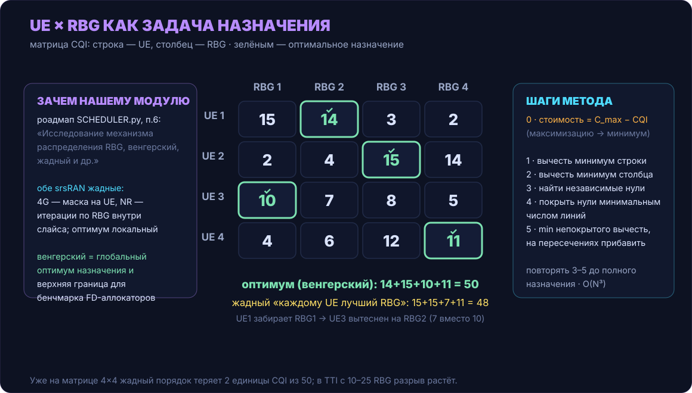

### 9.5. Причём здесь наш модуль

В роадмапе `SCHEDULER.py` эта тема стоит отдельным пунктом — и теперь видно, что за ним:

```python
# наш модуль · SCHEDULER.py:2686 — хвост роадмапа
#   4) QoS-aware планировщики
#   5) Исследование механизмов tie-brake когда метрики приоритетов совпадают
#   6) Исследование механизма распределения RBG, венгерский, жадный и др.
#   7) Исследование механизма оценки средней пропускной способности для PF
#   8) Исследование механизмов защиты голодающих UE
```

Пункт 6 роадмапа относится к этому разделу. План: использовать венгерский метод как **офлайн-бенчмарк верхней границы**, онлайн-аллокатором он не будет. На сценариях `scenario_tti5.py` сравнить три подхода по суммарному CQI выделений и по справедливости (доля обслуженных UE, разброс throughput): наш per-RBG greedy (раздел 8.5), greedy в стиле 4G (очередь UE + маска каждому) и оптимальное назначение венгерским методом. Любой новый FD-аллокатор можно будет измерять в процентах от оптимума, а не словами «лучше» или «хуже прошлого».

Почему он не годится для онлайн-аллокатора, видно из ограничений постановки:

- **UE нужен не один RBG.** Реальный грант — набор групп под TBS; назначение «один RBG одному UE» приходится либо расширять до прямоугольной матрицы (UE-слоты × RBG с фиктивными строками), либо запускать итеративно, что размывает оптимальность.
- **TBS связан с маской.** Средний CQI по выделенному набору определяет MCS/TBS (раздел 12); сумма «CQI назначений» этого не видит.
- **Связность для DCI 1A.** Произвольное точечное назначение может дать несвязный набор, который формат не примет.
- **Динамика между TTI.** PF-метрика меняется от факта выделения; разовое назначение одного TTI игнорирует эффект следующих — а в нём, собственно, и живёт справедливость.

srsRAN выбирает так же: обе кодовые базы остаются жадными и платят качеством назначения за предсказуемое время работы в реальном TTI. Венгерский метод здесь инструмент исследования. Он отвечает на вопрос «сколько теряют наши жадные алгоритмы», а без ответа пункт 6 роадмапа не закрыть.

<div align="right"><sub><a href="#week-03--сравнение-с-srsran-аллокаторы-пайплайн-границы-модулей">↑ к началу</a> · <a href="#10-аллокаторы-контроля-cce-и-pdcch">дальше →</a></sub></div>

---


## 10. Аллокаторы контроля: CCE и PDCCH

С контролем ситуация обратная разделу 7: здесь наша модель и srsRAN различаются максимально — потому что различается сам объект учёта. Мы считаем **количество** CCE, srsRAN размещает DCI на **позициях**.

Наш аллокатор — счётчик с двумя проверками:

```python
# наш модуль · SCHEDULER.py:1490 — allocate_cce (ядро)
if ue_id in self.cce_allocations:
    return False                        # один PDCCH на UE в TTI
if not self.check_cce_availability(cce_count):
    return False                        # max_dl_cce − num_assigned_cce < запрошено
self.num_assigned_cce       += cce_count
self.cce_allocations[ue_id]  = cce_count
```

```python
# наш модуль · SCHEDULER.py:1538 — обратная операция
def release_cce(self, ue_id: int) -> bool:
    """Освобождение CCE, выделенных для пользователя (ЗАГЛУШКА для дальнейшей разработки)."""
```

4G размещает каждый DCI в конкретные CCE: у каждого UE есть поисковые пространства и таблица кандидатов для уровней агрегации {1, 2, 4, 8}, и `alloc_dci` ищет комбинацию позиций, в которой все уже размещённые и новые DCI помещаются без перекрытий. Поиск — DFS с перебором перестановок прежних размещений, при неудаче — полный откат:

```cpp
// srsRAN 4G · sf_cch_allocator.cc:75 — alloc_dci (ядро цикла)
// Try to allocate grant. If it fails, attempt the same grant, but using
// a different permutation of past grant DCI positions
do {
  bool success = alloc_dfs_node(record, 0);
  if (success) {
    dci_record_list.push_back(record);
    ...
    return true;
  }
  if (temp_dci_dfs.empty()) {
    temp_dci_dfs = last_dci_dfs;         // возвращаемся к прежним размещениям
  }
} while (get_next_dfs());                // следующая перестановка истории

// Revert steps to initial state, before dci record allocation was attempted
last_dci_dfs.swap(temp_dci_dfs);         // неудача — всё как было до попытки
```

В Project контроль устроен ещё богаче: CORESET, поисковые пространства NR, кандидаты с уровнями агрегации, и тот же принцип «не встал — откати» (`cancel_last_pdcch`, `pdcch_resource_allocator_impl.cpp:258`).

Что из этого следует для нас:

- **Наш счётчик — необходимое условие, но не достаточное.** «Осталось 20 CCE» не означает, что DCI с агрегацией 8 найдёт себе позицию: в реальной сетке PDCCH кандидаты привязаны к поисковым пространствам, и при том же остатке размещение может не состояться. Наша модель в этом месте системно оптимистичнее обеих srsRAN — при дефиците контроля мы пропустим грант, который реальный планировщик отверг бы раньше.
- **Откат есть только в одну сторону.** `ALLOCATE_RBG` откатывается (раздел 7), `release_cce` — заглушка. Сценарий из её же docstring (PDCCH выделен, PDSCH не влез) оставляет CCE занятыми до конца TTI. В 4G такой сценарий невозможен конструктивно: DCI примеряется внутри транзакции `alloc_dl` и при провале не коммитится вообще.
- **Уровней агрегации у нас нет**: `cce_count` передаётся снаружи, но позиций и поисковых пространств за ним нет — это та же заглушка, только с другой стороны.

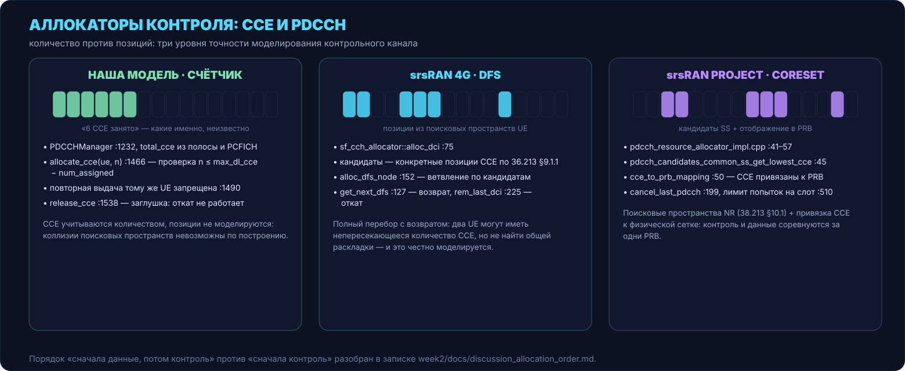

<div align="right"><sub><a href="#week-03--сравнение-с-srsran-аллокаторы-пайплайн-границы-модулей">↑ к началу</a> · <a href="#11-метрики-очереди-и-harq">дальше →</a></sub></div>

---


## 11. Метрики, очереди и HARQ

Метрики — место, где наши алгоритмы названы теми же словами, что в srsRAN (BestCQI, Proportional Fair, Round Robin), поэтому сравнивать их интереснее всего: форма та же, наполнение разное. Возьмём PF — он есть во всех трёх.

**srsRAN 4G** считает приоритет один раз на TTI для всей очереди:

```cpp
// srsRAN 4G · sched_time_pf.cc:193
dl_retx_h  = get_dl_retx_harq(ue, tti_sched);      // ретрансляция находится первой
dl_newtx_h = get_dl_newtx_harq(ue, tti_sched);
if (dl_retx_h != nullptr or dl_newtx_h != nullptr) {
  float r = ue.get_expected_dl_bitrate(cell.enb_cc_idx) / 8;  // CQI → ожидаемая скорость
  float R = dl_avg_rate();                                    // EWMA истории обслуживания
  dl_prio = (R != 0) ? r / pow(R, fairness_coeff)
                     : (r == 0 ? 0 : std::numeric_limits<float>::max());
}
```

**Наш PF** — та же дробь `r/R`, но каждое слагаемое своё:

```python
# наш модуль · SCHEDULER.py:2097 — ProportionalFair (ядро)
cqi            = self._get_wb_cqi(ue_id)
instant_rate   = rb_per_slot * self.amc.GET_BITS_PER_RB(cqi)  # вся полоса, не грант
avg_throughput = user['ue'].average_throughput

if avg_throughput <= 0:
    avg_throughput = 1e-6                  # новичок → приоритет стремится к бесконечности
    pf_metric = instant_rate / 1.0
else:
    pf_metric = instant_rate / (avg_throughput / 1000)
```

Различия по существу, а не по синтаксису:

- **Числитель.** У 4G `r` — ожидаемая скорость именно того гранта, который UE может получить (учитывает фактические ресурсы). У нас `instant_rate` — ёмкость всей полосы при данном CQI: величина не зависит от того, сколько RBG UE в итоге получит. Для порядка в очереди этого достаточно, но интерпретация «мгновенная скорость» здесь условная.
- **Знаменатель.** У 4G — EWMA с настраиваемой степенью `fairness_coeff`: степень > 1 усиливает давление истории, = 0 превращает PF в чистый max-CQI. У нас — `average_throughput / 1000` без настраиваемой жёсткости и с fast-start через `1e-6`: новый UE получает практически бесконечный приоритет и гарантированно забирает первый же TTI. В 4G новичок защищён мягче — через ту же EWMA.
- **HARQ.** У 4G ретрансляция ищется до новой передачи и обслуживается вне очереди метрик: `dl_retx_h` важнее `dl_newtx_h` по построению кода. Project делает то же внутри среза (`pending_dl_retxs` первыми). У нас HARQ-процессов нет вообще: передача считается успешной по факту выделения, ретранслировать нечего.
- **LCP.** Когда UE выбран и грант готов, 4G собирает PDU приоритизацией логических каналов (`sched_lch.cc:78–140`): у каждого канала приоритет и bucket size Bj, SRB ahead of DRB, остаток — по весам. У нас этап 7 забирает пакеты из буфера BS целиком, без каналов и приоритетов — различие упирается в то, что у нас один буфер на UE, а не набор логических каналов.

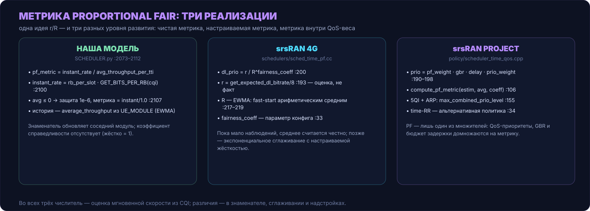

Round Robin и BestCQI сравниваются одной фразой: у нас это сортировки по счётчику и по CQI (в FD-вариантах — по subband CQI каждого RBG, раздел 8), в 4G — `sched_time_rr` с чередованием последней обслуженной позиции, в Project — `scheduler_time_rr.cpp` с окном и `scheduler_time_qos.cpp`, где PF-дробь спрятана внутрь QoS-веса. Структурно везде одно и то же, различия те же, что перечислены выше для PF.

<div align="right"><sub><a href="#week-03--сравнение-с-srsran-аллокаторы-пайплайн-границы-модулей">↑ к началу</a> · <a href="#12-amc-и-tbs-формула-против-таблиц">дальше →</a></sub></div>

---


## 12. AMC и TBS: формула против таблиц

Разделы 8 и 9 упирались в один и тот же механизм: любое изменение маски требует пересчёта «сколько байт влезет». В srsRAN за это отвечает связка MCS/TBS из таблиц стандарта; у нас — формула оценки битов на RB.

**srsRAN 4G** — таблицы TS 36.213, включая альтернативную таблицу TBS:

```cpp
// srsRAN 4G · sched_ue_cell.cc:400 — cqi_to_tbs_dl (сокращено)
bool     use_tbs_index_alt = cell.get_ue_cfg()->use_tbs_index_alt
                             and dci_format != SRSRAN_DCI_FORMAT1A;
uint32_t nof_prbs          = count_prb_per_tb(rbgs);   // фактические PRB маски,
                                                         // последний RBG может быть неполным
uint32_t dl_cqi            = cell.get_dl_cqi(rbgs);    // средний CQI по выделенной маске
ret = compute_min_mcs_and_tbs_from_required_bytes(
    nof_prbs, nof_re, dl_cqi, cell.max_mcs_dl, req_bytes, ..., use_tbs_index_alt);
...
ret.tbs_bytes = get_tbs_bytes((uint32_t)ret.mcs, nof_prbs, use_tbs_index_alt, false);
```

Здесь сходится всё из раздела 8: CQI берётся **средний по маске** (`get_dl_cqi(rbgs)` — поэтому один плохой саббанд тянет вниз весь TBS), число PRB — **фактическое по маске** (`count_prb_per_tb` — поэтому узкий последний RBG не обманывает ёмкость), а MCS подбирается **под требуемые байты** (`compute_min_mcs_and_tbs_from_required_bytes`). Комментарий в коде отмечает границу кодовой скорости 0.932·Qm, за которой TBS следовало бы обнулять.

**Наша модель** — формула спектральной эффективности:

```python
# наш модуль · SCHEDULER.py:1700 — GET_BITS_PER_RB
modulation, code_rate = self.CQI_TO_MCS[cqi]
rs_per_slot   = n_ports * 4                        # CRS: 4 RE на слот при 1 порте
re_slot0      = (7 - pcfich) * 12 - rs_per_slot    # первый слот минус регион контроля
re_slot1      = 7 * 12 - rs_per_slot
re_per_rb_tti = re_slot0 + re_slot1
return int(re_per_rb_tti * modulation * code_rate)
```

Формула вычитает из ёмкости регион PDCCH (`pcfich`) и опорные сигналы, для оценок в метриках этого достаточно. TBS она не считает: таблиц 36.213 за ней нет, от фактической маски результат не зависит (вход — только CQI), и используется он как «биты на RB», а не «байты в транспортном блоке». Исправление описано в собственном TODO:

```python
# наш модуль · SCHEDULER.py:1718 — TODO сразу под формулой
# TODO: [AMC] Заменить формульный расчёт RE на lookup-таблицу TBS
# по TS 36.213 Table 7.1.7.2.1 (I_TBS + N_PRB → TBS).
```

Последствия для сравнения: у 4G пересчёт TBS при сжатии маски (раздел 8.4) входит в контракт аллокатора; у нас ёмкость и аллокация живут раздельно, поэтому «проверка осуществимости» в FD-цикле отсутствует физически — её просто нечем сделать, пока нет таблиц. Таблицы TBS — третий пункт списка зазоров, и он разблокирует сразу два других (TBS-проверку в аллокаторе и осмысленный бенчмарк из раздела 9).

<div align="right"><sub><a href="#week-03--сравнение-с-srsran-аллокаторы-пайплайн-границы-модулей">↑ к началу</a> · <a href="#13-границы-модулей-кто-решает-кто-собирает-кто-передаёт">дальше →</a></sub></div>

---


## 13. Границы модулей: кто решает, кто собирает, кто передаёт

Последний срез сравнения — не алгоритмы, а контракты между модулями: кто кого дёргает, что передаёт и кто за что отвечает после передачи.

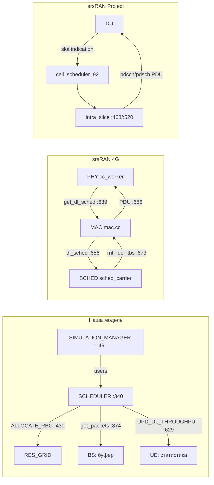

**В 4G** граница проходит внутри MAC: планировщик возвращает MAC-у список грантов (`mac.cc:673` — rnti, DCI, TBS на каждый), MAC сам собирает PDU из буферов RLC через LCP (`:686`) и отдаёт PHY на кодирование. Планировщик не знает, какие именно байты полетят, — только сколько их влезет.

**В Project** граница вынесена ещё дальше: планировщик в CU собирает структуры PDCCH/PDSCH, а исполняет их DU — отдельный процесс с собственным стеком. Контракт между ними — набор грантов слота; всё, что связано с данными и их очередями, на стороне DU.

**У нас** планировщик пересекает обе границы сразу: он и решает (этапы 3–6), и исполняет — сам тянет пакеты из буфера BS (`get_packets`, `SCHEDULER.py:874`) и сам обновляет статистику UE (`UPD_DL_THROUGHPUT`, `:629`). В терминах двух предыдущих абзацев наш SCHEDULER — это MAC и планировщик в одном файле, а SIMULATION_MANAGER (`:1491`) играет роль PHY с его тактом.

Этап 7 существует, потому что отдельного MAC-слоя в модели пока нет. Роадмап уже намечает расслоение: пункты 1–3 (`SCHEDULER.py:2676`) описывают вынос обработки буфера в BufferManager, отказ от прямой связи с RES_GRID и «каноничный output планировщика». Это движение к контракту 4G: планировщик возвращает гранты, данными занимается соседний модуль.

Сопоставление контрактов:

| Переход | Наша модель | srsRAN 4G | srsRAN Project |
|---|---|---|---|
| Такт | `run_tti()` из SIMULATION_MANAGER | pull от PHY к дедлайну | push slot indication от DU |
| Вход планировщика | список `users` со всем состоянием | UE-контексты + буферы RLC + отчёты CQI/HARQ | UE-контексты + срезы + BWP |
| Выход планировщика | записи в RES_GRID + выданные пакеты | гранты (rnti, dci, tbs) → MAC | структуры PDCCH/PDSCH → DU |
| Данные трогает | планировщик (этап 7) | MAC (LCP) | DU |
| Статистику UE ведёт | планировщик (`UPD_DL_THROUGHPUT`) | MAC/RLC по факту передачи | DU по факту передачи |

<div align="right"><sub><a href="#week-03--сравнение-с-srsran-аллокаторы-пайплайн-границы-модулей">↑ к началу</a> · <a href="#14-итоги-зазоры-и-что-перенимать">дальше →</a></sub></div>

---


## 14. Итоги: зазоры и что перенимать

Неделя дала три главных вывода.

**Первый — про порядок.** Три пайплайна используют три порядка аллокации (раздел 6), и наш control-first совпадает с Project — но без его откатов. Дыра в атомарности у нас одна, и она в контроле: данные откатываются (`ALLOCATE_RBG`), а заглушка `release_cce` превращает провал PDSCH после PDCCH в утечку CCE до конца TTI.

**Второй — про частоту.** Частотно-селективный выбор в srsRAN 4G устроен полностью: subband-отчёты с позициями, отображение на RBG с fallback, сжатие маски с пересчётом TBS на каждом шаге и ограничениями формата DCI (раздел 8). У нас subband есть, и даже мельче гранулярность (per-RBG), но нет второй половины механизма: ни проверки осуществимости по TBS, ни формы результата в виде маски. Оба жадные, и 4G говорит об этом в комментарии к коду.

**Третий — про оптимум.** Все три реализации выбирают ресурсы жадно. Венгерский метод (раздел 9) даёт способ измерить цену этой жадности: на примере 4×4 она составила 2 из 50 единиц CQI, и именно это измерение описывает пункт 6 роадмапа.

Список зазоров:

1. **`release_cce` + откат контроля.** Заглушка `SCHEDULER.py:1538`; сценарий применения описан в её же docstring. Без неё наш control-first небезопасен. Дёшево, разблокирует корректные эксперименты с дефицитом PDCCH.
2. **Проверка TBS-осуществимости при аллокации.** В 4G ёмкость пересчитывается при каждом изменении маски; у нас FD-цикл заполняет RBG до исчерпания буфера без проверки «влезет ли». Зависит от пункта 3.
3. **Таблицы TBS 36.213 вместо формулы.** Собственный TODO `SCHEDULER.py:1718`; вход — I_TBS + N_PRB, выход — байты. Разблокирует пункт 2 и делает бенчмарк из раздела 9 осмысленным.
4. **EWMA для PF с fast-start и `fairness_coeff`.** Заменить `average_throughput/1000` и `1e-6` на экспоненциальное сглаживание с настраиваемой жёсткостью — поведение новичков станет управляемым, а не бесконечно-приоритетным.
5. **Позиции CCE и уровни агрегации.** Хотя бы таблица кандидатов для общего поискового пространства, чтобы счётчик CCE перестал быть необходимым-но-недостаточным условием (раздел 10).
6. **LCP с приоритетами и Bj.** Появится вместе с расслоением на BufferManager (роадмап, пункты 1–3) — до этого один буфер на UE не оставляет места приоритизации каналов.
7. **HARQ-процессы и приоритет ретрансляций.** В обеих srsRAN retx обслуживается вне очереди метрик; у нас процессов нет — сравнение метрик (раздел 11) без них неполное.
8. **Венгерский бенчмарк.** Офлайн, на сценариях `scenario_tti5.py`: наш greedy против per-UE greedy против оптимума — метрика «процент от оптимума» для любого будущего FD-аллокатора.

Что перенимать прямо сейчас, почти бесплатно: транзакционность `alloc_dl` как образец для связки PDCCH+PDSCH (раздел 7); fallback-паттерн CQI — он у нас уже такой же (раздел 8.5); разделение «выбор частот / резервирование» из `try_dl_newtx_alloc_greedy` — оно ляжет в основу пункта 2 без переписывания FD-цикла.

Чего перенимать не нужно: DFS с перестановками истории DCI из 4G — дорогой механизм, оправданный реальным PDCCH; у нас до появления позиций CCE (пункт 5) ему не на чем работать.

<div align="right"><sub><a href="#week-03--сравнение-с-srsran-аллокаторы-пайплайн-границы-модулей">↑ к началу</a> · <a href="#15-источники">дальше →</a></sub></div>

---


## 15. Источники

Снимки кода, по которым велось сравнение:

| Репозиторий | Снимок | Ключевые файлы |
|---|---|---|
| [sherokiddo/project_py_scheduler](https://github.com/sherokiddo/project_py_scheduler/tree/dev) | ветка `dev`, `SCHEDULER.py` — 2694 строки | `SCHEDULER.py`, `RES_GRID.py`, `SIMULATION_MANAGER.py`, `UE_MODULE.py`, `BS_MODULE.py` |
| [srsran/srsRAN_4G](https://github.com/srsran/srsRAN_4G) | `master`, `bef8680` (10.09.2026) | `mac.cc`, `sched_carrier.cc`, `sched_grid.cc`, `sched_base.cc`, `sched_time_pf.cc`, `sched_time_rr.cc`, `sched_ue_cell.cc/.h`, `sched_dl_cqi.h/.cc`, `sf_cch_allocator.cc`, `sched_lch.cc`, `sched_harq.cc` |
| [srsran/srsRAN_Project](https://github.com/srsran/srsRAN_Project) | `main`, `4bf1543` (16.02.2026) | `cell_scheduler.cpp`, `ue_scheduler_impl.cpp`, `intra_slice_scheduler.cpp`, `ue_cell_grid_allocator.cpp`, `pdcch_resource_allocator_impl.cpp`, `scheduler_time_rr.cpp`, `scheduler_time_qos.cpp` |

Стандарты:

- [TS 36.211](https://www.etsi.org/deliver/etsi_ts/136200_136299/136211/) — LTE: физическая сетка, RB/RBG
- [TS 36.213](https://www.etsi.org/deliver/etsi_ts/136200_136299/136213/) — LTE: CQI/MCS, таблицы TBS (§7.1.7), subband-отчётность, PDCCH (§6.8)
- [TS 36.321](https://www.etsi.org/deliver/etsi_ts/136300_136399/136321/) — LTE MAC: LCP, Bj (Table 7.2.2-2 — bandwidth parts), HARQ
- [TS 38.214](https://www.etsi.org/deliver/etsi_ts/138200_138299/138214/) — NR: MCS/CQI, процедуры распределения ресурсов
- [TS 38.211](https://www.etsi.org/deliver/etsi_ts/138200_138299/138211/) — NR: ресурсная сетка, BWP

Документация srsRAN:

- [srsRAN 4G docs](https://docs.srsran.com/en/latest/) — архитектура eNB, описание MAC/scheduler
- [srsRAN Project docs](https://docs.srsran.com/projects/project/en/latest/) — архитектура gNB, user guide

Прошлые недели:

- [Week 01 — что такое планировщик и устройство SCHEDULER.py](week_01_report.md)
- [Week 02 — scheduling cycle по этапам: входы, выходы, побочные эффекты](week_02_report.md)

<div align="right"><sub><a href="#week-03--сравнение-с-srsran-аллокаторы-пайплайн-границы-модулей">↑ к началу</a></sub></div>
